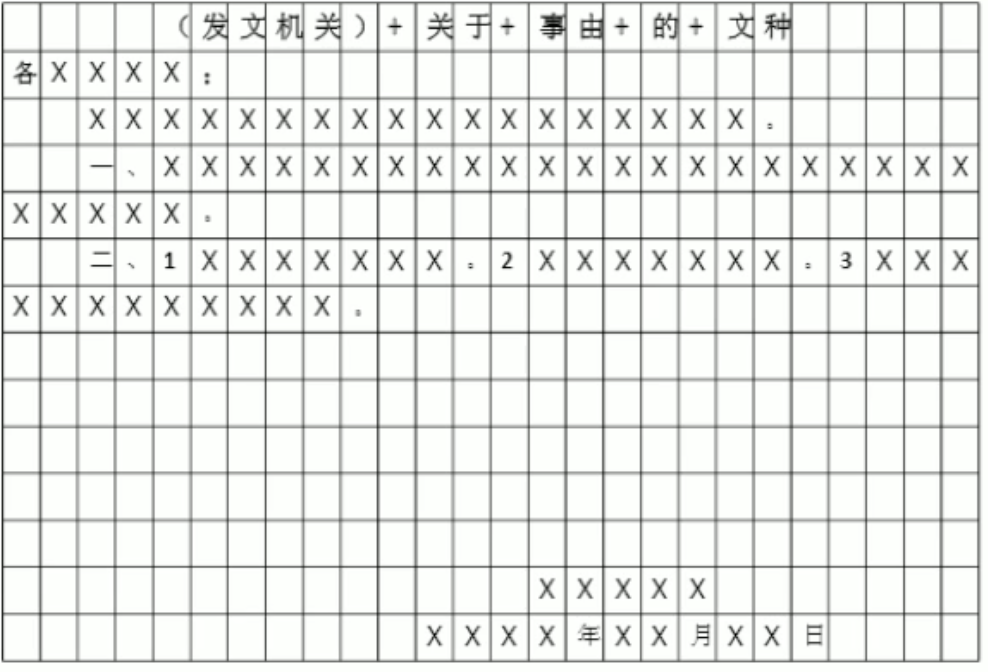
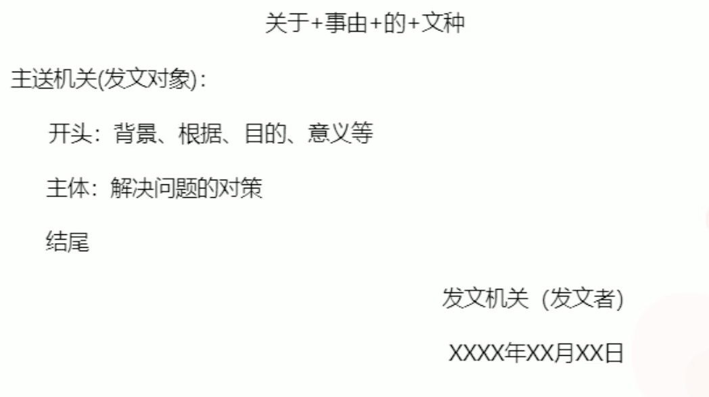
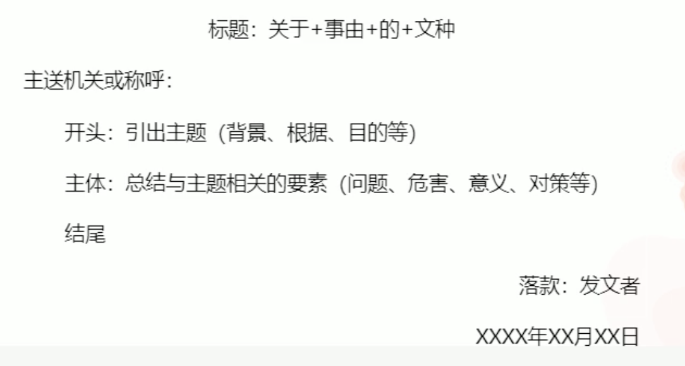
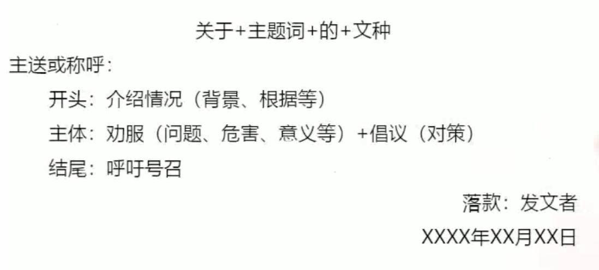
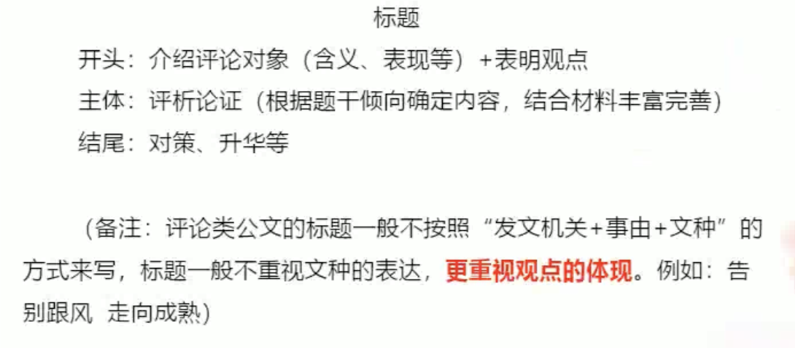

| [博客首页](https://njubroccoli.github.io/blog/) | [个人主页](https://njubroccoli.github.io/) |

# 申论备考经验

分享我在学习粉笔教育李梦圆老师“方法精讲”课程时所做的笔记。

## 学习路线

- 方法精讲：分题型讲解方法，是**由薄变厚**的过程——从不知道自己不知道，到知道自己不知道
- 方法精讲的学习方法：预习（我对于这类题目的解题思路）——听课（老师对于题目的解题思路）——复习（验证一下解题思路理解的程度）
- 系统班告诉我们学习是一个循序渐进的过程：方法——强化——刷题——冲刺

## 方法论

### 大纲总结

- **基本准则：所有的答案来源于材料，我们是材料的搬运工！**
- 答案来源：60%左右的词都是抄材料里的原词（符合题干、表述规范的词），对占30%左右的重复啰嗦不规范的词有准确的归纳（对客户非常好——客户至上），对10%的词的言外之意进行合理推断但不过度（要是瘦一点就更好了——偏胖）
- 语言表达：准确规范、简明畅达
  - 核心要求：**短！**（一个答案用4-5个字就能表达出来，别超过10个字）
  - 更高要求：通顺（小题不要求通顺，只有公文、大作文才需要保证通顺性）

### 答题要素与基本题型

- 单一题（要素明确的题）
  - 要素：问题、原因、影响（意义、危害）、对策等
  - 用时：**25分钟左右**
  - 最低标准：**80%以上**（15分的题拿12分以上，20分的题拿16分以上）

- 综合题（要素模糊的题）
  - 要素：问题、影响（意义、危害）、对策等
  - 用时：**25分钟左右**
  - 最低标准：**国考60%以上、省考70%以上**

- 公文题
  - 在**综合题**的基础上，多了格式和语言要求（得学会“装”）
  - 判定：文种（例如“一则导言”）
  - 要素：问题、影响（意义、危害）、对策等
  - 用时：**40分钟以内**
  - 最低标准：**国考70%以上、省考75%以上**

- 作文题（议论文）
  - 1000-1200字里面的200字当作综合题做（论点+分论点），源于材料；剩下的800-1000字是用于论证的素材（名言、例子等），高于材料，结合实际
  - 用时：**50~60分钟**
  - 最低标准：**70%~80%**（40分的作文，二类文是24-32分，一般给分在28分上下浮动）
    > 字不好看不会扣分，但字好看会加分，仅在大作文酌情加3分左右

### 申论答题步骤

> 所有题型通用！

#### 第一步：全面审题

1. 审作答范围
   - “根据、依据、结合、阅读给定资料X”：**范围就在材料X**
   - “材料X中提到了”：**范围重点在材料X，但要兼顾全部材料**
2. 审作答主题与结构
   - **最关键的一步：预判**——将抽象的作答主题具像化，比如“创作宗旨”是宏大而简练的目标、“艺术追求”是具体的小目标）看资料前认真思考，预判答案内容
3. 审作答要求
   - **准确：**要点来自材料；最好使用材料原词原句，或在原词原句的基础上归纳、概括
   - **全面：**确保关键词无遗漏，宁滥勿缺
   - **简明：**言简意赅，尽量突出关键词，去掉修饰语，避免同义反复
   - **有条理：**分条撰写，要标注序号
   - **层次分明：**建议分类

#### 第二步：资料阅读

1. **摘抄**（60%情况）
   - 例子：“未来，泰山慢谷的建设将有效疏解泰山人流，吸引更多客源，增加游客停留时间，从而带动消费、促进经济腾飞” --> “疏解人流，吸引客源，增加游客停留时间，带动消费，促进经济”
   - **经常出现直接摘抄要点的区域（万能）**
     1. **自然段的首尾段**
     2. 有观点的句子：政府、专家学者、百姓群众、媒体等的观点
     3. 有关联词的句子：转折、并列、因果、递进等
     4. 标点：分号、引号、顿号、破折号等

2. **归纳概括**（30%情况）
   - 例子：“将公共建设方面的投入金额扩大到1000万元，用于改善当地道路、路灯、污水、交通、信息网络等方面的建设” --> “扩大投资，完善基础设施”；“没有剧院或剧场，也没有图书馆，直接导致了老百姓文化生活的短缺。……共同援建了L县中心广场以及当地首座图书馆” --> “援建文娱设施”
     > （1）事例型材料
     >
     > - A：案例一般多为不规范语言，前后若有结论性句子，那才是重点
     > - B：案例一般为叙事性表达，通常要注意故事、案例的经过，即什么人做了什么事得出什么道理
     >
     > （2）数据型资料
     >
     > - A：数据本身非答案，前后若有结论性句子，那才是重点
     > - B：无结论性句子，一般可通过分析，用“多少、大小、高低、快慢、增减、比重”等词描述数量
   - **可以酌情加词（关键词表述多样化），为了得分概率提升，也正因为单个词简洁才能多写一个词！**
3. **分析推导**（10%情况）
   - 例子：材料只给了问题，但要回答对策。“缺乏新意” --> “创新”；“内容雷同低质” --> “提高内容质量”；“不少都是当地出版企业的库存书” --> “引进外地书籍”；“多是上不了院线播映的影片” --> “增加院线影片”

#### 第三步：答案组织

1. **最基本：加序号（除了作文题之外都要，包括公文题）**
   常见的方法是1.2.3.或①②③或一、二、三、
   > 在此基础上，每点答案可以更加均衡，可能可以加一点分

2. **分类整理**
   - 按资料或自然段个数归纳罗列：可根据资料的表述逻辑，通常一段为一个要点；或者一个资料是一个层面
   - **每一点写成总分结构**（有总结词，例如“树立防范意识”、“出台专门法律”）
   > 综合题里是分层，单一题里是分类

## 单一题

### 一、问题

- **常见命题的方式：**问题、不足、困境、瓶颈、挑战、难点等
- **答题技巧：**寻找负面的标志性词汇（不科学、不合理、不到位、不均衡、不完善、不健全、不足、缺乏、缺少、流失、少、低、差、弱、陈旧、单一等）

> 15分的单一题要求不超过150字，15的因数是5或3（更可能是5点）：若分5点，每点30字，刨去序号和标点符号大致有20字，每个词平均5个字，所以可以写4个词左右；若分3点，则每点6-7个词。

> **正确的思维方式：先纵览资料，了解大意，有分类词，然后再有要点，而非颠倒过来，Top-down而不是Bottom-up**
>
> 作文也是按点给分！
>
> 多做题可以提高归纳概括的能力

### 二、影响

> 影响是在一个事情发生之后才有的，**好的影响发生在对策之后，坏的影响发生在问题之后！**
>
> 有些问题、对策看起来也像影响，实在拿不准，就都写

- 常见问法（正面影响和负面影响）
  - 正面影响的常见问法：意义、效果、成果、积极作用等
  - 负面影响的常见问法：危害、后果等
- 答题技巧
  - **提示字：了、着、使、让、……于、能够、可以**
  - 正面影响
    - **直接摘抄：**激发、促进、实现、提升、倒逼……；有利于、有助于、感动着、推动了、巩固了……
    - **通过问题进行推导：**资料中想通过某项举措去解决问题，或者问题已经被措施解决了，可以将问题推导为意义（问题解决了！）
    - **通过目的进行推导：**资料中出现表示目的或目标的信息时，可推导为意义
  - 负面影响：引发、导致、造成、危及、损害……；消解着、割裂着、破坏了、阻碍了、致使……

> 词不够可以加，但必须优先用原词
>
> 单一题不提倡合并，因为非常容易遗漏要点

### 三、对策

- 常见问法
  - 答题元素中代表对策的常见词汇有：对策、措施、举措、建议、意见、做法、解决方法；经验、启示等
  - **概括做法、经验启示：**会抄即可
  - **提出对策：**需要自己根据问题提对策，本身有难度系数，需要有词汇储备
- 答题技巧
  - **直接摘抄：**材料中出现对策标志性动词时，该处往往有得分点。常见的动词有：建立、健全、统筹、创新、规范、整顿、打击、扶持、规划、设置等
  - **问题反推**：解决资料中的现有问题
    - 例子：“中国的工人获得了美国《时代》周刊的认同，却没有在中国获得普遍的认同” --> “提高社会认同感，加强宣传引导，倡导社会尊重工人”
    - **反推的对策优先级**
      1. **常用对策动词+问题名词。**例如，没有非机动车道，反推出增设非机动车道。
      2. **推一步，根据背后的原因推对策**。例如，不认同原因是观念出了问题，观念需要宣传引导。
  - **经验借鉴：**其他地区或国家的成功经验可以拿来借鉴**（由小到大、范围扩大，实现普适性）**
    - 例子：法文->本国语言；议会->有关部门

> 只有在题干或要求中明确要概括问题的时候，才需要写“问题+对策”，否则只需要写对策

## 综合题

> 综合题是词句解释题，是小题里面最难的
>
> 申论是**按词给分**的，不是按意给分的，有时阅卷人拿到的答案有几个可替代的词，命中一个即可
>
> 每3到5个错别字扣1分

### 答题逻辑

1. **释义**
   - 题干：字面含义自己要理解
   - 材料：这句话前后多看看
2. **要素（核心）**
   - 根据题干预判问题、原因、影响等
   - 根据材料找出要点或者梳理逻辑

   > 1.要素各要点要标序号，综合题里面各要素的总结词一般没分，有把握的话可以写
   >
   > 2.有些题目要对词句的两个分句进行对比：“想着懒，而不是懒得想”，需要写“想着懒”的意义和“懒得想”的危害
   >
   > 3.有些题目要对比喻的喻体和本体进行关联：“城市的水系就像指纹一样”，需要解释“城市的水系”和“指纹”像在哪
   >
   > 4.有些问题要对词句多个要点进行分别阐释：“城市建设与管理的目的如果仅仅是为满足经济或某种美观诉求，显然是片面的，甚至是短视而危险的。”，需要解释”片面“在哪，”短视“在哪，”危险“在哪

3. **对策**（未来怎么做）
   - 一定要写！可能占2-3分，也可能不占分
   - 有则抄，没有则反推，还剩多少格就写多少格

> 答题时不要直接写“定义：”、“原因：”、“对策”，而要写“xxx是指……”、“其原因是/具体包括/其意义在于”、“因此，要……”

### 一般评分标准

以20分为例：

- 内容要素：17分
  - 准确判断2分、问题分析12分、解决思路3分
- 逻辑与表达：3分
  - 按照三个层面（层次）表述，重点在分析上，给3分
  - 三个层次缺少了一个层次，给2分
  - 三个层次缺少两个层次，给1分
  - 只要有字就不给0分

> 关于预判
>
> - 单一题：从话题出发预判材料中可能有哪些要点
>
> - 综合题：预判回答思路（定义——展开——对策）

## 公文题

> **判断公文题的唯一标志：有没有要求文种**
>
> 即使有“提纲”，也是跟在文种后面（例如“讲话提纲”），提纲不是文种

### 阅卷要求

- **格式分（0-5分）：**标题、称谓（主送机关）、落款
  > 四种情况下，格式不计分，只需要**标题**即可：
  >
  > - “提纲”
  > - “纲要”
  > - “内容要点”
  > - 明确要求“不必注重格式”
  >
  > **除此之外，必须有完整的格式**

- **语言分（0-3分）：**通俗易懂、表达生动、有感染力、有号召力、态度诚恳、采用建议口吻等
  > 看具体场合，给上级部门或者领导写公文，不需要语气，给群众则需要
  >
  > 重点：在结尾体现出语气！

- **内容分：**问题、危害、意义、对策等

### 公文题格式

- 具体格式
  - **标题（1-3分）**
    - 自拟标题（例如：女神妈祖，天下一家）
    - 一般写法：看给谁写
      - 正式场合（给上级部门等）：发文机关+“关于”+事由+“的”+文种（例如“国务院关于坚决稳定市场物价的通知”）
      - 非正式场合（给读者、游客、群众等）：**自拟紧扣主题的生动的标题**
    - 书法格式：标题要居中书写（不带有书名号）
  - **称谓或主送机关（2分）**
    > 长眼睛就好

    - 称谓：对象为人物（例如：尊重的与会嘉宾、广大家长朋友们）
    - 主送机关：对象为单位（例如：各社区、各街道办）
    - 书写格式：顶格书写
  - **落款（2分）**
    - 单位（个人）写在日期上一行（例如：某企业工会）
    - 日期（例如：2021年XX月XX日或者XXXX年XX月XX日）
    - 书写格式：右下角（落款位于正文右下，日期右空四个格子，发文者以日期为准上方居中）
      

- 公文有无格式对应表

  |                         题目                         | 标题 | 称谓 |     落款     |
  | :--------------------------------------------------: | :--: | :--: | :----------: |
  |               报告、通告、意见、通知等               |  有  |  有  |      有      |
  |                倡议书、公开信、宣传稿                |  有  |  有  |      有      |
  |              经验发言稿、时间处理发言稿              |  有  |  有  | 根据格子确定 |
  |                 时评、网评、新闻稿等                 |  有  |  无  |      无      |
  |                  调查问卷、活动方案                  |  有  |  无  |      无      |
  |                编者按、内容要点、导言                |  有  |  无  |      无      |
  | 提纲、纲要、内容要点、明确要求不写公文格式的命题方式 |  有  |  无  |      无      |

### 公文题分类

> **内容和文种无关，但由写作目的确定**

- **分类的标准（直接决定了内容侧重点）**
  - 方案类：提出未来的对策
  - 宣传类：号召、劝诫
  - 总结类：总结、汇总
  - 评论类：评价、评论

#### 方案类

- 识别方案类公文：为完成工作提出具体可行的对策或者建议
- 典型的方案类公文：指导意见、建议、活动方案等
- 写作框架（25分的题目：背景4分，篇幅占1/3左右，简洁引入，总结问题；对策15分，篇幅占2/3左右；衔接语“对此特提出以下建议”1分）
  

> **最新规则：**文种的提纲，不强调格式，但**在内容上，每一个部分要有总启词**，比如方案类里面，第一段可能是“背景问题：”，第二段可能是“建设意见：”

#### 总结类

- 识别总结类公文：主要目的是把具体情况告知或汇报给某个或者某些对象
- 典型的总结类公文：汇报（提纲）、调查报告、讲话稿、发言稿、编者按、导言等
- **原则：有啥写啥，没啥不答**
- 一般只有两种场景
  - 常规类型（“养猪类”）：背景+经验+（意义）
    > 如果写给老百姓，就加结尾，否则无所谓

  - 非常规类型（“妈祖类”）：根据具体内容而定，有啥写啥
- 写作框架 

#### 宣传类

- 识别宣传类公文：说服、号召、倡导宣传对象采取某些行动或措施
- 典型的宣传类公文：公开信、倡议书、宣传稿等
- **动之以情、晓之以理**
- 写作框架
  

> 注意人称：“我省”、“贵校”，如果是第三方的报道，就用第三人称。可能占1分
>
> 开头两行（最多三行）搞定。

#### 评论类

- 识别评论类公文：目的是对某些社会现象的观点或者评价
- 典型的评论类公文：时评、短评等评论文
- 写作框架
  

  > 短文、短评、时评严格意义上来说属于作文，不标序号，用“首次”、”其次“等；并不是评论类文章就不标序号

> 公文题里有典型例子（少而精或篇幅长）的话，在答案里可以带一嘴：“如xxx公司……”

## 作文题

- 写作文常见的误区
  - 瞎写，写得不**准确**：脱离材料另起炉灶；偷换概念跑题偏题
    > 例如：要求写“黄河的精神”，但通篇写的是“黄河的治理与开发”

  - 没货，写得不**精彩**：挤牙膏；车轱辘话
    > 一大段话全是一个意思，都是正确的废话

  > 观点直接决定作文是几类文（A类33-40分、基准分36分，B类24-32分、基准分28分，C类17-23分、基准分20分，D类9-16分，基准分13分，E类8分以下、基准分5分**（大量抄袭给定资料）**）
  >
  > 同样的观点，精彩程度可以相差5-8分（一个往23分浮动，一个往32分浮动）；**例子以材料外的为主，材料中的例子要少用，用也要放后面一些**
  >
  > **作文和资料的重复度不能超过20%！**
  >
  > 每少50字扣1分

  - 文采不是第一位的，观点才是第一位，不能本末倒置，要做老实人！

  > 观点准了，基本就稳了。

- A类文评分标准
  - 对观点的理解准确、深刻
  - 从给定资料出发，写出自己的切身感受
  - 具有社会实际的例证
  - 思路清晰，语言流畅，文面整洁，字迹工整
- 阅卷思路（20-30秒内打出分数）
  1. 主题和观点
  2. 论据
  3. 结构
  4. 语言

### 高分技巧总结

1. **观点：**准确、全面、明显、价值观正确
   - 准确：和题干给出的语句、词有关系，有个基本方向；然后按照这个方向，回到材料找点
   - 全面：分论点一般是3-6个，尽量写4个（更保险）
2. **论据：**贴切、丰富。材料之内的要改变表述，多用新闻热点、领导人讲话、名人名言与典故
3. **结构：**清晰、完整、自然
4. **语言：**流畅、自然、多用短句、有风格（文采）

### 文章的主题与观点

1. **主题与观点**
   - 主题：**议论对象、写作对象**
   - 观点：希望考生在写作过程中表达出来的**所有重要信息**
   - 实际考试中，找准主题后，可以**从阐释含义、分析原因或意义、危害，提出对策等角度切入展开**，从关系、问题、原因、意义、危害、对策等角度提出观点，并结合资料内容和社会实际例子展开论述。
2. **如何确定作文的主题与观点**
   - **第一步：剖析题干，梳理写作方向**
     - 第一组
       - 以“众筹:金钱之外的价值”为题 --> **主题是众筹，先解释众筹，然后是意义、对策**
       - 以“以水为师”为题 --> **先解释“以水为师”，再论证水有哪些学习的地方，最后对策（如何学习水）**
     - 第二组
       - 深入思考“科学、艺术和古文化对于想象力都起着非常重要的作用，构成了想象力的源泉” --> **重点是三个词的意义**
       - 思考“从某种意义上说，好的政策不仅仅是对公民意愿的满足，更是对公民理性乃至德性的滋养” --> **重点是三个方面的意义**
     - 第三组
       - 有知名学者说“当一件件文物、一幅幅佳作走出高墙深闺，来到寻常百姓中间，虽然它的容颜依旧，它的价值却早已跨越了市场定位，带给百姓的不仅仅是自豪，还有自信，让他们更加坚定地沿着自己民族的道路走向未来”。 --> **一句句剖析：文化共享和传承、文化的市场价值、增强文化自信、提出对策**
       - 思考“跟着时代的大潮往前走，尽到我所有的力量，做好我要做的事情” --> **时代的大潮、奋斗、使命/报国**
     - 第四组
       > 给出两个词语，**第一步要说A是什么、B是什么，**A和B的关系是什么，二者关系是好还是不好，**关系好就有意义，关系不好就有问题和危害；第二步至少有两个分论点，第三步怎么办、对策。**
       - “有”与“无”
       - “标准化与个性化”
   - **第二步：梳理资料挖掘观点 + 丰富观点表达**
     - **优先阅读：**指定资料、小题未涉及资料、权威资料
     - **关照全篇：**小题提示（题干、答案）、全部给定资料
     > 各个要点放在开头、标题和各段首句 

> 60分钟里面，先花10-15分钟时间找观点、列提纲，再花45-50分钟写作文，先想后写而不是边想边写，绰绰有余。
>
> 一类文的观点在二类文的基础上，更加深刻，围绕资料里的观点多开了一些“脑洞”
>
> 题目抽象，写的也要抽象；题目具体，写的也要具体。见招拆招。

### 作文的结构

- 文章结构是文章的谋篇布局，形式上一般而言包括**标题、开头、分析论证、结尾**等基本构成部分。
  - 标题、开头：凤头（眼前一亮、留下深刻印象、主旨明显）
  - 结尾：豹尾（简短、升华）
  > **5段3分法：不要用！模版化明显！**

- **核心：文无定式**（不要想着套模版！）
  - 一般情况下，作文分6-8段
  - 开头：150字左右
  - 结尾：150字左右
  - 中间：4-5段，每段150-200字，分论点可以自由分布
  - **可以适当加过渡段（例如从开头到分析，从分析到对策，从对策到结尾），承上启下，让文章更加流畅**

#### 文章标题写作方法

- 大前提：**15字以内的论点式标题**，应包含文章主题和观点
- 常规型标题
  - 把简政放权做实做好
  - 担起防治污染的主体责任
  - 迈好“科技强国”的坚实一步
- **比喻式标题**（最推荐，但比喻要贴切）
  - 政府公开进入“快车道”
  - 绘好科技创新的“工笔画”
  - 家教是孩子最好的“营养剂”
  - 做好公共管理“加减法”
  > 经济相关：动力、引擎、马达、发电机、三驾马车、火车头……
  >
  > 文化相关：纽带、沃土、源头活水、春风、润物无声……
  >
  > 民生治理：保护伞、一把锁、传声筒、压舱石、定盘星……
  >
  > 治理贪污腐败：一把利剑、良方、猛药去疴

- 警醒式标题（话题揭露问题时可用）
  - 莫让诗词“热”一时
  - 莫让“丧文化”伤了孩子
  - 新闻，不要以伤害为代价
  - 文化艺术，勿以传统反现代
- **对称式标题**（动词+主题词）
  - 以礼立人 以礼立国
  - 身在急时代 心享慢生活
  - 开放文化资源 促进共享传承
  - 弘扬优良家风 助力中国腾飞
  - 勇于自我革命 战胜风险挑战
- 主副式标题（主标题太宽泛时，补充具体主旨）
  - 试探”有“与”无“（换行居中）——城市建设理念的辩证法
  - 不患寡而患不均（换行居中）——以制度建设保障教育公平

#### 文章开头写作方法

- 作用：背景铺垫、引出主题，点明或阐释主题，引出文章后续观点
  > 文章开头可用是1个段落，也可根据实际情况拆分成2个段落

- **阐释式**——主题抽象时开篇必须进行解释！
  > 150字=3句话=重复题干句子+解释这句话+中心论点

  - 解释的时候不能用“这句话是指”，太刻板，可以写“换言之”、“的确”
- **评论式**——分析、评论观点或划线句子观点错误
  - 赞同：可以写“深以为然“ 、”非常赞同”
  - 反对：可以写“这是可笑、荒谬的”

- **总结式**
  - 社会背景+很重要（有利于、有利于、有利于）/很严重（可喜的是，可悲的是）+中心论点

#### 文章论证介绍

**论证结构：论证=观点+阐释+举例+引言+总结回扣中心论点**

- 每段150-200字，所以共有4-5句话
> **一些套路：例子多用引号、分号、省略号，要用排比句、四言八句，名次不变变动词，动词不变变名词**

- **论据**
  - 事实论据：社会热点、经典故事、数据、调查报告、新闻报道
  - 理论论据：名人名言、俗语俚语、领导人讲话、理论政策、客观规律、科学原理、论著文章
- **素材积累的丰富：用而不是背（分领域总结、挑短不挑长）**
  - 经济、政治、社会、文化、生态话题
  - 不要强背例子而增大记忆负担，要记好懂的、读三遍就能记住的
- **素材积累的来源：过往申论资料（宝库）+粉笔晨读热点**

#### 文章结尾写作方法

- **核心：升华**
  - 第一种：词的升华（社会治理现代化、提升民众幸福感、中国梦……）
  - 第二种：情感升华（大有可为，大放异彩！/我相信……/让我们……）
- **总结式结尾**
- **展望式结尾**
  - 我相信/期待/盼望/希冀/有理由相信/梦想/坚信/……，在党和国家的号召下，在广大人民群众的努力下，……
- **呼吁号召式结尾**
  - 让我们一起……

> 作文很好学，最终影响得分的还是观点的准确性

