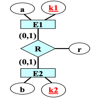

# 数据库期末复习整理（基于提纲）

## 第一章 数据库系统概述

### 1.1 基本概念

- **数据库（DB）**：是数据集合，具有统一的结构形式并存放于统一的存储介质内，它由多种应用数据集成，并可被应用所共享。
- **数据库管理系统（DBMS）**：位于用户与操作系统（OS）之间的一层数据管理软件，为用户或应用程序提供访问数据库的方法和接口。
	+ 能对持久性数据进行管理
	+ 能对大量数据进行有效存取
	+ 可为众多使用者使用同一数据（即数据共享）
- **数据库系统（DBS）**：是一个以对海量的、具有复杂数据结构的、可以持久保存的、可供多用户共享的数据进行统一管理为目标的计算机系统。
	+ 组成部分：数据库、数据库管理系统、数据库管理员、软件平台、硬件平台
- **数据库管理员（DBA）**：对数据库进行规划、设计、维护、监视的专职人员
	+ 数据库设计、建立与调整
	+ 数据库维护
	+ 改善系统性能，提高系统效率
- **数据子语言**：数据定义语言（DDL）、数据操纵语言（DML）、数据控制语言（DCL）

### 1.2 数据库系统的特点

- **数据集成化**：集多种应用数据于一体。采用统一的数据结构，建立一个全局统一的数据模式，根据每个应用的数据需要构作局部模式。
- **数据独立性**：指数据库中的数据与使用这些数据的应用程序之间的互不依赖性，即数据或数据结构的改变不会导致对使用这些数据的应用程序的修改，反之亦然。
	+ **物理独立性**：数据的物理结构（包括存储结构、存取方式等）的改变，不影响数据库的逻辑结构，从而不致引起应用程序的变化
	+ **逻辑独立性**：数据库总体逻辑结构的改变，如修改数据模式、增加新的数据类型、改变数据间联系等，不需要相应修改应用程序
- **数据共享**：可供多个应用程序使用，并可用于不同的目的；可以在已有的数据库系统上开发新的应用程序；可向外界提供信息服务功能。
- **数据冗余**：同一个数据在不同的地方出现了重复存储
- **数据的完整性检查**：对数据库中数据正确性作检查以保证数据的正确。
- **数据的安全性保护**：对数据库访问者作检查以防止非法访问。
- **并发控制**：对多个应用并发访问所产生的相互干扰作控制以保证其正确性。
- **故障恢复**：对遭受破坏的数据具有恢复能力，使数据库具有抗破坏性。

### 1.3 数据库内部体系结构

- **数据模式**：数据库系统中数据结构的一种表示形式，它具有不同的层次与结构方式
- **三级模式**：概念模式、外模式（用户模式、子模式）、内模式（物理模式）
	+ **概念模式：是关于整个数据库中数据的全局逻辑结构的描述。**是面向数据库系统的，它一般以某种数据模型为基础，利用具体的DBMS所提供的数据定义语言（DDL）来描述：
		- 数据的类型、长度、特征
		- 数据间的联系
		- 安全性、完整性等方面的要求
	+ **外模式：是关于某个（组）用户所需数据的逻辑结构的描述。**可由概念模式推导而出，是概念模式的一个子集。一个概念模式可对应着多个外模式。
		- 简化用户接口，便于使用
		- 降低数据冗余度
		- 有利于数据的安全性保护和保密
	+ **内模式：是关于数据库中数据的物理存储结构和物理存取方法的描述。**
	+ 只有物理数据库真实存在于外存中，其它由物理数据库通过DBMS构造而成。
- **二级映射**
	+ **概念模式到内模式的映射**：该映射给出了概念模式中数据的全局逻辑结构到数据的物理存储结构间的对应关系，此种映射一般由DBMS实现。**可实现“物理独立性”。**
	+ **外模式到概念模式的映射**：该映射给出了外模式与概念模式的对应关系，这种映射一般也由DBMS实现。**可实现“逻辑独立性”。**

## 第二章 数据模型

### 2.1 数据模型的基本概念

- **数据模型**：描述数据的结构，定义在该数据结构上可以执行的操作以及数据之间必须满足的约束条件。**组成成分**：数据结构、数据操作、数据约束。
	+ **数据结构（也称为数据模式）**：描述数据的类型、内容、性质以及数据间的联系。**是划分不同类型数据模型的依据。**
	+ **数据操作**：在相应数据结构上可以执行的操作类型与操作方式
	+ **数据约束**：主要描述数据结构内数据间的相互关系，包括：数据间的语法/语义联系、数据间的制约与依存关系、数据（间）的动态变化规则，其目的是确保数据的正确、有效与相容。
	+ **数据模型的核心：数据结构**
- 三个抽象层次上的数据模型概念
	+ **概念数据模型**：是一种面向客观世界和用户的模型，与具体采用的DBMS及计算机实现无关。举例：E-R模型、EE-R模型、面向对象模型、谓词模型
	+ **逻辑数据模型**：着重于数据模型在数据库系统一级的实现，即利用具体的DBMS所提供的工具（DDL）来定义的数据模型。是一种面向数据库系统的模型，概念数据模型只有在转换成逻辑数据模型后才能在数据库中得以表示。分类：结构化与非结构化。
	+ **物理数据模型**：用于描述数据是如何在计算机中进行存储，如何表达记录结构、记录顺序和访问路径等信息。给出了数据模型在计算机内部的真正物理实现结构，是一种面向计算机物理实现的模型。也向用户提供了一些与物理存储结构和存取方法有关的定义功能：索引、集簇、存储区域的选择。

### 2.2 用户模型的四个世界

- **现实世界**：在客观世界中根据用户的需求目标而划定边界的一个应用环境。为整个转换过程提供了客观基础与初始启动环境。
- **概念世界**：以现实世界为基础作进一步的抽象而形成的概念模型。DB设计人员进行用户需求分析，形成一些基本概念与基本关系，并用某一种概念数据模型中所提供的术语和方法来统一表示。**概念世界与具体的DBMS和计算机无关。**
- **信息世界**：以概念世界为基础，选用特定的DBMS构造而成的逻辑数据模型。**信息世界与具体的DBMS有关。**
- **计算机世界**：基于逻辑数据模型在计算机中的物理实现而形成的物理数据模型。侧重于数据库物理存储结构的描述，是DB的最终实现结构。

### 2.3 概念世界与概念模型

- **E-R模型与E-R图**
	+ 最核心的三个概念：**实体（矩形）、属性（椭圆形）、联系（菱形）**
		- **实体**：客观存在且又能相互区别的事物。是对现实世界中的客观事物的抽象，是概念世界中的基本单位。
		- **属性**：实体所具有的某种特性或特征，属性可以有值。可以取的值的集合，被称为该属性的域 (domain)。
		- **联系**：一个实体集中的实体与另一个实体集中的实体之间存在着某种对应关系。在概念世界中，我们用两个实体集的联系来反映它们之间的这种关系。
			+ 两个实体集间的联系（二元联系）
			+ 多个实体集间的联系（多元联系）
			+ 单个实体集内部的联系
	+ 基本概念之间的连接关系
		- **实体集（联系）与属性间的连接关系**
			+ 属性的描述：属性名
			+ 实体的描述：实体名+实体型（实体中的所有属性名所构成的集合）
			+ 实体集的描述：实体名+实体型+关键字（区分同一个实体集中不同实体的 ‘最小属性集合’）
		- **联系与实体集间的连接关系**
			+ 联系名
			+ 联系的属性
			+ 函数对应关系
		- 连接关系的表示：无向线段
- **EE-R模型与EE-R图**
	+ **IS-A联系**
		- 如果实体集B是实体集A 的一个子集，且具有比实体集A更多的属性，则我们称在实体集A与实体集B之间存在着一种特殊的‘IS-A联系’。其中实体集A被称为超(实体)集，实体集B被称为子(实体)集。子集B可以通过IS-A联系继承超集A中的所有属性。
		- **表示方法：用从‘子实体集’指向‘超实体集’的单向箭头表示**
		- 继承性与传递性
		- 覆盖约束、不相交约束
	+ **弱实体**
		- 如果一个实体A的存在需要依赖于其他某个实体的存在，那么实体A被称为弱实体。弱实体(集)与所依赖的实体(集)之间的函数对应关系通常应该是“多对一”的关系。
		- **表示方法：从弱实体到联系的有向箭头**
	+ **属性划分**
		- 属性基数：可以用一个二元组 (x, y) 来描述一个实体在该属性上的取值数量特征。
		- 标识符：关键字或候选关键字
		- 描述符：非关键字的属性
		- 组合属性：用于描述实体或联系的性质的简单属性的集合
		- 多值属性：一个对于单个实体呈现多个值的属性
- **面向对象模型**
	+ **对象**：客观世界中能够相互区别开来的事物。OO模型中的最基本的概念。
	+ **对象标识符（OID）**：每个对象均具有的一个能相互区别的名字
	+ **方法**：是可以作用在对象上的一段程序。用于反映对象的行为特征，是对象的固有动态行为的表示，可用于审视并改变对象的内部状态（属性值）。
	+ **类**：具有相同属性、方法的对象集合。可以被抽象成一个对象，我们称其为‘类对象’或实例。
	+ **超类和子类**：IS-A关系（继承）
	+ **类的聚合与分解**：IS-PART-OF关系

### 2.4 信息世界和逻辑模型

- 关系模型
	+ 基本数据结构：二维表，简称‘表’
	+ 数据操纵：建立在二维表上的操作，包括查询、删除、插入、修改
	+ **关系**：由行和列组成的二维表格
		- 同一表中的属性名各不相同
		- 表中的属性与属性的排放次序无关
		- 表中的元组均不相同
		- 表中的元组与元组的排列次序无关
		- 表中的每一分量必须是一个不可分割的基本数据项
	+ **元组**：关系中的每一行
	+ **关系数据库模式**：该关系数据库中所有关系的关系模式的集合
	+ **关键字**：关系中的一个属性集的值能唯一标识关系中的一个元组，且又不含多余的属性值，则称该属性集为该关系的关键字。一个关系也可以有多个关键字，所以关键字也被称为‘候选关键字’。
		- **主关键字**：可以从关系的候选关键字中选取一个作为该关系的主关键字
		- **外关键字**：设关系R中的属性集F，其取值来自于关系S中的主关键字K，则称属性集F是关系R的外关键字。关系R和关系S可以是同一个关系。 
	+ **五种基本操作：属性指定、元组选择、关系合并、元组插入、元组删除**

### 2.5 计算机世界与物理模型

- 逻辑模型的数据存储
	+ **项**：文件系统中最小基本单位，项内符号是不能继续分割的。
	+ **记录**：由若干项组成，记录内的各项间有内在语义联系
	+ **文件**：记录的集合
	+ **索引**：将文件中的记录与其物理地址(即磁盘块)间建立一张对应关系表以便于快速查找。可以有多级索引。**B+树是关系数据库的物理实现中最常用的一种多级索引技术。**
	+ **HASH法**：一种函数转换法。通过一个hash函数将要查找的记录转换成该记录所在的物理地址，然后可以直接进行记录的定位读取操作。
	+ **集簇**：在记录查找中往往需要按某项的项值查找，将具有相同或相邻项值的记录聚集在相同磁盘块内或圆柱体内以减少读盘次数，提高查找速度。

## 第三章 关系数据库系统

### 3.1 关系数据库系统概述

- 关系型数据库的优点
	1. 数据结构简单（二维表）
	2. 使用方便（不涉及内部物理结构，非过程性数据子语言）
	3. 功能强
	4. 数据独立性高
	5. 理论基础深（关系代数、关系演算）
	6. 可移植性好
	7. 标准化程度高（SQL语言标准的制订）
	8. 分布式功能（Client/Server、Browser/Server、分布式数据库）
	9. 开放性
	10. 其他方面的功能拓展

### 3.2 关系数据库系统的衡量准则

- **完全关系型的十二条衡量准则**
	1. **信息准则**（关系数据库的所有信息都应能在逻辑一级唯一地用‘表’中的值显式表示）
	2. **确保访问准则**（应能保证用逻辑方式依靠表名、关键字值与列名的组合来访问数据库中每一个原子数据）
	3. **空值的关系处理准则**（系统应该具有处理空值的能力）
	4. **基于资源管理的动态联机目录**（数据库的描述信息（数据字典）与用户数据具有相同的表示形式与操作方式）
	5. **统一易用的数据子语言**（至少有一种数据子语言能全面支持下列功能：数据定义、视图定义、数据操纵、完整性约束能力、授权机制、事务处理能力）
	6. **视图更新准则**（通过视图不仅可以查询，还可以执行对数据的增、删、改等操作）
	7. **高级的插入、删除及修改操作**（一条命令可以插入、删除及修改操作多条元组）
	8. **物理数据独立性**
	9. **逻辑数据独立性**
	10. **数据完整性准则**（提供三类数据完整性约束的定义功能）
	11. **分布独立性**（数据分布的改变不影响原有的应用程序）
	12. **无损害原则**（对提供低级数据子语言的要求）

- **空值（NULL）的定义**：**无意义**或**当前未知**的值。

### 3.3 关系模型数学理论—关系代数

- **关系模型**
	+ **关系数据结构**
		- **表结构**：表框架由n个命名的**属性（Attribute）**组成，n被称为表的**元数**（n元表）。每个属性有一个取值范围, 被称为该属性的**值域(Domain)**。中的每一行数据被称为一个**元组（Tuple）**。一个表框架可存放m个元组，m被称为表的**基数(Cardinality)**。
		- **关系**：对二维表的一种抽象，是关系模型的基本数据单位。设关系的名为$R$，其属性名为$A_1, A_2, \dots, A_n$, 则该关系的框架是：$R(A_1, A_2, \dots, A_n)$。
			+ **关系的性质**
				1. First Normal Form Rule（不能有多值属性）
				2. Content Only Rule（行和列的无序性）
				3. The Unique Row Rule（不能有完全相同的两行）
		- **关键字**：在二维表中能唯一最小标识元组的属性集
			+ **候选键**：候选关键字（关键字不一定唯一）
			+ **主键**：在一张二维表的所有候选键中，被选中的一个候选键
			+ **外键**：如果表A中的属性集F是表B的键，则称该属性集F为表A的外键。表A被称为**引用表**，表B被称为**被引用表**，表A和表B可以是同一张二维表。
			+ **关系数据库：关系子模式-视图**
	+ **关系操纵**
		- **数据查询**：两个关系的合并、单个关系内的元组选择（选择满足指定条件的元组）、单个关系内的属性指定（选择结果所需要的属性）
		- **元组删除**：确定被删除的元组（满足给定逻辑条件）、执行删除操作（一次删除操作只能删除一个关系内的元组）
		- **元组插入**：在指定关系中插入一个或多个新的元组（一条数据插入操作只能向一个关系中增加新的元组）
		- **元组修改**：在一个关系内修改指定元组的某些列上的值（即修改某些元组分量的值）。数据修改操作不是一个基本操作，其功能可以由删除+插入实现。
		- **关系模型上的五种基本操纵功能**：元组选择、属性指定、两个关系的合并、元组插入、元组删除
		- **空值处理**
			+ 关系的主键中不允许出现空值
			+ 在算术表达式中如出现空值，则其运算结果也为空值；在逻辑运算表达式中如出现空值，则其运算结果为逻辑假
			+ 在作SUM，AVG，MAX，MIN或COUNT统计操作时，集合中的空值元素是不统计在内的。对空集作SUM，AVG，MAX或MIN统计操作时，其统计结果均为空值。对空集作COUNT统计操作时，其统计结果为0。
	+ **关系中的数据约束**
		- **实体完整性约束**：主键中的属性不能有空值
		- **参照完整性约束**：外键要么取空值，要么是被引用表中当前存在的某元组上的主键值
		- **用户定义的完整性**：用户自己定义的属性取值约束
- **关系的表示**
	+ $n$元关系$R$是一个$n$元有序组的集合
	+ 设$n$元关系$R$的属性域分别是$D_1,D_2,\dots, D_n$，那么这$n$个域的笛卡儿乘积也是一个$n$元有序组的集合，并且与$n$元关系$R$存在如下联系$R\subseteq D_1\times D_2\times\dots\times D_n$

- **关系操纵的表示**
	+ **关系代数中的五种基本运算**
	
	| 关系上的五种基本操作 | 关系代数中的五种基本运算 |
	| ----- | ----- |
	| 元组选择 | 选择运算 |
	| 属性指定 | 投影运算 |
	| 关系的合并 | 笛卡儿乘积 |
	| 元组的插入 | 并运算 |
	| 元组的删除 | 差运算 |
	
	+ **每种运算的执行条件和结果关系**
		- **并运算**：条件：参与运算的两个关系必须是**同类关系**（具有相同的属性个数，且对应列所表示的属性应具有相同的值域）。结果：关系模式不变，由所有属于关系$R$或属于关系$S$的元组所组成的集合。
		- **差运算**：条件：参与运算的两个关系必须是同类关系。结果：关系模式不变，由所有属于关系$R$但不属于关系$S$的元组所组成的集合。
		- **投影运算**：$\pi_{B_1,B_2,\dots, B_m} (R)$，其中$B_i\in\{ A_1,A_2,\dots, A_n \} (i=1,2,\dots,m)$。结果：是一个由$B_1,B_2,\dots, B_m$所组成的$m$元关系。关系$R$中的每个元组$t$在$B_1,B_2,\dots, B_m$这$m$个属性上的取值$t_1,t_2,\dots, t_m$构成结果关系中的一个元组。
		- **选择运算**：$\sigma_F(R)$，根据给定的条件$F$从关系$R$中选出符合条件的元组。结果：结果关系的关系模式不变，由属于关系$R$且满足条件$F$的元组所组成。【<u>投影运算不满足交换律而选择运算满足，投影运算和选择运算不能相互交换</u>】
		- **笛卡儿乘积**：设关系$R$和$S$分别有$n$和$m$个属性，即：
$R(A_1,A_2,\dots, A_n)$和$S(B_1,B_2,\dots, B_m)$
则它们的笛卡儿乘积$T = R\times S$有$(n+m)$个属性，即：$T(A_1,A_2,\dots, A_n, B_1,B_2,\dots, B_m)$。若关系R和S分别有$p$和$q$个元组，那么它们的笛卡儿乘积中就含有$(p\times q)$个元组。【<u>笛卡儿乘积满足交换律和结合律</u>】

- **关系模型与关系代数**：由关系的集合$A$及关系间的五种基本运算（$\pi, \sigma, \times, \cup, -$）所构成的代数系统被称为**关系代数**。

- **关系代数中的扩充运算**
	+ **扩充运算**
		- **交运算**：条件：同类关系。结果：关系模式不变，由所有既属于关系$R$也属于关系$S$的元组所组成的集合。
		- **除运算**：设关系$R$和$S$的关系模式(即它们的属性集)分别是$\textrm{Head}(R)$和$\textrm{Head}(S)$。运算条件为$\textrm{Head}(S)\subset\textrm{Head}(R)$。假设$\textrm{Head}(R)=\{A_1,A_2,\dots,A_n,B_1,B_2,\dots,B_m\},\textrm{Head}(S)=\{B_1,B_2,\dots,B_m\}$。在结果关系中，令$T=R\div S$，则$\textrm{Head}(T) = \textrm{Head}(R) – \textrm{Head}(S) = \{ A_1,A_2,\dots,A_n \}$。结果元组是关系$S$中的所有元组在关系$R$中所对应的同一个值。
			+ 若$R=T\times S$，则$T=R\div S$且$S=R\div T$。若$T=R\div S$，则$T\times S\subseteq R$。
			+ $R\div S=\pi_{A_1,\dots,A_n}(R)-\pi_{A_1,\dots,A_n}((\pi_{A_1,\dots,A_n}(R)\times S)-R)$
		- **联接运算**：$R\underset{F}{\Join}S$，又称$\theta$－联接运算，可以将关系$R$和关系$S$根据联接条件$F$合并为一个关系。$R\underset{F}{\Join}S=\sigma_F(R\times S)$
		- **自然联接运算**：根据两个关系中的同名属性（公共属性）进行等值联接。条件：要求关系$R$和关系$S$有公共属性即$\textrm{Head}(R)\cap\textrm{Head}(S)\neq\emptyset$。设设有关系$R$和$S$，$R$有属性$A_1, A_2, \dots, A_n$，$S$有属性$B_1, B_2, \dots, B_m$, 它们之间的公共属性为$A_1, A_2, \dots, A_j$与$B_1, B_2, \dots, B_j$。则$R\Join S=\pi_{A_1,A_2,\dots,A_n,B_{j+1},B_{j+2},\dots,B_m}(\sigma_{A_1=B_1\wedge A_2=B_2\wedge\dots\wedge A_j=B_j}(R\times S))$
		- **外联接运算**：对于不满足自然联接选择条件的元组中某个值，保留为NULL。

- **关系代数的应用**

- **关系演算**
	+ **一阶谓词演算**
		- 谓词：一种由一个谓词标识符号$P$和若干个(个体)变元$x_1, x_2, \dots, x_n$所组成的符号。如$P(x_1,x_2,\dots,x_n)$。谓词是一个能够根据变元的取值来判断其是否成立的逻辑表达式，相当于一个带有变量的命题公式。
		- 指派：设变元$x_1,x_2,\dots,x_n$分别取值$v_1,v_2,\dots,v_n$，则$(v_1,v_2,\dots,v_n)$称为谓词$P(x_1,x_2,\dots,x_n)$的一个指派。成真指派/成假指派
	+ **关系的表示**
		- 元组关系演算：$R=\{t|P(t)\}$用来描述（表示）由谓词$P(t)$的所有成真指派所构成的元组集合。可简写为$P(t)$。
		- 域关系演算：$R＝\{ <x_1,x_2,\dots,x_n> | P (x_1,x_2,\dots,x_n) \}$
，其中，$x_1,x_2,\dots,x_n$是谓词$P (x_1,x_2,\dots,x_n)$中的所有自由变元。
	+ **原子公式、公式的定义**
		- 原子公式
			1. 谓词$R(t)$是原子公式
			2. $u(i)\theta v(j)$是原子公式（其中：$u$，$v$是两个元组变量，$u(i)$代表元组$u$在第$i$个属性上的值，$v(j)$代表元组$v$在第$j$个属性上的值，$\theta$是比较运算符）
			3. $u(i)\theta a$是原子公式（其中$a$是常量）
		- 公式
			1. 原子公式是公式
			2. 如果$\varphi_1,\varphi_2$是公式，则$(\varphi_1\wedge\varphi_2),(\varphi_1\vee\varphi_2),(\varphi_1\rightarrow\varphi_2)$及$(\neg\varphi_2)$均为公式
			3. 如果$\varphi$是公式，$\varphi$中有自由变元$r$，则$\exists r(\varphi),\forall r(\varphi)$均为公式
			4. 公式由且仅由上面三种方式通过有限次组合构成
	+ **关系代数与关系演算的对应关系**
		- 用关系演算表示关系代数$R\cup S=\{t|R(t)\vee S(t)\}$$R-S=\{t|R(t)\wedge\neg S(t)\}$$\sigma_F(R)=\{t|R(t)\wedge F\}$$\pi_{A_{i_1},A_{i_2},\dots,A_{i_k}}(R)=\{u^{(k)}|\exists t(R(t)\wedge u(1)=t(i_1)\wedge u(2)=t(i_2)\wedge\dots\wedge u(k)=t(i_k))\}$$R\times S=\{t^{(m+n)}|\exists u^{(m)}\exists v^{(n)}(R(u)\wedge S(v)\wedge t(1)=u(1)\wedge\dots$$\wedge t(m)=u(m)\wedge t(m+1)=v(1)\wedge\dots\wedge t(m+n)=v(n))\}$
		- 用关系代数表示关系演算：假设有两个公式$\varphi_1$和$\varphi_2$，以公式$\varphi_1$作特性构造出来的元组集合对应着关系$R_1$，以公式$\varphi_2$作特性构造出来的元组集合对应着关系$R_2$。
			+ $\varphi_1\wedge\varphi_2$：当两者有公共变元时，等价于$R_1\Join R_2$；当两者无公共变元时，等价于$R_1\times R_2$。
			+ $\varphi_1\vee\varphi_2$：等价于$R_1\cup R_2$。
			+ $\varphi_1\rightarrow\varphi_2$：等价于$R_2\div R_1$。
			+ $\neg\varphi$：设公式中有$n$个自由变元，其值域分别为$D_1, D_2, \dots, D_n$，以公式$\varphi$作特性构造出来的元组集合对应着关系$R$，则公式$\neg\varphi$所对应的关系代数表达式是：$(D_1\times D_2\times\dots\times D_n)-R$。
			+ $\exists r(\varphi)$：以公式$\varphi$作特性构造出来的元组集合对应着关系$R$，公式$\exists r(\varphi)$中的自由变元分别是：$A_1, A_2, \dots, A_k$，则$\exists r(\varphi)$等价于：$\pi_{A_1, A_2, \dots, A_k} (R)$。
			+ $\forall r(\varphi)$：以公式$\varphi$作特性构造出来的元组集合对应着关系$R$，由受全称量词约束的变元$A_1, A_2, \dots, A_m$（关系$R$中的属性）构成关系$S$。
	+ **基于关系演算的数据查询表示**
		- 所有目标属性均以自由变元形式出现，其它属性以约束变元形式出现。一般情况下我们使用存在量词对变元作约束，根据题目的需要也可以使用全称量词来约束变元。
		- 检索条件(元组选择条件）以合取形式(逻辑与）与谓词相联结。
		- 当变元与常量进行相等比较时，可以用常量值代替变元直接出现在谓词中。
		- 关系的联结
			1. 可以通过相关谓词的逻辑与运算$\wedge$实现两个关系的笛卡儿乘积：$R(p)\wedge S(q)$
			2. 在1的基础上再通过选择条件$F$实现两个关系的$\theta$-连接：$R(p)\wedge S(q)\wedge F$
			3. 可以通过两个谓词中的公共变元（同名变元）实现两个关系的自然连接：$R(x,y,z) \wedge S(y,u,v)$

### 3.4 关系数据库语言SQL’92

- **SQL概貌**
	+ **基本概念** 
	+ **使用方式**：自含式（独立的交互式命令行语言）；嵌入式（嵌入到某种高级程序设计语言（即主语言）中使用），可通过嵌入式SQL与函数调用。

- **SQL数据定义功能**
	+ SQL数据类型 
	+ 基表的创建命令
	
		```
		CREATE TABLE tablename (
			colname datatype [NOT NULL]
			{, colname datatype [NOT NULL]}
		);
		```
		
	+ 基表的修改命令

		```
		ALTER TABLE <基表名> ADD <列名> <数据类型>;
		ALTER TABLE <基表名> DROP <列名>;
		```
		
	+ 基表的删除命令

		```
		DROP TABLE <基表名>;
		```
	
- **SQL数据操纵功能**
	+ **SQL语言与关系代数的关系**
		- 关系代数$\pi_{A_1,A_2,\dots,A_m}(\sigma_F(R_1\times R_2\times\dots\times R_n))$对应于SQL语言

			```
			SELECT A1, A2, ..., Am
			FROM R1, R2, ..., Rn
			WHERE F
			```
		
		- 设$\textrm{Head}(R) = \{A_1, \dots, A_n, B_1, \dots, B_k \}, \textrm{Head}(S) = \{ B_1, \dots, B_k, C_1, \dots, C_m \}$，则关系代数$\pi_{A_1,A_2,\dots,A_m}(\sigma_F(R \Join S))$对应于SQL语言

			```
			SELECT A1, A2, ..., Am
			FROM R, S
			WHERE F and R.B1=S.B1 and R.B2=S.B2 and ... and R.Bk=S.Bk
			```
	+ **映像语句的结构**

		```
		SELECT * | colname {, colname ...}
		FROM tablename {, tablename ...}
		[ WHERE search_condition]
		[ GROUP BY colname {, colname ...}
		[ HAVING group_condition ]]
		[ ORDER BY colname [ASC|DESC] {, colname [ASC|DESC] ...}]
		```
		
	+ **基本查询功能**
		- **DISTINCT谓词**：可以要求数据库管理系统对查询结果进行结果元组的**去重**处理
		- **LIKE谓词**：`column [NOT] LIKE val1 [ ESCAPE val2 ]`其中`val1`是模版，下划线`_`可以匹配任意一个字符，百分号`%`可以匹配长度为0或有长度的任意字符串，其它字符只能匹配其自身。`val2`是转义指示字符，紧跟在转义指示字符`val2`之后的`_`或`%`（包括转义字符自身）不再是通配符，而是其自身。
		- **IS [NOT] NULL谓词**：是否为空
		- **多表联接查询**：在WHERE子句中，通过两个属性之间的相等比较实现表与表之间的连接。
		- **表的自联结查询**：在查询中，有时需要对相同的表进行连接。为了区分两张相同的表，必须在FROM子句中至少对其中之一进行换名（即定义别名），以区分开这两张表。
	+ **嵌套查询**
		- **IN谓词**：标量与集合量之间的属于比较。`expr  [ NOT ] IN ( subquery )`
		- **SOME/ANY/ALL谓词**：限定比较谓词，标量与集合中元素之间的量化比较。`expr \theta SOME|ANY|ALL ( subquery )`
		- **EXISTS谓词**：是否为空集的判断谓词。`[ NOT ] EXISTS ( subquery )`
		- **独立子查询**：嵌套查询中的子查询只需要被执行一次，然后利用所获得的中间查询结果来计算外层的查询语句（由内到外）
		- **相关子查询**：在子查询中调用了外层查询中的表及其元组变量。随着外层元组变量的每一次的取值变化，都需要重新执行子查询以获得相关的中间查询结果（由外到内）
	+ **字查询之间的并、交、差运算**

		```
		<subquery1> UNION [ALL] <subquery2>
		<subquery1> INTERSECT [ALL] <subquery2>
		<subquery1> EXCEPT [ALL] <subquery2>
		```
		
	+ **统计查询**
		- count统计
			+ `count(*)`：返回集合中的元组个数
			+ `count(colname)`：返回在colname属性上取值非空的元组个数
			+ `count(distinct  colname)`：返回colname取值非空且互不相同的元组个数
		- SUM, AVG, MAX, MIN统计
		- **分组统计查询**
			+ `GROUP BY colname {, colname ... }`根据属性colname的取值的不同，将满足WHERE条件的元组划分为不同的集合。此时根据SELECT子句进行统计，每一个小组(group)都单独进行统计，一个小组产生一条结果元组。
			+ `HAVING group_condition`只有满足条件group_condition的元组集合才会被保留下来，用于生成最终的查询结果。

- **SQL的更新功能**
	+ **元组删除**

		```
		DELETE FROM table_name
		[ WHERE search_condition ];
		```
		
	+ **元组插入**

		```
		INSERT INTO tabname [( colname {, colname … })]
		VALUES ( expr | NULL {, expr | NULL … }) 
		| subquery;
		```
		
	+ **元组修改**

		```
		UPDATE table_name
		SET colname = expr | NULL | subquery, ......
		[ WHERE search_condition ];
		```
	
- **视图**
	+ **视图概念**：由若干张表经映像语句构筑而成的表，又称为：导出表（drived table）。
	+ **视图与基表的区别**：被称为视图的二维表本身（结构与数据）并不实际存在于数据库内，而仅仅保留了其构造信息（有关视图的定义信息）。因此视图又被称为**虚表**（virtual table）。当用户执行视图上的访问操作时，数据库管理系统将根据视图的定义命令将用户对于视图的访问操作转换成相应基表上的访问操作。
	+ **视图创建**：创建一个以\<视图名\> 为表名的视图，对应的数据查询语句是\<映像语句\>。以\<映像语句\>作查询所得到的查询结果即是该视图中的元组。如果没有给视图中的属性命名，则用\<映像语句\>的SELECT子句中的属性名作为视图属性的属性名。否则视图中的属性必需与\<映像语句\>的SELECT子句中的结果属性一一对应。`WITH CHECK OPTION`用于约束视图上的修改操作：<u>如果允许在该视图上执行更新操作，则其更新后的结果元组仍然必需满足视图的定义条件。即通过该视图插入或修改后的新元组能够通过该视图上的查询操作查出来。</u>

		```
		CREATE VIEW <视图名> [( <列名> {, <列名> … })]
			AS <映像语句> [ WITH CHECK OPTION ]
		```
	
	+ **视图删除**

		```
		DROP VIEW <视图名>
		```
	
	+ **视图的嵌套定义**：可以利用已有的视图定义新的视图
	+ **视图删除中的连锁反应**：在执行视图的删除操作时，将连带删除定义在该视图上的其它视图
	+ **可更新视图的判断准则**
		- 视图的每一行必须对应基表的惟一一行
		- 视图的每一列必须对应基表的惟一一列
	+ **视图的作用**：提高了数据独立性，简化用户观点，提供自动的安全保护功能。
		

## 第四章 数据库的安全性与完整性保护

### 4.1 数据库的安全性保护

- **数据库安全**：防止非法使用数据库。即要求数据库的用户通过规定的访问途径，按照规定的访问规则（规范）来访问数据库中的数据，并接受来自DBMS的各种检查。
- **安全数据库**：那些能适应网络环境下安全要求级别的数据库，也称为可信数据库。
- **数据库安全的基本概念与内容**
	+ **主体**：数据库中数据的访问者
	+ **客体**：数据库中的数据及其载体，如表、视图、快照、存储过程、数据文件等
	+ **身份标识与鉴别**：每个主体必须有一个标识自己身份的标识符（以区别不同的主体）以及一个用以验证其身份的访问口令。当主体访问客体时，TCB 将对主体所提交的身份标识符和口令进行鉴别，以阻止非法访问。
	+ **自主访问控制（DAC）**：是一种基于存取矩阵的安全控制模型
		- 存取权限：一个客体的所有者自动拥有该客体上的所有操作权限；拥有权限的用户可以自主地将他所拥有的权限传授给其它任意在系统登录的用户。
		- 访问控制：在用户登录时进行用户的身份鉴别；在用户访问数据库时执行访问控制检查
	+ **审计**：跟踪记录用户对数据的访问操作，如访问时间/访问内容/用户名/终端名/操作类型/操作结果，可根据审计结果给出报警信息。主要用于安全性要求较高的部门。
- **SQL对数据库安全的支持**
	+ 在SQL’92中提供的C1级数据库安全的支持：主体、客体及主客体分离；身份标识与鉴别；数据完整性；自主访问控制与授权功能；审计。
	+ **自主访问控制与授权功能**：通过（用户，操作对象，操作权限）这样的三元组来定义用户对于数据的访问权限的，并可通过授权（Grant）和回收（Revoke）语句来改变用户的访问权限。
		- **授权语句**：  
		`GRANT <操作权限列表> ON <操作对象> TO <用户名列表> [WITH GRANT OPTION]`
		- **回收语句**：  
		`REVOKE <操作权限列表> ON <操作对象> FROM <用户名列表> [RESTRICT | CASCADE]`  
		`CASCADE`：连锁回收；`RESTRICT`：在不存在连锁回收问题时才能回收权限，否则拒绝回收

### 4.2 数据库的完整性保护

- **数据库的完整性保护**：对数据库中数据的正确性和一致性的维护，包括：在执行更新操作时，检查是否违反完整性约束条件，并且在证明其无效后作出适当的反应；防止有存取权的合法用户的误操作。
	+ **目的**：及时发现错误；能够采取措施防止错误的进一步蔓延；最终将数据库恢复到正确状态。
	+ **实现措施**：完整性约束条件的定义及检查；触发器；并发控制技术
- **三类数据完整性约束**
	+ **实体完整性**：在一个基表的主关键字（主键）中，其属性的取值不能为空值。
	+ **参照完整性**：关系R中的每个元组在外关键字F上的值或者是空值（NULL），或必须引用在关系S中存在的元组，即不能引用不存在的实体。
	+ **用户定义完整性**：由用户来定义的数据完整性要求。
- **完整的CREATE TABLE命令**
	+ 需要定义的内容：模式名与表名。属性的定义：属性名与数据类型、缺省值、数据约束。
	+ 完整性约束的定义
		- **主关键字**：主键定义自动隐含着‘非空’约束要求
		- **外关键字**：  

		  ```		
  FOREIGN KEY ( colname { , colname ... } )
  REFERENCES table_name [ ( colname { ,colname... } ) ]
  [ ON DELETE CASCADE | RESTRICT | SET NULL ]
  [ ON UPDATE CASCADE | RESTRICT | SET NULL ]   }
  ```
		
		- **CHECK约束**：其他任意的属性取值约束
		- **UNIQUE**：唯一键
		- **NOT NULL**：必须为非空值
		- **DEFAULT**：默认值
- **触发器及其创建命令**
	+ **功能**：某个事件的发生会导致另外一些事件的执行，以消除前一个事件对数据完整性所起的影响。
	+ **组成**：触发事件、结果事件、触发过程
	+ **定义命令**：

	  ```
  CREATE TRIGGER trigger_name { BEFORE | AFTER }
  { INSERT | DELETE
    | UPDATE [ OF colname { , colname ... } ] }
    ON table_name 
  [ REFERENCING corr_name_def { , ...... } ]
  [ FOR EACH ROW | FOR EACH STATEMENT ]
  [ WHEN ( search_condition ) ]
  { statement
  | BEGIN ATOMIC statement; { statement; ... } END
	  ```

## 第五章 事务处理、并发控制与故障恢复技术

### 5.1 事务处理

- **事务**：由某个用户所执行的一个不能被打断的对数据库的操作序列。是应用程序访问数据库的基本逻辑工作单位。

- **事务的ACID特性**
	+ **原子性**：在一个事务中，所有的数据库访问操作构成一个不可分割的操作序列，这些操作要么全部执行结束，要么一个都不要执行。<u>数据库管理系统会自动维护用户事务执行的原子性：事务管理子系统；事务日志。</u>
	+ **一致性**：一个事务的成功执行总是将数据库从一个一致的状态转换到另一个一致的状态，即数据库中所有数据的正确性。
		- 一致性原则基于的假设：在一个事务开始执行之前数据库处于一个一致的状态，如果没有**其它事务的干扰和系统故障**，那么当该事务执行结束时数据库仍然处于一致的状态。
		- <u>一致性特性由两方面完成：DBMS中的数据完整性保护子系统；编写事务的应用程序员</u>
	+ **隔离性**：一个事务的执行与并发执行的其它事务之间是相互独立的，互不干扰。多个事务**并发执行**的最终结果，应该与它们的某种**串行执行**的最终结果相等，这被称为**并发事务的可串行化**。<u>由DBMS的并发控制子系统来实现。</u>
	+ **持久性**：一个事务一旦完成其全部操作后，它对数据库的所有更新应永久地反映在数据库中，即使以后系统发生故障也应该能够通过故障恢复来保留这个事务的执行结果。<u>由DBMS的恢复管理子系统实现。</u>
	
- **事务活动及其状态转换图**
	
	+ **预提交阶段**：事务在**预提交**阶段，必须确保将当前事务的所有修改操作的执行结果被真正写入到数据库的磁盘中去。在所有写磁盘操作执行结束后，事务就进入**提交**状态。
	+ **提交阶段**：事务进入**预提交**状态后，并发控制子系统将检查该事务与并发执行的其它事务之间是否发生干扰现象。在检查通过以后，系统执行提交操作，把对数据库的修改全部写到磁盘上，并通知系统，事务已成功地结束。为事务打上一个提交标志(committed)，事务就进入**提交**状态
	+ **失败状态**
		- 从**活动**状态转变为失败的原因：用户或应用程序主动放弃（abort）当前事务；因并发控制而被放弃的事务；发生系统故障
		- 从**预提交**状态转变为失败的原因：发生系统故障
	+ **异常终止状态**
		- 回退（rollback）：对事务的撤消操作。由DBMS的恢复子系统实现。
		- 此时系统可以：作为一个新的事务，重新启动；取消事务。
	
- **事务控制及相关的参数设置语句**
	+ **事务的提交**：`Commit  transaction`  
	提交当前事务，事务在执行过程中对于数据库的所有修改操作都将永久地反应到数据库中，并且不可被取消。
	+ **事务的回滚**：`Rollback  transaction`  
	取消在该事务执行过程中的所有操作，回滚该事务至事务的起点或某个保存点，以便重新执行或放弃（abort）该事务。
	+ **设置事务的读写类型**：`SET  TRANSACTION READONLY|READWRITE`  
	缺省类型定义：读写型事务
	+ **设置事务的隔离级别**：
	
	  ```
  SET  TRANSACTION  ISOLATION  LEVEL
	  READUNCOMMITTED|READCOMMITTED|
	  READREPEATABLE|SERIALIZABLE
	  ```
	- **未提交读**：当前事务不需要申请任何类型的封锁，因而可能会读到未提交的修改结果。
		- **提交读**：在读数据对象A之前需要先申请对数据对象A的共享性封锁，在读操作执行结束之后立即释放该封锁。
		- **可重复读**：在读数据对象A之前需要先申请对数据对象A的共享性封锁，并将该封锁维持到当前事务的结束。可以避免其它的并发事务对当前事务正在使用的数据对象的修改。
		- **可串行化**：并发事务以一种可串行化的调度策略实现其并发执行，以避免它们相互之间的干扰现象。
		
	
- **事务的语句组成成分**
	+ 事务控制操作
		- 事务的开始：`START T0`
		- 提交事务：`COMMIT T0`
		- 放弃事务：`ABORT T0`
	+ 数据访问操作
		- 将数据对象A的值从磁盘中读入内存缓冲区：`INPUT(A)`
		- 将内存缓冲区中数据对象A的值写入磁盘：`OUTPUT(A)`
		- 将内存缓冲区中数据对象A的值读入内存变量t：`READ(A, t)`可能隐含`INPUT(A)`
		- 将内存变量t的值写入内存缓冲区中数据对象A：`WRITE(A, t)`

### 5.2 并发控制技术

- 事务的并发执行
	+ **并发性**：数据库是一个多用户共享系统。每个用户（或用户程序）都是以**事务**为单位访问数据库。
	+ **并发控制技术**：用于实现多个用户事务的并发执行的技术。<u>目标：实现并发事务的可串行化调度。</u>
	+ 并发执行的概念
		- **调度**：一个或多个事务中的数据库访问操作，按照这些操作在DBMS中被执行的时间先后，排序所形成的一个操作序列，满足两个要求：<u>必须包括所有事务的所有操作，包括每一个事务的结束命令 （commit或abort）；单个事务内部的操作顺序必须保持不变。</u>
		- **串行调度**：首先是一个事务的所有操作，然后是另一个事务的所有操作，依此类推，则我们称该调度是串行的，或称为**串行调度**。
		- **可串行化调度**：如果一个调度对数据库状态的影响和某个串行调度相同，则我们称该调度是可串行化的，或称为**可串行化调度**。
		- **冲突**：指调度中的一对相邻操作(op1; op2)，它们满足如下的条件：<u>如果交换它们两者的执行顺序，那么涉及的事务中至少有一个的行为会改变。</u>
		- **冲突可串行化**：对于初始给定的一个调度，如果通过一组**非冲突**操作的交换，能够将该调度转换成一个串行调度，则我们认为最初的调度就是一个可串行化调度，并称之为**冲突可串行化调度**。
		- **视图可串行化**：相同的一组事务，两个不同的调度S与H。S和H被称为**视图等价**当且仅当满足下列三个条件：对每一个数据项D，
			1. 如果在调度S中事务$T_k$读到D的初始值，则在调度H中事务$T_k$也必须读到D的初始值；
			2. 如果在调度S中事务$T_k$执行了$r_k(D)$，并且读到的是由事务$T_j$写入的D的值，则在调度H中事务$T_k$的$r_k(D)$读到的也必须是由事务$T_j$写入的D的值；
			3. 如果在调度S中是由事务$T_k$来执行最后一条关于D的写操作$w_k(D)$，则在调度H中也一定是事务$T_k$执行最后一条关于D的写操作$w_k(D)$。
	+ **冲突可串行化的判定方法**
		- 事务的优先次序：已知在调度H中存在两个事务$T_1$和$T_2$，如果有$T_1$的一个动作$A_1$和$T_2$的一个动作$A_2$满足：在调度H中$A_1$在$A_2$前；$A_1$和$A_2$涉及数据库中的同一数据对象，且至少有一个是写动作。则我们称$T_1$优先于$T_2$，记为$T_1<_s T_2$。
		- 事务的优先图：以调度H中的事务作为优先图中的结点（事务$T_i$可简记为i），如果$T_i <_s T_j$，则从结点i到结点j引一条有向边。依此类推构成的一个有向图被称为调度H的事务优先图。
		- **冲突可串行化的判断规则**
			+ 如果调度S的事务优先图中**无环**，则S是冲突可串行化调度。
			+ 如果调度S的事务优先图中**有环**，则S不是冲突可串行化调度。
	+ **不正确的事务并发所导致的数据不一致现象**
		- **丢失修改**
			+ 现象：一个事务的修改结果破坏了另一个事务的修改结果
			+ 原因：对多个事务并发修改同一个数据对象的情况未加控制
		- **脏写**：事务A更新时，事务A还没提交，事务B就进行更新，覆盖了A提交的更新数据。
		- **脏读**
			+ 现象：读到了错误的数据(即与数据库中的情况不相符的数据)
			+ 原因：一个事务读取了另一个事务未提交的修改结果
		- **不可重复读**
			+ 现象：在一个事务的执行过程中，前后两次读同一个数据对象所获得的值出现了不一致。
			+ 原因：在两次读操作之间插入了另一个事务的写操作。
		- **幻像读**：在同一个事务T中，同一条查询命令Q可能被多次执行。在此期间，如果有其他并发事务执行了元组插入操作并提交，那么事务T中的查询Q，前后执行可能返回不一样的结果集，这种现象被称为**幻像读**.
- **封锁**
	+ 常用的封锁类型
		- **排它锁（X锁）**：可读可写，其它事务禁止访问。必须维持到事务T执行结束。
		- **共享锁（S锁）**：可读不可写。不必维持到事务T执行结束。
	+ **锁相容矩阵**
		
	+ **封锁的申请与释放**
		- 申请对数据对象A的S锁：`read_lock(A)`  
		
		```C
		B：if  LOCK(A) = ‘Unlocked' 
			{
				LOCK(A) := 'Read_locked';
				no_of_reads(A) := 1;
			} else {
				if  LOCK(A) = 'Read_locked'
					no_of_reads(A) := no_of_reads(A) + 1;
				else {
					wait ( until LOCK(A) != 'Write_locked' and the lock manager wakes up the transaction);
					go to B;
				}
			}
		```
```

		- 申请对数据对象A的X锁：`write_lock(A)` 

		```C
		B：
		if  LOCK(A) = 'Unlocked'
		{
			LOCK(A) := 'Write_locked';
		}
		else
		{
			wait ( until LOCK(A) = 'Unlocked' and the lock manager wakes up the transaction);
			go to B;
		}
```

		- 释放对数据对象A的封锁：`unlock(A)`
	
		```C
		if  LOCK(A) = 'Write_locked'  
		{
			LOCK(A) := 'Unlocked';
			wake up one of the waiting transaction, if any
		}
		else  if  LOCK(A) = 'Read_locked'  {
			no_of_reads(A) := no_of_reads(A) - 1;
			if no_of_reads(A) = 0  {
				LOCK(A) := 'Unlocked'
			wake up one of the waiting transaction, if any
			}
		}
``

	+ **三级封锁协议**
		- **一级封锁协议**：事务T在写数据对象A之前，必须先申请并获得A上的X锁，并维持到事务T的执行结束(包括Commit与Rollback)才释放被加在A上的X锁。
		- **二级封锁协议**：在一级封锁协议的基础上，事务T在读数据对象A之前，必须先申请并获得A上的S锁，在读操作完成后即可释放A上的S锁（没有规定释放S锁的时间）。
		- **三级封锁协议**：在一级封锁协议的基础上，事务T在读数据对象A之前，必须先申请并获得A上的S锁，并维持到事务T的执行结束(包括Commit与Rollback)才释放被加在A上的S锁。
		- **三级封锁与数据不一致现象之间的关系**
			
	+ **两阶段封锁协议（2PL协议）**
		- 在一个事务执行过程中，必须把锁的申请与释放分为两个阶段
			+ **扩展阶段**：事务可以申请其整个执行过程中所需要的锁
			+ **收缩阶段**：释放所有申请获得的锁。事务一旦开始释放封锁，那么就不能再申请任何封锁。
		- **封锁技术的使用规定（三点）**
			+ 采用如下的封锁协议：读动作$r_i(A)$之前必须有$sl_i(A)$或$xl_i(A)$，而且在两者之间没有$u_i(A)$；写动作$w_i(A)$之前必须有$xl_i(A)$，而且在两者之间没有$u_i(A)$；每一个$sl_i(A)$或$xl_i(A)$之后必须有一个$u_i(A)$。
			+ 必须遵循两阶段封锁协议：在任何$sl_i(A)$或$xl_i(A)$之前不能有$u_i(B)$，其中$A$和$B$可以是同一个数据对象。
			+ 保证事务调度的合法性：对任意两个不同的事务$T_i$和$T_j$，其调度必须满足：如果$xl_i(A)$出现在调度中，那么后面不能再有$sl_j(A)$或$xl_j(A)$，除非中间插入了$u_i(A)$；如果$sl_i(A)$出现在调度中，那么后面不能再有$xl_j(A)$，除非中间插入了$u_i(A)$。
			+ 如果一个调度以及它的每个事务都满足上述三个方面的要求，我们称该调度是一个**合法调度**。
	+ **两阶段封锁协议与冲突可串行化的关系**
		- <u>**定理: 由2PL事务所构成的任意合法调度S都是冲突可串行化的**</u>
- **多粒度封锁**
	+ **封锁粒度**：一把锁可以封锁的数据对象的大小
	+ **封锁粒度/并发度/并发控制实现开销之间的关系**
		
	+ **多粒度树与多粒度封锁**：在一个系统中同时支持多种封锁粒度供事务选择使用的封锁方法。可以按照封锁粒度的大小构造出一棵**多粒度树**，以树中的每个结点作为封锁对象，可以构成一个**多粒度封锁协议**。
	+ **基于意向锁的多粒度封锁协议**
		- 可以对多粒度树中的每个结点独立加锁(显式封锁)；对一个结点加锁意味着该结点的所有后裔结点也被加以同样类型的锁(隐式封锁)。
		- **意向锁**：如果对一个结点加意向锁，则说明该结点的下层结点正在被加锁；对任一结点加锁时，必须先对它的上层结点加意向锁。
			+ **意向共享锁（IS锁）**：如果对结点N加IS锁，表示准备在结点N的某些后裔结点上加S锁
			+ **意向排它锁（IX锁）**：如果对结点N加IX锁，表示准备在结点N的某些后裔结点上加X锁
			+ **共享意向排它锁（SIX锁）**：如果对结点N加SIX锁，表示对结点N本身加S锁，并准备在N的某些后裔结点上加X锁
		- **意向锁相容矩阵**
			
		- **锁的申请与释放**：如果要对一个结点加锁，必须先对它的上层结点加意向锁
			+ 申请封锁的顺序：自上而下
			+ 释放封锁的顺序：由底向上
- **死锁的检测与预防**
	+ **死锁**：每个事务都可能拥有一部分锁，并因申请其它事务所持有的锁而等待，因此产生的循环等待现象被称为**死锁**。
	+ **活锁**：有部分事务因封锁申请得不到满足而处于长期等待状态，但其它的事务仍然可以继续运行下去，这种情况被称为**活锁**。
	+ **死锁的检测及其处理方法**
		- **等待图法**：使用一个协调者来集中检测系统状态，并消除出现的死锁。维护一个全局的等待图。有必要时检查者运行回路算法。
		- **超时死锁检测法**：事务的执行时间超时/锁申请的等待时间超时。
		- **时间戳死锁检测法**：每个事务都具有一个用于死锁检测的时间戳，该时间戳反映当前事务的新老程度（即已运行时间的长短）。如果事务T必须等待另一个事务U所持有的锁，那么有两种死锁检测策略（牺牲的往往是较年轻的事务）
			+ **等待-死亡方案**：如果T比U老，那么允许T等待U持有的锁；如果U比T老，那么事务T死亡(被回滚)。
			+ **伤害-等待方法**：如果T比U老，它将伤害U，U必须被回滚；如果U比T老，那么T等待U持有的锁。

### 5.3 数据库恢复技术

- **数据库恢复**
	+ **含义**：在数据库遭受破坏后及时进行恢复的功能。
	+ **方法**：利用数据冗余原理，将数据库中的数据在不同的存储介质上进行冗余存储，当数据库本身受到破坏时，可以利用这些冗余信息进行恢复。
	+ **常用措施**：数据转储；日志；数据库镜像
- **数据库故障的分类**
	+ **小型故障（事务内部故障）**：故障的影响范围在一个事务之内，不影响整个系统的正常运行
	+ **中型故障（系统故障、外部影响）**：可导致整个系统停止工作，但磁盘数据不受影响。在系统重启时，可通过当前的日志文件进行恢复
	+ **大型故障（磁盘故障、计算机病毒、黑客入侵）**：可导致内存及磁盘数据的严重破坏，需要对数据库做彻底的恢复
- **数据转储**
	+ 含义：定期地将数据库中的内容复制到其它存储设备中去的过程
	+ 后备副本：经转储而得到的备份数据
	+ **分类**：静态转储/动态转储，海量转储/增量转储
- **日志**
	+ **定义：是由数据库系统创建和维护的，用于自动记载数据库中<u>修改型操作</u>的数据更新情况的文件。**
	+ **内容**：每个更新操作的事务标识、更新对象、更新前的值和/或更新后的值；每个事务的开始、结束等执行情况；其他信息。
	+ **组成**：日志是**日志记录**的一个序列，每个**日志记录**记载有关某个事务已执行操作的情况。由于事务通常是并发执行的，所以多个事务的日志记录通常是交错在一起的。
	+ **作用**：确保事务执行的原子性；实现增量转储；实现故障恢复。
	+ **记载原则**：按照操作执行的先后次序，遵循先写日志，后修改数据库的原则。
	+ **在日志中设置检查点的作用**：降低数据库故障恢复开销。在故障恢复时，只要逆向扫描到第一条<CKPT>记录(最后一个被记入的检查点)就可以结束故障恢复工作。
	+ **事务的撤销（undo）**：反向扫描日志文件，查找应该撤消的事务，查找这些事务的更新操作，对更新操作做逆操作（插入变删除、删除变重新插入、修改变修改前的值），如此反向扫描直到日志文件的头部。
	+ **事务的重做（redo）**：正向扫描日志文件，查找应该重做的事务，查找这些事务的更新操作，对更新操作作重做处理（重新插入、重新删除、重新修改），如此正向扫描直到日志文件的尾部。
	+ **UNDO日志**
		- **内容**
			+ 开始一个事务：`Start T`			+ 提交事务T：`Commit T`
			+ 放弃事务T：`Abort T`
			+ 更新记录：`<T, X, V>`（其中`V`是`X`更新前的旧值）
		- **记载规则**
			+ $U_1$：如果事务`T`修改了数据库元素`X`，则更新日志`<T,X,V>`必须在X的新值写到磁盘前写到磁盘
			+ $U_2$：如果事务`T`提交，则日志记录`<Commit T>`必须在事务`T`改变的所有DB元素已写到磁盘后再写到磁盘
		- **恢复过程**
			1. 将所有事务划分为两种类型：
				+ 已提交事务：有`<Start T>`和`<Commit T>`
				+ 未提交事务：有`<Start T>`但没有`<Commit T>`
			2. 从undo日志的尾部开始向后（日志头部）扫描整个日志，对每一条更新记录`<T,X,V>` 作如下处理：
				+ 如果`<Commit T>`已被扫描到，则继续扫描下一条日志记录（基于规则U2）
				+ 否则，由恢复管理器将数据库中`X`的值改为`V`（基于规则U1）
			3. 在日志的尾部为每个未结束的事务`T`写入一条日志记录`<Abort T>`，并刷新日志（Flush Log)
	+ **REDO日志**
		- **内容**：同undo日志，唯一的区别是在更新记录`<T, X, V>`中记载的是更新后的值
		- **记载规则（$R_1$)**：在修改磁盘上的任何数据库元素X之前，要保证所有与X的这一修改有关的日志记录（包括更新记录`<T,X,V>`和提交记录`<Commit T>`）都必须出现在磁盘上。
		- **恢复过程**
			1. 确定所有已提交的事务（扫描一遍日志文件）
			2. 从日志文件的头部开始扫描日志，对遇到的每一条更新记录`<T,X,V>`：
				+ 如果`T`是未提交事务，则继续扫描日志
				+ 如果`T`是已提交的事务，则为数据库元素`X`写入新值`V`
			3. 对每个未完成的事务`T`，在日志的尾部写入结束标志`<Abort T>`并刷新日志
	+ **UNDO/REDO日志**
		- **内容**：与undo日志或redo日志的格式基本一样，区别在于更新记录的格式：`<T, X, v, w>`，不仅记录更新前的值`v`，同时也要记录更新后的新值`w`。
		- **记载规则**：
			+ 在由于某个事务`T`所做的改变而修改磁盘上的数据库元素`X`之前，更新记录`<T,X,v,w>`必须出现在磁盘上。（事务提交(Commit)和写数据库磁盘(Output)的操作顺序是随机的）
			+ 为了确保在日志中写入`<Commit T>`记录的事务`T`确实被提交，在每一条`<Commit T>`后面必须紧跟一条Flush Log操作。
		- **恢复过程**
			+ 按照从后往前的顺序，撤消(undo)所有未提交的事务
			+ 按照从前往后的顺序，重做(redo)所有已提交的事务
	+ **UNDO日志与REDO日志的不足**
		- Undo日志要求数据在事务结束后立即写到磁盘，可能增加需要执行磁盘I/O的次数。
		- Redo日志要求事务提交和日志记录刷新之前将所有修改过的数据保留在内存缓冲区中，可能增加事务需要的平均缓冲区的数量。
		- 如果被访问的数据对象X不是完整的磁盘块，那么在undo日志与redo日志之间可能产生相互矛盾的请求。
- **恢复策略**
	+ **小型故障的恢复**：利用未结束事务的undo操作进行恢复
	+ **中型故障的恢复**
		- 对于非正常中止的事务，执行undo操作
		- 对于已完成提交的事务，其更新操作的修改结果还留在内存缓冲区中，尚未来得及写入磁盘，由于故障使内存缓冲区中的数据被丢失，故执行redo操作
	+ **大型故障的恢复**：先利用后备副本进行数据库恢复，再利用日志进行数据库的恢复。具体步骤如下——
		1. 将后备副本中的数据拷贝到数据库中
		2. 检查日志文件：确定哪些事务已经执行结束，哪些尚未结束
		3. 按照日志的记载顺序：逆向：对尚未结束的事务作撤消处理(undo)；正向：对已经结束的事务作重做处理(redo)

### 5.4 事务处理的实现技术

- 事务隔离的实现
	+ 锁的粒度
		- **表锁（table locking）**：粗粒度的锁。当一行被访问时，包含该行的该表被上锁。可预防幻像读。产生可串行化调度。性能不佳。
		- **行锁（row locking）**：细粒度的锁。当一行被访问时，仅有该行被上锁。可能引发幻像读。可产生不可串行化调度。
		- **谓词锁（predicate locking）**：	一个谓词描述了某些元组的集合，有些元组在表中有些不在。对于谓词锁$PL_A$与$PL_B$，若它们之中至少有一个是写操作并且至少存在它们两者都包含的一行，则$PL_A$和$PL_B$冲突。可预防幻像读。产生可串行化调度。实现难度大。
		- **索引锁（index locking）**：对表中的页索引进行加锁。
			+ $T_1(SEL(P))$获得
				- 表的长期IS锁
				- 表中那些包含满足P的行的页的长期S锁
				- 表中那些包含满足P的记录的叶索引页的长期S锁
			+ $T_2(INS(t))$获得
				- 表的长期IX锁
				- 表中t将被插入的那些页的长期X锁
				- 表中t的索引项将会被存储的叶索引页的长期X锁
	+ **Key-Range Locking**： 对叶子上的索引项加锁，而不是对索引页加锁
		
		
		
		预防了幻像读，等价于谓词锁。
	+ **B+树**
		- B+树所有的关键字都出现在叶子节点的链表（稠密索引）中，且链表中的关键字是有序的。非叶子节点只起索引作用（稀疏索引）。
		- B+树只有达到叶子结点才命中（B-树可以在非叶子结点命中），其性能也等价于在关键字全集做一次二分查找
		- 非叶子结点的子树指针与关键字个数相同
		- 非叶子结点的子树指针P[i]，指向关键字值属于[K[i], K[i+1])的子树（B-树是开区间）
		- 为所有叶子结点增加一个链指针
		
		- 查询、插入与删除：[https://blog.csdn.net/sunshine_lyn/article/details/82747596]()
- **原子性与持久性的实现**
	+ **页（传输单元）与日志缓冲区（log buffering）**
		
	+ **用于提交处理的强制策略（Force Policy for Commit Processing）**
		1. 将事务T的任何更新记录强制冲入日志缓冲区（保证了原子性）
		2. 将被事务T更新的dirty pages强制冲入cache（保证了原子性）
		3. 将事务T的commit记录添加到日志缓冲区。然后使日志缓冲区立即提交，或当一组事务被提交后写入日志缓冲区。（保证了持久性）
		
	+ **非强制的提交处理（No-Force Commit Processing）**
		1. 将T的提交记录添加到日志缓冲区，并使其立即提交
		2. 在更新记录被写入后的任何时间，T的dirty pages都可以从cache中冲刷
		3. 在提交记录之前或之后，T的dirty pages都可以被写入
		
- **事务处理的实现**
	+ **分布式事务**：访问分布在网络上的资源管理者的事务。当资源管理者是DBMS时，即有分布式数据库系统。
	+ **两阶段提交协议**
		- 日志与缓冲区
			
		- Commit Case
			
		- Abort Case
			

## 第六章 数据库中的数据交换

- **游标管理**
	+ **游标的作用**：将SQL变量中的集合型变量逐个取出后送入应用程序变量内供其使用
	+ **定义游标**：为某SELECT语句的结果集合定义一个命名游标，形式为`DECLARE <游标名> CURSOR FOR <SELECT语句>`
	+ **打开游标**：在游标定义之后，当使用数据时需要打开游标，此时游标处于活动状态并指定集合的第一个记录，形式为`OPEN <游标名>`
	+ **推进游标**：将游标定位于集合中的指定记录，并从该记录取值，送入程序变量中。形式为`FETCH <定位取向> FROM <游标名> INTO <程序变量列表>`其中

	```
	<定位取向> ::= NEXT | PRIOR | FIRST | LAST | ABSOLUTE +/- n | RELATIVE +/- n
	```
+ **关闭游标**：游标使用完后需关闭，形式为`CLOSE <游标名>`
	[https://www.cnblogs.com/feiquan/p/8684925.html]()

## 第八章 关系数据库规范化理论

### 8.1 概述

- 好的**模式设计方案**：具有合理的**数据冗余**度；不存在**插入异常**和**删除异常**现象。
- **关系的规范化**：在每个关系中，属性与属性之间的语义联系（函数依赖、多值依赖）需要满足一定的要求
- **范式**：范式(Normal Form)：对一个关系中允许存在的依赖的要求
- **规范化的途径**：将一个关系分解形成多个子关系，在模式设计中，用分解后的这一组子关系代替原来的单个关系。
	+ 竖向规范化：关系模式的分解。采用投影和联接运算，将一个关系模式的属性集分解构成若干个子关系模式。有关理论构成了**关系数据库的规范化理论**。
	+ 水平规范化：采用选择和并运算，将一个关系的元组集合分解成若干个子集，从而构成若干个与原来关系具有相同关系模式的子关系，尚未形成一个成熟的规范化理论。
- **规范化的目的**：降低数据冗余度，消除插入、删除及修改异常
- **规范化的手段**：模式分解

### 8.2 规范化理论

- **函数依赖（FD）**
	+ **定义**：设有关系模式$R(U)$，U是关系模式$R$的属性集合，$X$、$Y$是$U$的子集。对于任一个符合关系模式$R(U)$的关系$r$，若$r$中的任一元组$r_i$在$X$中的属性值确定后，则元组$r_i$在$Y$中的属性值也必确定，则称$Y$函数依赖于$X$，或者称$X$函数决定$Y$，并记为$X\rightarrow Y$。其中：$X$被称为决定因素，$Y$被称为依赖因素。
	+ **如何寻找函数依赖**：语义联系；在取值对应关系上的数量特征。
	+ **函数依赖种类**
		- **平凡/非平凡函数依赖**：一个函数依赖关系$X\rightarrow Y$如满足$Y\nsubseteq X$，则称该函数依赖是非平凡函数依赖，否则称其为平凡函数依赖。（如无特殊声明，函数依赖默认是非平凡的）
		- **完全/部分函数依赖**：在关系模式$R(U)$中，如有$X\subseteq U, Y\subseteq U$，满足$X\rightarrow Y$，且对任意$X$的真子集$X'$都有$X'\nrightarrow Y$，则称$Y$完全函数依赖于$X$，记为$X\xrightarrow{f} Y$，否则称$Y$部分函数依赖于$X$，记为$X\xrightarrow{p} Y$。
		- **直接/传递函数依赖**
	+ **Armstrong公理系统**
		- 基本规则
			+ $R_1$自反规则：如果$Y$是$X$的子集，则$X\rightarrow Y$。
			+ $R_2$增广规则：如果$X\rightarrow Y$，则$XZ\rightarrow YZ$。
			+ $R_3$传递规则：如果$X\rightarrow Y, Y\rightarrow Z$，则$X\rightarrow Z$。
		- 扩充规则
			+ $R_4$分解规则：如果$X\rightarrow YZ$，则$X\rightarrow Y$且$X\rightarrow Z$。
			+ $R_5$合并规则：如果$X\rightarrow Y$且$X\rightarrow Z$，则$X\rightarrow YZ$。
			+ $R_6$伪传递规则：如果$X\rightarrow Y$且$WY\rightarrow Z$，则$WX\rightarrow Z$。
	+ **基于函数依赖的关键字定义**：在关系模式$R(U,F)$中，如有$K\subseteq U$且满足$K\xrightarrow{f} U$，则称$K$为关系$R$的关键字。
	+ **属性集闭包的计算方法**
		
	+ **关键字的计算算法**
		
- **与函数依赖有关的范式**
	+ **1NF**：如果关系模式$R(U)$中的每个属性值都是一个不可分割的数据量，则称该关系模式满足第一范式，并记为$R\in 1NF$。第一范式是关系模型的基础，每一个关系都必须满足1NF。可能有数据冗余现象，产生更新异常。
	+ **2NF**：设有关系模式$R(U)\in 1NF$，且其每个非主属性都完全函数依赖于关键字，则称关系模式$R(U)$满足第二范式，并记作$R\in 2NF$。仍可能有数据冗余，因为可能存在非主属性对关键字的传递函数依赖。
	+ **3NF**：设有关系模式$R(U)\in 2NF$，且其每个非主属性都不传递函数依赖于关键字，则称关系模式$R(U)$满足第三范式，并记作：$R\in 3NF$。
	+ **BCNF**：设关系模式$R(U)\in 1NF$，且若$X\rightarrow Y$时$X$必含有该关系模式的关键字，则称关系模式$R(U)$满足BCNF范式，并记作：$R\in BCNF$。
- **多值依赖与第四范式**
	+ **多值依赖（MVD）**：设有关系模式$R(U)$，$X$, $Y$是$U$的子集$(X,Y\in U)$，若对$R(U)$的任何一个关系$r$，对$X$的一个确定值，存在$Y$的一组值与之对应，且$Y$的这组值又与$Z=U-X-Y$中的属性值不相关，此时称$Y$多值依赖于$X$，并记为：$X\rightarrow\rightarrow Y$。
	+ **平凡/非平凡多值依赖**：设在关系模式$R(U)$中，$X\rightarrow\rightarrow Y$且$U-X-Y\neq\emptyset$，则称$X\rightarrow\rightarrow Y$是非平凡的多值依赖，否则称为平凡的多值依赖。
	+ **多值依赖的性质**：在一个关系模式$R(U)$中，
		- 如有$X\rightarrow\rightarrow Y$，则必有$X\rightarrow\rightarrow(U-X-Y)$
		- 如有$X\rightarrow Y$，则必有$X\rightarrow\rightarrow Y$
	+ **4NF**：在关系模式$R(U)$中，如果$X\rightarrow\rightarrow Y$是非平凡多值依赖，则$X$必含有关键字，此时称关系模式$R$满足第四范式，并记作$R\in 4NF$。

### 8.3 规范化所引起的一些问题

- **函数依赖的逻辑蕴含**：设$F$是关系模式$R(U)$的一个函数依赖集，$X$, $Y$是关系模式$R$的属性子集，如果从$F$中的已有函数依赖关系利用Armstrong公理系统能够推出$X\rightarrow Y$，则称$F$逻辑蕴涵$X\rightarrow Y$，并记为：$F\models X\rightarrow Y$。
- **函数依赖集的闭包**：由被$F$逻辑蕴涵的所有函数依赖关系构成的集合被称为函数依赖集$F$的闭包，并记为$F^+$，有$F^+=\{X\rightarrow Y │ F\models X\rightarrow Y \}$。
- **函数依赖集的等价**：如果两个函数依赖集$F_1$和$F_2$的闭包是相等的，即$F_1^+ = F_2^+$，则称函数依赖集$F_1$等价于函数依赖集$F_2$。
- **最小函数依赖集**：与函数依赖集$F$相等价的所有函数依赖集中的最小者被称为函数依赖集$F$的最小函数依赖集。也被称为最小覆盖(Minimal Cover)。
- **最小函数依赖集的判断条件**：对于$F$中的每一个FD关系$X\rightarrow A$均作如下判断：
	1. 依赖因素$A$为单个属性；（非必需）
	2. 令$F_1=F-\{X\rightarrow A\}$，则$F_1^+\neq F^+$。（不存在冗余的函数依赖）
	3. 对于决定因素$X$的每一个真子集Y均作如下判断：令$F_2=F-\{X\rightarrow A\} \cup\{Y\rightarrow A\}$，则$F_2^+\neq F^+$。（不存在部分函数依赖）  
	如果$F$中的每一个函数依赖$X\rightarrow A$均符合上述三个条件的要求，则$F$是一个最小函数依赖集。
- **最小函数依赖集的计算算法**
	+ 输入：函数依赖集$F$
	+ 输出：与$F$等价的最小函数依赖集$G$
	+ 过程
		1. 令$G:= F$
		2. 将$G$中每一个形如$X\rightarrow(A_1,A_2,\dots, A_n)$的函数依赖替换为如下一组依赖因素为单个属性的函数依赖：$X\rightarrow A_1,X\rightarrow A_2,\dots, X\rightarrow A_n$
		3. 对$G$中每一个函数依赖$X\rightarrow A$作如下的处理——对决定因素$X$中的每一个属性$B$作如下处理——计算属性集的闭包$(X-B)_G^+$，如果$A\in (X-B)_G^+$，则用新的函数依赖$(X-B)\rightarrow A$替换原来的$X\rightarrow A$
		4. 对$G$中每一个函数依赖$X\rightarrow A$作如下处理：令$N:=G-\{X\rightarrow A\}$，计算属性集的闭包$X_N^+$，如果$A\in X_N^+$，则从$G$中删去函数依赖$X\rightarrow A$
		5. 将$G$中一组形如$X\rightarrow A_1,X\rightarrow A_2,\dots, X\rightarrow A_n$的函数依赖合并为一个函数依赖$X\rightarrow(A_1,A_2,\dots, A_n)$
- **模式分解的无损联接性**：设$R$是一个关系模式，$F$是关系模式上R的函数依赖集，$\rho=\{R_1, R_2,\dots, R_k \}$是对$R$的一个分解。如果对$R$中满足$F$的每一个关系实例$r$都有：
$r =\pi_{R_1}(r)\infty\pi_{R_2}(r)\infty\dots\infty\pi_{R_k}(r)$（其中：$\pi_{R_i}(r)$为关系实例$r$在关系模式$R_i$上的投影，即根据$R_i$中的属性对$r$执行投影运算后的结果）则称该分解$\rho$相对于$F$是**无损联接分解**，或称分解$\rho$具有**无损联接性**。
- **无损联接性的判定方法**：如果$R$的分解为$\rho= \{R_1,R_2\}$，$F$为$R$所满足的函数依赖集合，分解$\rho$具有无损联接性的充分必要条件是$R_1\cap R_2\rightarrow(R_1-R_2)\quad\textrm{或}\quad R_1\cap R_2\rightarrow(R_2-R_1)$
- **模式分解的依赖保持性**：设$F$是属性集$U$上的函数依赖集，$Z$是$U$的一个子集，$F$在$Z$上的投影用$\pi_Z(F)$来表示，设存在关系模式$R$的一个分解$\rho=\{R_1,R_2,\dots,R_k\}$，$F$是$R$上的函数依赖集，如果$F^+=(\pi_{R_1}(F)\cup\pi_{R_2}(F)\cup\dots\cup\pi_{R_k}(F))^+$则称分解$\rho$具有依赖保持性。
- **直接到3NF且满足无损联结性和依赖保持性的模式分解算法**  
	假设$S$是分解所获得的字关系模式的集合
	1. 计算$F$的最小函数依赖集，并用来代替$F$进行下面的模式分解
	2. $S=\emptyset$
	3. 对$F$中的每一个函数依赖$X\rightarrow Y$做如下处理：
		+ 如果在集合$S$中找不到满足$X\cup Y\subseteq Z$的子关系模式$Z$，则由$X$和$Y$构成一个新的子关系加入到集合$S$中，即$S=S\cup\textrm{Heading}(X\cup Y)$
	4. 如果关系$R$中的每一个候选关键字$K$都没有出现在分解后的子关系模式中，即找不到一个关键字$K$和一个子关系模式$Z$，它们之间满足$K\subseteq Z$，则从关系$R$中任选一个候选关键字$K$，由$K$的属性单独构成一个子关系模式并加入到集合$S$中去，即$S=S\cup\textrm{Heading}(K)$。
- **从3NF到BCNF、4NF的分解方法**
	+ **从3NF到BCNF** 
	+ **从3NF到4NF** 

## 第九章 数据库设计 

### 9.1 数据库设计概述

- **数据库设计的基本任务**：根据用户对象的信息需求（用户的数据、结构及其要求）、处理需求（用户对数据的处理过程和方式）和数据库的支持环境（包括硬件、操作系统与DBMS）设计出数据模式。
- **数据库的生命周期**：需求分析$\rightarrow$概念设计$\rightarrow$逻辑设计$\rightarrow$物理设计$\rightarrow$编码$\rightarrow$测试$\rightarrow$运行$\rightarrow$进一步修改

### 9.2 数据库设计的需求分析

- **需求说明书**：确定需要在数据库保存其信息的客观事物（things）及其相互关系（relationship），最终按一定规范要求以文档形式写出数据的需求说明书。

### 9.3 数据库的概念设计

- **数据库概念设计的过程**：用户分解、视图设计、视图集成
	+ 用户分解：首先将所有用户划分为功能相对独立的若干个用户组，然后针对每个用户组进行视图设计。
	+ 视图设计：针对每个用户组设计其数据视图，以反映该组用户对于数据的需求。
	+ 视图集成：将设计好的若干个局部数据视图集成为一个完整的全局数据视图。
		- 命名冲突（同义异名，同名异义）$\rightarrow$重命名
		- 概念冲突（同一概念在一处为实体，而在另一处则为属性或联系）$\rightarrow$统一为同一个概念（一般为实体）
		- 域冲突（类型冲突、度量单位冲突）$\rightarrow$统一 “数据类型” 和 “度量单位”
		- 约束冲突$\rightarrow$统一数据约束，或者如果不同数据约束的语义之间有包含关系，可以尝试构建具有‘父子’关系的继承层次结构，子类可以有比父类更严格的数据约束。或构建不同的实体集。
- **E-R模型与扩充E-R模型的设计**：见第二章

### 9.4 数据库的逻辑设计

- **从E－R模型和扩充E－R模型向关系模型的转换**
	+ **实体集的转换方法（规则R1）**：每个实体集被转换成一个关系（模式），关系及其属性的命名采用原实体集及其属性的名称。
	+ **联系的转换方法（规则R2）**：在一般情况下，每个联系也被转换成一个关系模式，联系名被用作转换得到的关系模式的关系名。来自于相关实体集的标识属性也是相关实体集转换得到的关系模式的主关键字，因此它们也是联系转换得到的关系模式中的外关键字。
	+ **命名与属性域的处理**
		- 关系及属性的命名：尽量采用在EE-R模型中原有的名称；可以重新命名，但要避免命名的冲突现象。
		- 属性域的定义：根据DBMS的选型进行必要的数据类型转换
	+ **非原子属性的处理**
		- 集合属性的处理（规则R1.1）：关系模式不变，但原有关系的一个元组将被纵向展开成多个元组。转换得到的关系模式的主关键字由<u>原实体集的标识属性</u>和该<u>集合属性</u>联合构成。例如
		
			| <font color=#FF0000>学号</font> | 姓名 | <font color=#FF0000>选读课程</font> |
			| ------------------------------- | ---- | ----------------------------------- |
			| S1307                           | 张三 | DataBase                            |
			| S1307                           | 张三 | Operating System                    |
			| S1307                           | 张三 | Computer Network                    |
		- 元组属性的处理（规则R1.2）：将一个元组属性横向展开成多个属性。如实体集‘圆’有三个属性：圆标识符，圆心和半径，而圆心又由其X坐标轴和Y坐标轴的值组成。转换得到的关系模式即为
		
			| <font color=#FF0000>圆标识符</font> | X轴 | Y轴 | 半径 |
			| ----- | ----- | ----- | ----- |
	+ **联系的转换**
		- **1:1二元关系**
			+ **若$E_1$和$E_2$都是非全参与**  
				  
				可以转化为三个关系模式：  
				$E_1(k_1,a)$（关键字为$k_1$）  
				$E_2(k_2,b)$（关键字为$k_2$）  
				$R(k_1,k_2,r)$（关键字为$k_1$或$k_2$）  
				
			+ **若$E_1$全参与，$E_2$非全参与**  
				  
				可以转化为两个关系模式：  
				$E_1(k_1,a,k_2,r)$（关键字为$k_1$，外键为$k_2$）  
				$E_2(k_2,b)$（关键字为$k_2$）  
				
			+ **若$E_1$和$E_2$都是全参与**  
				  
				可以转化为一个关系模式：  
				$E(k_1,a,k_2,b,r)$（$k_1, k_2$是两个候选关键字）  
			
		- **1:n二元关系**
			+ **若多端$E_2$是全参与**  
				  
				可以转化为两个关系模式：  
				$E_1(k_1,a)$（关键字为$k_1$）  
				$E_2(k_2,b,k_1,r)$（关键字为$k_2$，外键为$k_1$）  
				
			+ **若多端$E_2$是非全参与**  
			   
				可以转化为三个关系模式：  
				$E_1(k_1,a)$（关键字为$k_1$）  
				$E_2(k_2,b)$（关键字为$k_2$）  
				$R(k_2,k_1,r)$（关键字为$k_2$，外键为$k_1$）  
			
		- **m:n二元关系**  
			  
			可以转化为三个关系模式：  
			$E_1(k_1,a)$（关键字为$k_1$）  
			$E_2(k_2,b)$（关键字为$k_2$）  
			$R(k_1,k_2,r)$（关键字为$(k_1,k_2)$，两者都为外键）  
		- **单个实体集内部的联系**  
			将该联系转换成两个实体集之间的二元联系，再按照二元联系的处理方式转换成关系模式将两个实体集转换得到的关系模式合并为一个关系。
			+ 1:1联系可合并为$E(k,a,k',r)$
			+ 1:n联系可合并为$E(k,a,k',r)$
			+ m:n联系可合并为$E(k,a)$, $R(k_1,k_2,r)$
	+ **继承的转换**
		- 若$E_1,E_2$继承于$S$，$S$的属性有$(k,A_1,A_2,\dots,A_n)$，其中$k$为标识属性；实体集$E_1$的属性有$(B_{11},B_{12},\dots,B_{1i})$，实体集$E_2$的属性有$(B_{21},B_{22},\dots,B_{2j})$。有三种转换方式：
			+ 每一个实体集都将被转换为一个关系：  
				$S(k,A_1,A_2,\dots,A_n)$  
				$E_1(k,B_{11},B_{12},\dots,B_{1i})$  
				$E_2(k,B_{21},B_{22},\dots,B_{2j})$
			+ 只有最底层的叶子结点才会被转换为关系，并从其所有超实体集中继承属性：  
				$E_1(k,A_1,A_2,\dots,A_n,B_{11},B_{12},\dots,B_{1i})$  
				$E_2(k,A_1,A_2,\dots,A_n,B_{21},B_{22},\dots,B_{2j})$
			+ 被转换为单个关系，其中含有所有实体集中的属性：  
				$E_1(k,A_1,A_2,\dots,A_n,B_{11},B_{12},\dots,B_{1i},B_{21},B_{22},\dots,B_{2j})$
- **对转换得到的关系模式进行规范化设计**：通过关系数据库的规范化过程，使设计得到的结果关系模式至少需满足第三范式(3NF)<u>【见第八章】</u>
				 
### 9.5 数据库的物理设计

- **设计目标**：对数据库内部物理结构作调整并选择合理的存取路径，以提高数据库访问速度及有效利用存储空间。
- **索引设计的作用及设计策略**
	+ **在主关键字及外关键字上建立索引**：提高关系联接查询的速度，有利于实体完整性及引用完整性的检查。
	+ **以读为主的关系应尽可能多地建立索引**
	+ 如果根据某属性的等值查询所得到的结果元组数量较少，则可以考虑对该属性建立索引
	+ **对经常用于统计查询的属性建立索引**：可以根据索引数据直接获取统计结果，不必再去访问对应关系的数据块。