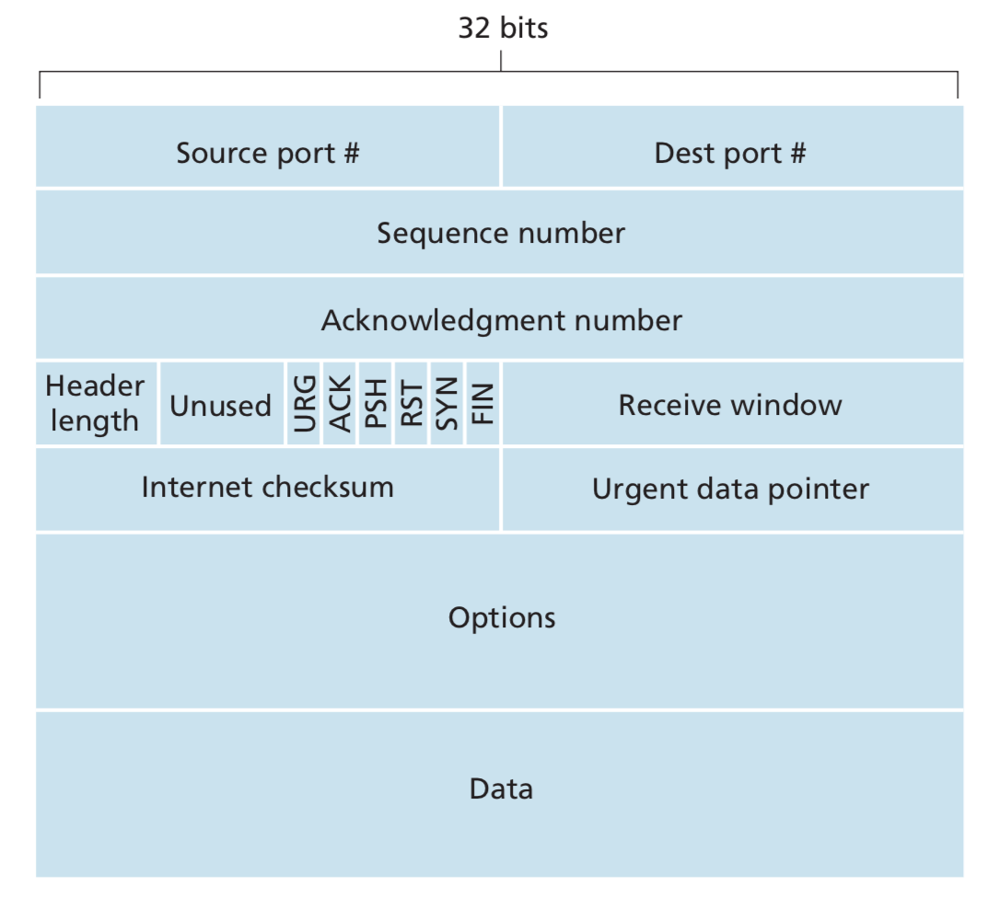
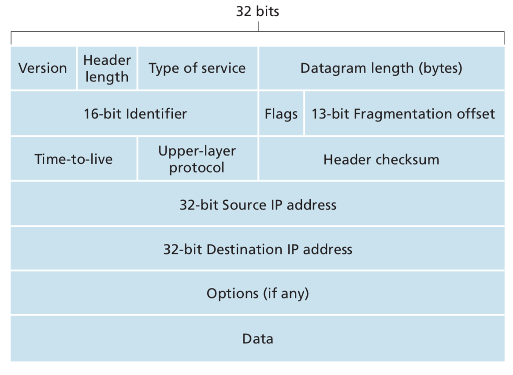
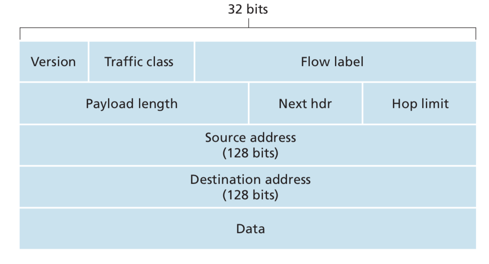

# 计算机网络复习整理笔记

## 第1章 计算机网络和因特网（非重点）

### 1.1 什么是因特网

- 因特网：世界范围的计算机网络，一个互联了遍历全世界的数以亿计的计算设备的网络。
- 连接到因特网的设备一般称为**主机（host）**或**端系统（end system）**，端系统通过通信链路（communication link）和分组交换机（packet switch）连接到一起。
- 链路的传输速率以比特/秒度量（bit/s或bps）
- **分组（packet）**是发送端系统将数据分段，并为每段加上首部字节，由此形成的信息包。
- **路由器（router）**和**链路层交换机（link-layer switch）**是两种著名的分组交换机，它们朝着最终目的地转发分组。
- **路径（route或path）**：从发送端系统到接收端系统，一个分组所经历的一系列通信链路和分组交换机。
- 端系统通过**因特网服务提供商（Internet service provider，ISP）**接入因特网。
- **TCP**和**IP**协议是因特网中两个最为重要的协议，后者定义了在路由器和端系统之间发送和接收的分组格式。因特网的主要协议统称为**TCP/IP**。
- 分布式应用程序：涉及多台相互交换数据的端系统的应用程序。
- 与因特网相连的端系统提供**应用程序编程接口（Application Programming Interface，即API）**
- 一个**协议（protocol）**定义了在两个或多个通信实体之间交换的报文格式和次序，以及报文发送和/或接收一条报文或其它事件所采取的动作。

### 1.2 网络边缘

- 因特网的边缘（端系统）包括了桌面计算机、服务器和移动计算机。
- **接入网（access network）**：将端系统连接到其**边缘路由器（edge router）**的物理链路，是端系统到任何其它远程端系统的路径上的**第一台**路由器。
- **P2图1.1的标记很重要！**
- 接入网包含家庭接入、企业接入和广域接入。
- 宽带住宅接入两种最流行的类型：**数字用户线（Digital Subscriber Line，即DSL）**和电缆。每个用户的DSL调制解调器使用现有的电话线与位于本地电话公司的本地中心局中的数字用户接入复用器（DSLAM）来交换数据。
- **电缆因特网接入（cable Internet access）**利用了有线电视公司现有的有线电视基础设施。
- **光纤到户（Fiber To The Home，即FTTH）**：从本地中心局直接到家庭提供一条光纤路径。
- **局域网（LAN）**通常在公司、大学校园及越来越多的家庭中被用于将端用户连接到边缘路由器。其中**以太网**是最流行的。
- 一个无线局域网用户通常必须位于接入点的几十米范围内。而对于蜂窝网等广域网的用户来说，仅需要位于基站的数万米范围内。
- **物理媒体（physical medium）**传播电磁波或光脉冲来发送比特。它分为两类：导引型媒体和非导引型媒体，前者电波沿固体媒体前行，如光缆、双绞铜线（最便宜且使用最为普遍）或同轴电缆（导引型共享媒体），后者在空气或外层空间中传播，如无线局域网或数字卫星频道。

### 1.3 网络核心

- 网络核心：由互联因特网端系统的分组交换机和链路构成的网状网络。
- 分组以等于该链路最大传输速率的速度传输通过通信链路。若某源端系统或分组交换机经过一条链路发送一个L比特的分组，链路的传输速率为R比特/秒，则传输该分组的时间为L/R秒。
	+ 分组交换：多数分组交换机在链路的输入端使用**存储转发传输（store-and-forward transmission）**机制。在交换机能够开始向输出链路传输该分组的第一个比特之前，必须接收到整个分组。通过由$$N$$条速率均为$$R$$的链路组成的路径（即从源到目的地有$$N-1$$台路由器），从源到目的地发送一个分组，端到端时延为$$$$d_{端到端}=N\frac{L}{R}$$$$
	+ 排队时延和分组丢失：对于每条相连的链路，分组交换机具有一个输出缓存，用于存储路由器准备发往那条链路的分组。除了存储转发时延，分组还要承受输出缓存的**排队时延**。因为缓存空间大小有限，一个到达的分组可能发现该缓存已被其他等待传输的分组完全充满了。在此情况下，将出现**分组丢失（丢包）（package lost）**，到达的分组或已经排队的分组之一将被丢弃。
	+ 转发表和路由选择协议：每个端系统具有一个称为IP地址的地址。当源主机要向目的端系统发送一个分组时，源在该分组的首部中包含了目的地的IP地址。每台路由器具有一个**转发表（forwarding table）**，用于将目的地址映射成为输出链路。
- 通过网络链路和交换机移动数据的两种基本方法：电路交换和分组交换。
	+ 电路交换网络中，预留了端系统间通信沿路径所需要的资源（缓存、链路传输速率），而分组交换网络中不预留。当网络创建这种电路时，它也在连接期间在该网络链路上预留了恒定的传输速率，如此发送方能够以恒定速率向接收方传送数据。
	+ 链路中的电路通过频分复用FDM或时分复用TDM来实现。FDM中链路的频谱由跨越链路创建的所有连接所共享。在连接期间链路为每条连接专用一个频段，该频段的宽度称为带宽。对于一条TDM链路，时间被分为固定区间的帧，每帧被划分为固定数量的时隙。
	+ 分组交换不适合实时服务如电话和视频会议，因为它的端到端时延是可变而不可预测的。分组交换比电路交换有更好的带宽共享，比电路交换更简单，实现成本更低。

### 1.4 分组交换网中的时延、丢包和吞吐量

- **结点总时延 = 结点处理时延 + 排队时延 + 传输时延 + 传播时延**
	+ 处理时延：检查分组首部和决定将该分组导向何处、检查比特级别的差错等所需要的时间。处理结束后，路由器将该分组引向通往路由器B链路之前的队列。
	+ 排队时延：分组在链路上等待传输，取决于先期到达的正在排队等待向链路传输的分组数量。
	+ 传输时延：当该分组到达队首时，设L比特表示该分组的长度，用R bps表示从路由器A到路由器B的链路传输速率。传输时延是L/R。这是将所有分组的比特推向链路所需的时间。
	+ 传播时延：一个比特从链路的起点到路由器B传播所需的时间。等于两台路由器之间的距离除以传播速率，即d/s。
- 刻画排队时延可以用**流量强度（traffic intensity）**。设所有分组由L比特组成，a表示分组到达队列的平均速率，R表示传输速率即从队列中推出比特的速率。则流量强度为La/R。流量工程中有一条金科玉律：设计系统时流量强度不大于1，否则队列无穷增加。随着流量强度接近1，平均排队长度变得越来越长。见P28图1-18。
- 假定在源主机和目的主机之间有N-1台路由器，此时网络无阻塞，在每台路由器和源主机上的处理时延为$$d_{proc}$$，每台路由器和源主机的输出速率为$$R$$ bps，每条链路的传播时延为$$d_{prop}$$，则端到端时延为$$$$d_{end-end} = N(d_{proc} + d_{trans} + d_{prop})$$$$其中有$$d_{trans} = L/R$$。
- 从主机A到主机B跨越计算机网络传送一个大文件，在任何时间瞬间的瞬时吞吐量是主机B接收到该文件的速率。若该文件由F比特组成，主机B接收到所有F比特用了T秒，则文件传送的平均吞吐量为F/T。

### 1.5 协议层次及服务模型

- 因特网协议栈层次：物理层、链路层、网络层、运输层、应用层。
	+ **应用层**：网络应用程序及它们的应用层协议存留的地方。位于应用层的信息分组称为**报文（message）**
	+ **运输层**：在应用程序端点之间传送应用层报文。运输层分组称为**报文段（segment）**
	+ **网络层**：负责将称为**数据报（datagram）**的网络层分组从一台主机移动到另一台主机
	+ **链路层**：将分组从一个结点移动到下一个结点。在每个结点，网络层将数据报下传给链路层，链路层沿着路径将数据报传递给下一结点。下个结点，链路层将数据报上传给网络层。链路层分组称为**帧（frame）**
	+ **物理层**：将帧中的一个个比特从一个结点移动到下一个结点。

- **OSI模型**：应用层、表示层、会话层、运输层、网络层、数据链路层和物理层。表示层：使通信的应用程序能够解释交换数据的含义。会话层：提供数据交换定界和同步功能，包括建立检查点和恢复方案的方法。
- 主机实现所有五个层次，链路层交换机实现第一层和第二层，路由器实现了一到三层。

### 1.6 面对攻击的网络

- **自我复制**：恶意软件一旦感染了一台主机，就会从那台主机寻求进入更多的主机
- **病毒**：一种需要某种形式的用户交互来感染用户设备的恶意软件
- **蠕虫**：一种无需任何明显用户交互就能进入设备的恶意软件
- **拒绝服务攻击（Denial-of-Service (DoS) attack）**：使得网络、主机或其它基础设施部分不能由合法用户所使用。攻击类型有弱点攻击、带宽洪泛、连接洪泛。
- 此外还有分组嗅探器（packet sniffer）和IP哄骗

### 1.7 计算机网络和因特网的历史

- 分组交换的发展：1961-1972
- 专用网络和网络互联：1972-1980
- 网络的激增：1980-1990
- 因特网爆炸：20世纪90年代

## 第2章 应用层（只考第1节）

### 2.1 应用层协议原理

- 研发网络应用程序的核心：写出能够运行在不同的端系统和通过网络彼此通信的程序。
- **应用程序体系结构（application architecture）**：由应用程序研发者设计，规定了如何在各种端系统上组织该应用程序。
- 两种主流应用程序体系结构：**客户-服务器体系结构**和**对等（P2P）体系结构**
- **客户-服务器体系结构（client-server architecture）**
	+ **服务器**：总是打开的主机，服务于来自许多其它称为客户的主机的请求。
	+ 服务器具有固定的、周知的**IP地址**
	+ 具有此结构的著名的应用程序包括：Web、FTP、Telnet和电子邮件
	+ **数据中心**：配置大量主机，常被用于创建强大的虚拟服务器。
- **P2P体系结构（P2P architecture）**
	+ 对位于数据中心的专用服务器依赖最小或没有依赖。应用程序在间断连接的主机对之间使用直接通信，这些主机对被称为**对等方**。
	+ 流量密集型的许多应用是P2P体系结构的，如文件共享（BitTorrent）、对等方协助下载加速器（迅雷）、因特网电话（Skype）、IPTV（迅雷看看、PPstream）。
	+ 对于许多**即时讯息应用**而言，服务器被用于**跟踪用户的IP地址**，但用户到用户的报文在用户主机之间直接发送。
	+ 重要特征：**自扩展性（self-scalability）**——在一个P2P文件共享应用中，尽管每个对等方都由于请求文件产生工作量，但每个对等方通过向其它对等方分发文件也为系统增加服务能力。
	+ 成本有效，通常不需要庞大的服务器基础设施和服务器带宽。
	+ 未来三个主要挑战：**ISP友好、安全性、激励**
- 网络应用程序由成对的进程组成，这些进程通过网络相互发送报文。对每对通信进程，一般将其中之一标识为**客户**，另一个进程标识为**服务器**。在P2P文件共享的某些应用中，一个进程既能上传文件又能下载文件，所有既是客户又是服务器。
- **客户与服务器的定义：在给定的一对进程之间的通信会话场景中，发起通信的进程被标识为客户，在会话开始时等待联系的进程是服务器。**
- **套接字（socket）**：进程向网络发送报文和从网络接收报文的**软件接口**。也被称为应用程序和网络之间的应用程序编程接口（API）。
- 应用程序开发者可以控制套接字在应用层端的一切，但是对该套接字的运输层端几乎没有控制权，仅限于选择运输层协议和设定如最大缓存、最大报文长度几个运输层参数。
- 在一台主机上运行的进程为了向在另一台主机上运行的进程发送分组，接收进程需要有一个地址，需要定义两种信息：**主机的地址**和定义在目的主机中的接收进程的**标识符（端口号）**。
- 可供应用程序使用的运输服务
	+ **可靠数据传输**：确保由应用程序的一端发送的数据正确、完全地交付给该应用程序的另一端。当一个运输层协议不提供可靠数据传输时，某些数据可能能被**容忍丢失的应用（loss-tolerant application）**所接受，如交谈式音频视频等多媒体应用。
	+ **吞吐量**：在沿着一条网络路径上的两个进程之间的通信会话场景中，**可用吞吐量**就是发送进程能够向接收进程交付比特的速率。具有吞吐量要求的应用程序被称为**带宽敏感的应用**。**弹性应用**能够根据情况或多或少利用可供使用的吞吐量。
	+ **定时**：许多实时应用程序如因特网电话、电话会议和多方游戏，为了有效性而要求数据交付有严格的**时间限制**。非实时对应用对端到端的时延没有严格的约束。
	+ **安全性**：运输层协议提供的**加密解密**、数据完整性和端点鉴别等服务。
- 因特网提供的运输服务
	+ **TCP服务**：**面向连接的服务、可靠的数据传送服务，具有拥塞控制机制**
	+ **UDP服务**：一种不提供不必要服务的轻量级运输协议，仅提供**最小服务**，**没有拥塞控制机制**
	+ 目前的因特网运输协议**不提供吞吐量或定时保证**
	+ P64图2-5。许多防火墙被配置成阻挡UDP流量，所以因特网电话应用通常设计成如果UDP通信失败则使用TCP作为备份。
- **应用层协议**定义了运行在不同端系统上的应用程序如何相互传递报文，具体为
	+ 交换的**报文类型**，如请求报文和响应报文
	+ 各种报文类型的**语法**，如报文中的各个字段及这些字段是如何描述的
	+ 字段的**语义**，即这些字段中包含的信息的含义
	+ 一个进程**何时以及如何**发送报文，对报文进行响应的规则

## 第3章 运输层（第6节非重点）

### 3.1 概述和运输层服务

- 运输层协议为运行在不同主机的应用进程之间提供了**逻辑通信**功能（运行不同进程的主机好像直接相连一样）。
- **报文段（segment）**：由运输层从发送应用程序进程接收到的报文转化而成的分组，实现方法是将应用层报文划分为较小的块，并为每块加上一个运输层首部以生成运输层报文段。
- 网络层提供了主机之间的逻辑通信，而运输层提供了运行在不同主机上的进程之间的逻辑通信。
- 两种不同的可用运输协议：UDP（用户数据报协议）和TCP（传输控制协议）
- IP的服务模型是**尽力而为交付服务（best-effort delivery service）**，它不确保报文段的交付，不保证报文段的按序交付，不保证报文段中数据的完整性。所以IP被称为**不可靠服务（unreliable service）**。
- UDP仅有的两种服务——进程到进程到数据交付和差错检查（两种最低限度的运输层服务）
- TCP的附加服务——提供可靠数据传输（通过使用流量控制、序号、确认和定时器）、拥塞控制。

### 3.2 多路复用与多路分解

- **多路分解（demultiplexing）**：将运输层报文段中的数据交付到正确的套接字的工作
- **多路复用（multiplexing）**：在源主机从不同套接字中收集数据块，并为每个数据块装上首部信息从而生成报文段，然后将报文段传递到网络层
- 运输层多路复用要求
	+ 套接字有唯一的标识符
	+ 每个报文段友特殊字段来指示该报文段所要交付到的套接字。该特殊字段即为**源端口号字段**和**目的端口号字段**。
- **端口号**是一个**16比特**的数，在0-65536之间。0-1023范围的端口号是周知端口号，受限制，只提供给周知应用层协议使用。
- 运输层多路分解服务的简要描述：在主机上的每个套接字能够分配一个端口号，当报文段到达时，运输层检查报文段中的目的端口号，并将其定向相应的套接字，然后报文段中的数据通过套接字进入其所连接的进程。
- 一个**UDP套接字**由一个**二元组**来全面标识，该二元组包含一个**目的IP地址**和一个**目的端口号**。而源端口号被用于B回发一个报文段给A时目的端口号的取值。
- 一个**TCP套接字**由一个**四元组**来全面标识，该四元组包含**源IP地址**、**源端口号**、**目的IP地址**、**目的端口号**。当一个TCP报文段到达主机时，所有4个字段被用来将报文段定向到相应的套接字。
- 连接套接字和进程之间并非总是一一对应，当今的高性能web服务器通常只使用一个进程，但为每个客户连接创建一个具有新连接套接字的新线程。

### 3.3 无连接运输：UDP

- UDP适合许多应用使用的原因
	+ **关于何时、发送什么数据的应用层控制更为精细**：当实时应用要求更小的发送速率、不希望过分延迟报文段的传送，且能容忍一些数据丢失时，不需要拥塞控制机制。
	+ **无需连接建立**：UDP没有建立连接的时延，适合DNS
	+ **无连接状态**：UDP不维护连接状态也不跟踪参数，对于某些专门用于某种特定应用的服务器支持更多的活跃用户。
- 流行的因特网应用程序选择的运输层协议（括号中为应用层协议）
	+ TCP：电子邮件（SMTP）、远程终端访问（Telnet）、Web（HTTP）、文件传输（FTP）
	+ TCP或UDP：流式多媒体、因特网电话
	+ 通常UDP：远程文件服务器（NFS）、网络管理（SNMP）、路由选择协议（RIP）、名字转换（DNS）
- TCP的拥塞控制会使如因特网电话、视频会议之类的实时应用性能变得很差，而当分组丢包率低时，且为了安全原因，某些机构会阻塞UDP流量，导致TCP越来越多地被用于流式多媒体传输。
- **UDP报文段结构（P135图3-7）**首部包含源端口号、目的端口号、长度、检验和，各占两个字节。长度字段指示了在UDP报文段中的字节数（首部加数据）。
- UDP检验和提供了**差错检测功能**，发送方的UDP对报文段中的所有16比特字的**和**进行**反码运算**，求和时遇到的任何溢出都被**回卷**【注意P135的例子】，得到的结果放在UDP报文段的检验和字段。
- **端到端原则（end-end principle）**：因为某种功能（如差错检测）必须基于端到端实现：“与在较高级别提供这些功能的代价相比，在较低级别上设置的功能可能是冗余的或几乎没有价值的。”

### 3.4 可靠数据传输原理

- 可靠数据传输协议（rdtp）、不可靠数据传输协议（udtp）
- P137图3-8中`rdt_send(), udt_send(), rdt_rcv(), deliver_data()`的步骤
- **经完全可靠信道的可靠数据传输：rdt 1.0**
	+  P138图3-9
	+  因为信道完全可靠，所以接收端不需要提供任何反馈信息给发送方，接收方接受数据的速率能够与发送方发送数据的速率一样快。
- **经具有比特差错信道的可靠数据传输：rdt 2.0**
	+ P139图3-10
	+ 添加了肯定确认（ACK）和否定确认（NAK），添加了差错检测（检验和`checksum`）和重传功能（当接收方收到有差错的分组时，发送方将重传该分组）
	+ 当发送方处于等待ACK或NAK的状态时，它不能从上层获得更多的数据，即`rdt_send()`事件不可能出现。发送方将不会发送一块新数据除非发送方已正确接收当前分组。所以该协议被称为**停等协议（stop-and-wait）**
	+ 致命缺陷：没有考虑到ACK或NAK分组受损的可能性——解决这个问题的一个简单方法：在数据分组中添加一新字段，让发送方对其数据进行编号，将发送数据分组的序号放在该字段。接收方检查序号即可确认收到的分组是否一次重传。
- rdt 2.1：发送方和接收方FSM的状态数是rdt 2.0的两倍
- rdt 2.2：无NAK
- **经具有比特差错的丢包信道的可靠数据传输：rdt 3.0**
	+ P144图3-15
	+ 为了实现基于时间的重传机制，引入一个倒计数定时器：每次发送一个分组时，便启动一个**定时器**；响应定时器中断；终止定时器
	+ 因为分组序号在0和1之间交替，所以有时被称为**比特交替协议（alternating-bit protocol）**
- **流水线可靠数据传输协议**
	+ 停等方式性能糟糕，流水线方式允许发送方发送多个分组而无需等待确认。
	+ 必须增加序号范围，每个输送的分组必须有一个唯一的序号。
	+ 发送方和接收方两端必须缓存多个分组。
	+ 解决流水线的差错恢复方法：回退N步、选择重传。
- **回退N步（GBN）**
	+ P147图3-19中GBN的序号范围：四段范围——
		- $$[0, base - 1]$$ 已经发送并被确认的分组
		- $$[base, nextseqnum - 1]$$ 已经发送但未被确认的分组
		- $$[nextseqnum,  base + N - 1]$$ 要被立即发送的分组
		- $$[base + N, ...]$$ 不能使用的
	+ 接收方丢弃所有失序分组
- **选择重传**
	+ 发送方仅重传那些它怀疑在接收方出错的分组从而避免不必要的重传。
	+ SR接收方将确认一个正确接收的分组而不管其是否按序，失序的分组将被缓存直到所有序号更小的分组都被收到为止。
	+ 发送方和接收方的窗口并不总是一致。

### 3.5 面向连接的运输：TCP

- 全双工服务（full-duplex service）、点对点
- **TCP报文段结构：P157图3-29**，首部一般是20字节（通常选项字段为空）
- **主机A填充进报文段的确认号是主机A期望从主机B收到的下一字节的序号。**
- 当主机在一条TCP连接时收到失序报文段时，如何处理由实现TCP的编程人员确定，可以丢弃失序报文段或保留直到缺少的字节填补间隔。
- 估计往返时间$$EstimatedRTT$$的公式（指数加权移动平均EWMA)：$$$$EstimatedRTT = (1-\alpha) \cdot EstimatedRTT + \alpha \cdot SampleRTT$$$$
- $$SampleRTT$$与$$EstimatedRTT$$之间差值的EWMA：$$$$DevRTT = (1-\beta)\cdot DevRTT + \beta\cdot |SampleRTT - EstimatedRTT|$$$$
- 大多数TCP实现采用**超时间隔加倍**：每次TCP重传时，会将下一次的超时间隔设为先前值的两倍，而不是用从$$EstimatedRTT$$和$$DevRTT$$推算出的值。
- 冗余ACK：再次确认某个报文段的ACK，一旦收到3个冗余ACK，TCP就执行**快速重传（fast retransmit）**，即在该报文段的定时器过期之前重传丢失的报文段。（P167图3-37）
- TCP发送方仅维持已发送过但未被确认的字节的最小序号（SendBase）和下一个要发送的字节的序号（NextSeqNum），更像是一个GBN风格的协议，但许多TCP实现会将正确接收但失序的报文段缓存起来。是GBN协议和SR协议的结合体。
- **流量控制**
	+ 消除发送方使接收方缓存溢出的可能性
	+ 发送方维护**接收窗口（rwnd）**——接收方还有多少可用的缓存空间。
		- $$LastByteRead$$ 主机B上的应用进程从缓存读出的数据流的最后一个字节的编号
		- $$LastByteRcvd$$ 从网络中到达的并且已放入主机B接收缓存中的数据流的最后一个字节编号
		- TCP不允许已分配的缓存溢出：$$$$LastByteRcvd - LastByteRead\le RcvBuffer$$$$
		- 接收窗口即可用空间的数量：$$$$rwnd = RcvBuffer - [LastByteRcvd - LastByteRead]$$$$
		- 主机A保证不使主机B的接收缓存溢出：$$$$LastByteSend - LastByteAcked\le rwnd$$$$
- TCP连接建立的**三次握手**
	+ 客户端TCP向服务器TCP发送一个特殊的，不含应用层数据，首部SYN被置为1，序号字段中放置一个随机初始序号（client\_isn）的报文段【SYN报文段】。
	+ 服务器从数据报中提取出TCP SYN报文段并为该TCP连接分配TCP缓存和变量，将SYN置为1，确认号字段置为client\_isn + 1，选择初始序号为server\_isn，向该客户TCP发送允许连接的报文段【SYNACK报文段】
	+ 收到SYNACK报文段后，客户端给TCP连接分配缓存和变量，向服务器发送一个序号为client\_isn + 1，确认号为server\_isn + 1，SYN置为0的报文段进行确认。
- TCP**终止连接**的步骤：在客户应用发出关闭连接的命令后，客户TCP向服务器进程发送一个FIN置为1的特殊报文段，随后服务器回送一个确认报文段；服务器发送一个FIN置为1的终止报文段，客户端进行确认。经过等待后，连接正式关闭，客户端所有资源（包括端口号）将被释放。

### 3.7 TCP拥塞控制

- 运行在发送方的TCP拥塞控制机制跟踪额外变量——**拥塞窗口（cwnd）**，它对一个TCP发送方能向网络中发送流量的速率进行了限制$$$$LastByteSent - LastByteAcked\le min\{cwnd, rwnd\}$$$$
- 一个TCP发送方的丢包事件：**出现超时；收到来自接收方的3个冗余ACK**
- **TCP拥塞控制算法【P184图3-52】【重点】**
	+ **慢启动（强制部分）**：cwnd以1个MSS开始并且每当传输的报文段首次被确认就增加一个MSS。每过一个RTT，发送速率就翻番，以指数增长。当cwnd不低于ssthresh时，直接进入拥塞避免状态；收到3个冗余ACK时，ssthresh设为cwnd的一半，cwnd设为此时ssthresh加3个MSS进入快速恢复阶段；若超时，ssthresh设为cwnd的一半，cwnd设为1个MSS，重新开始慢启动状态。
	+ **拥塞避免（强制部分）**：每个RTT只将cwnd的值增加一个MSS。收到3个冗余ACK或超时与上者操作相同。
	+ **快速恢复（推荐部分）**：对收到的每个冗余的ACK，cwnd的值增加一个MSS；当对丢失报文段的一个ACK到达时，cwnd降至ssthresh进入拥塞避免状态。超时操作与上者相同。
- TCP Tahoe这种TCP早期版本，没有快速恢复阶段，对于超时事件和收到3个冗余ACK事件的处理相同。而TCP的较新版本TCP Reno则有。
- 高度理想化的TCP稳态动态性模型中，用W表示丢包事件发生时w的值，一条连接的平均吞吐量：$$\frac{0.75\cdot W}{RTT}$$。若考虑丢包率，则表示为$$\frac{1.22\times MSS}{RTT\sqrt{L}}$$

## 第4章 网络层（第2、7节非重点）

### 4.1 概述

- 两种重要的网络层功能
	+ **转发（forwarding）**：当一个分组到达路由器的一条输入链路时，路由器必须将该分组移动到适当的输出链路。
	+ **路由选择（routing）**：网络层决定从发送方流向接收方的分组所采用的路由或路径。
- **分组交换机**：根据分组首部字段中的值，从输入链路接口到输出链路接口转移分组到一种通用分组交换设备。基于链路层字段中的值做转发决定的是**链路层交换机（link-layer switches）**；基于网络层字段中的值做转发决定的是**路由器（router）**
- 网络层提供的服务
	+ **确保交付**：确保分组最终到达目的地
	+ **具有时延上界的确保交付**：在确保交付的基础上，在特定的主机到主机时延上界内交付
	+ **有序分组交付**
	+ **确保最小带宽**
	+ **确保最大时延抖动**
	+ **安全性服务**
- 因特网的网络层只提供了单一的服务，即尽力而为服务
- 恒定比特率（CBR）异步传递方式（ATM）网络服务：保证恒定带宽，有丢包保证，确保有序分组交付，维护定时，不出现拥塞；可用比特率（ABR）ATM网络服务：保证最小带宽，确保有序分组交付，提供拥塞指示。

### 4.2 虚电路和数据报电路

- **虚电路（Virtual-Circuit, VC）网络**：仅在网络层提供连接服务的计算机网络；**数据报（datagram）网络**：仅在网络层提供无连接服务的计算机网络。
- 虚电路（ATM、帧中继等网络体系结构）的组成：
	+ 源和目的主机之间的路径
	+ VC号，沿着该路径的每段链路的一个号码
	+ 沿着该路径的每台路由器的转发表表项
- 虚电路网络中的路由器必须为进行中的连接维持**连接状态信息**：每当跨越一台路由器创建一个新连接，必须在该路由器转发表中增加一个新的连接项；每当释放一个连接，必须从该表中删除该项。
- 虚电路的3个阶段
	+ 虚电路建立：发送方运输层与网络层联系，指定接收方地址，等待网络建立虚电路。路径的决定、VC号的决定、转发表的决定。对于一个虚电路网络层，**沿两个端系统之间路径上的路由器都要参与虚电路的建立，且每台路由器都完全知道经过它的所有虚电路。**
	+ 数据传送
	+ 虚电路拆除
- **信令报文（signaling message）**：端系统向网络发送指示虚电路启动与终止的报文，以及路由器之间传递的用于建立虚电路的报文。**信令协议（signaling message）**：用来交换信令报文的协议。
- 数据报网络中，每台路由器有一个将目的地址映射到链路接口的转发表，根据目的地址的范围划分对应的链路接口。当有多个匹配时，使用最长前缀匹配规则，在该表中寻找最长的匹配项，并向与最长前缀匹配相关联的链路接口转发分组。

### 4.3 路由器工作原理

- 路由器的4个组成部分
	+ **输入端口**：执行将一条输入的物理链路与路由器相连接的物理层功能；执行需要与位于入链路远端的数据链路层交互的数据链路层功能；执行查找功能，通过查询转发表决定路由器的输出端口。
	+ **交换结构**：将输入端口与输出端口相连接。
	+ **输出端口**：存储从交换结构接收的分组，并通过执行必要的链路层和物理层功能在输出链路上传播这些分组。
	+ **路由选择处理器**：执行路由选择协议，维护路由选择表以及连接的链路状态信息。并计算转发表，执行网络管理功能。
	+ P212图4-6:**路由器转发平面（router forwarding plane）**
- **输入端口**
	+ 在输入端口路由器使用转发表来查找输出端口，使得到达的分组能经过交换结构转发到该输出端口。转发表虽然由路由选择处理器计算和更新，但是一份影子副本通常被存放在每个输入端口。
	+ 若来自其它输入端口的分组当前正在使用该交换结构，一个分组被阻塞，在输入端口处排队。
	+ 输入端口处理还必须出现物理层和链路层处理；必须检查分组的版本号、检验和以及寿命字段并重写后两个字段；必须更新用于网络管理的计数器。
- 交换结构
	+ 三种交换技术（P215图4-8）：经内存交换、经总线交换、经互联网络交换
	+ **经内存交换**：到达输入端口的一个分组被复制到处理器内存中，路由选择处理器从其首部提取目的地址，找到适当的输出端口，并将该分组复制到输出端口的缓存中。
	+ **经总线交换**：不需要路由选择处理器的干预。让输入端口为分组预先计划一个交换机内部标签（首部），指示本地输出端口。一次只有一个分组能够跨越总线。
	+ **经互联网络交换**：能够并行转发多个分组。而两个来自不同输入端口的分组的目的地为相同的输出端口，则一个分组需要等待。
- 输出端口：取出存放在输出端口内存中的分组并将其发送到输出链路上，包括选择和取出排队的分组进行传输，执行所需的链路层和物理层传输功能。
- 若$$R_{switch}$$比$$R_{line}$$快$$N$$倍，则在输入端口处仅会出现微不足道的排队。在最坏情况下，所有的分组被转发到相同的输出端口，此时因为输出端口在一个单位时间只能发送一个分组，所有输出端口的可用内存很快会被耗尽，出现丢包。
- **主动队列管理（Active Queue Management, AQM）算法**的几个例子：弃尾；删除一或多个已排队的分组为新到的分组腾出空间；在缓存填满前丢弃一个分组以便向发送方提供一个拥塞信号；**随机早期检测算法**

### 4.4 网络协议：因特网中的转发和编址

- 因特网目前在使用的两个版本的IP：**IPv4**和**IPv6**
- **IPv4数据报（P221图4-13）**
	+ 版本；首部长度；服务类型（如实时数据报和非实时数据报）；数据报长度；标识、标志和片偏移（与IP分片有关，IPv6中删去）；寿命（确保数据报不会在网络中死循环）；协议（运输层）；首部检验和（只检验首部）；源和目的IP地址；选项（IPv6中删去）；数据（有效载荷，大多数情况下包含运输层报文段，也可承载其它类型的数据如ICMP报文段）
	+ 一个IPv4数据报首部总长为20字节（假设无选项），若承载一个TCP报文段，则每个（无分片）数据报共承载总长40字节的首部以及应用层报文。
	+ IP数据报分片
		- **最大传送单元（Maximum Transmission Unit，MTU）**：一个链路层帧能承载的最大数据量
		- 当某条链路接收到的一个IP数据报长度大于MTU时，需要将该数据报中的数据分片成多个较小的IP数据报，用单独的链路层帧封装它们，并向输出链路上发送这些帧。它们称为**片（fragment）**
		- **标识号**用于确定哪些数据报实际上是同一较大数据报的片。
		- 最后一个片的**标志**比特置为0，而所有其他片的**标志**比特置为1，以让目的主机相信它已接收到了初始数据报的最后一个片。且以8字节块为单位。
		- **偏移字段**指定一个片应放在IP数据报的哪个位置。
- **IPv4编址**
	+ **接口（interface）**：主机与物理链路之间的边界；也指路由器与其任意一条链路之间的边界
	+ 因为每台主机与路由器都能发送和接收IP数据报，**IP要求每台主机和路由器接口拥有自己的IP地址。**
	+ 每个IP地址为32比特，一般采用点分十进制记法。
	+ **子网（subnet）的定义：分开主机和路由器的每个接口，产生几个隔离的网络岛，使用接口端接这些隔离的网络的端点。这些隔离的网络中的每一个都叫做一个子网。**
	+ **子网掩码（network mask）**指示了32比特中最左侧多少个比特定义了子网地址。
	+ 因特网的地址分配策略：**无类别域间路由选择（CIDR）**。形如`a.b.c.d/x`的x最高比特构成了IP地址的网络部分，也经常被称为该地址的前缀。一个组织通常被分配一块连续的地址，前缀相同。剩余32-x比特用于区分该组织的内部设备。
	+ **分类编址（classful addressing）**：IP地址的网络部分被限制为长度为8、16或24比特。这三类子网分别被称为A、B和C类网络。一个C类子网能容纳$$2^8-2=254$$台主机，其中的两个地址预留用于特殊用途。
	+ IP广播地址为255.255.255.255，当一台主机发出一个目标地址为广播地址的数据报时，该报文会交付给同一个网络中的所有主机。
- **一个组织为其设备得到地址块，及一个设备得到地址的方式**
	+ 网络管理员可以从ISP获取子网，ISP可以将它被分配到的地址块分为若干个长度相等的连续地址块。**（P230的例子）**
	+ **动态主机配置协议（Dynamic Host Configuration，DHCP）**：允许主机自动获取一个IP地址，还允许一台主机得到其他信息如子网掩码、第一跳路由器地址（默认网关）和它的本地DNS服务器的地址。DHCP是一个客户-服务器协议，客户是新达到的主机，在最简单场合下，每个子网将具有一个DHCP服务器，否则需要一个DHCP中继代理（通常是一台路由器）。
	+ DHCP四步骤—**【P232图4-21】**—
		- **DHCP服务器发现**：客户在UDP分组中向端口67发送一个广播目的地址255.255.255.255、源地址为0.0.0.0的含有DHCP发现报文的IP数据报。客户将其传递给链路层后，链路层将该帧广播到所有与该子网连接的子网。
		- **DHCP服务器提供**：DHCP服务器收到一个DHCP发现报文时，用一个DHCP提供报文向客户作出响应，使用IP广播地址，报文中含收到的发现报文的事务ID、向客户推荐的IP地址、网络掩码以及IP地址租用期。
		- **DHCP请求**：客户从一个或多个服务器中选择一个，向选中的服务器提供一个DHCP请求报文进行响应，回显配置参数。 
		- **DHCP ACK**：响应请求报文，证实所要求的参数。
	+ **网络地址转换（Network Address Translation，NAT）【P234图4-22】**
		- 如10.0.0.0/24这样的专用地址只在一定地域有效，要进入全球因特网需要地址转换
		- **NAT使能路由器**对外界的行为如同一个具有单一IP地址的单一设备，所有离开家庭路由器流向更大因特网的源IP地址与进入家庭的目的IP地址相同，如138.76.29.7。它对外界隐藏了家庭网络的细节。
		- NAT妨碍了P2P应用程序，因为若某对等方B在一个NAT后面，则它不能充当服务器并接收TCP连接。此时A可以通过一个不位于NAT后面且与B创建了一条进行中的TCP连接的对等方C来与B联系。【连接反转（connection reversal）被用于NAT穿越】
	+ **UPnP（通用即插即用）**允许外部主机使用TCP或UDP向NAT化的主机发起通信会话。
- **因特网控制报文协议（ICMP）**
	+ 典型用途：差错报告（P326图4-23），但不仅用于通知差错情况
	+ 有一个类型字段和一个编码字段
	+ ping程序发送一个ICMP类型8编码0的报文到指定主机，然后目的主机发回一个类型0编码0的ICMP回显回答。
	+ Traceroute的原理【P237】
- **IPv6**
	+ 数据报格式特点
		- 扩大的地址容量：将IP地址从32比特增加到128比特；引入**任播地址（anycast address）**，可将数据报交付给一组主机中的任意一个。
		- 简化高效的40字节首部
		- 流标签与优先级：流标签给那些发送方要求进行特殊处理的流的分组加上标签；流量类型即用于给出一个流中某些数据报的优先级。
		- 跳限制：转发数据报的每台路由器对该字段的内容减1，若达到0则该数据报将被丢弃。
		- 不再有IPv4首部中包含的分片/重新组装、首部检验和与选项。
	+ 从IPv4到IPv6的迁移方法
		- **双栈（dual-stack）方法**：IPv6结点还具有完整的IPv4实现。若结点名字是IPv6使能的，则返回一个IPv6地址，否则返回IPv4地址；若发送方或接收方中任意一个仅为IPv4使能，则必须使用IPv4数据报。在执行从IPv6到IPv4的转换中，IPv6数据报中的一些字段在IPv4数据报中无对应部分，会被丢失。	
		- **建隧道（tunneling）**：【P242图4-26】将两台IPv6路由器之间的中间IPv4路由器的集合称为一个隧道，在隧道发送端的IPv6结点可将整个IPv6数据报放到一个IPv4数据报的有效载荷里，该IPv4的地址指向隧道接收端的IPv6结点。
- 涉足IP安全性
	+ 提供安全性服务的新型网络层协议之一：IPsec
		- 密码技术约定：允许两台通信的主机对加密算法和密钥达成一致
		- IP数据报有效载荷的加密
		- 数据完整性
		- 初始鉴别：确信在数据报中的源IP地址是该数据报的实际源

### 4.5 路由选择算法

- 与主机直接相连的一台路由器称为**默认路由器**或**第一跳路由器（first-hop router）**。将源主机的默认路由器称为**源路由器**，目的主机的默认路由器称为**目的路由器**。算法目的即为：找出源和目的地之间的最低费用路径。
- 路由选择算法的分类一（全局or分散）
	+ **全局式路由选择算法（global routing algorithm）**：具有连通性和链路费用方面的完整信息。也称为**链路状态（Link State，LS）算法**。
	+ **分散式路由选择算法（decentralized routing algorithm）**：以迭代、分布式的方式进行计算，开始工作时每个结点仅有与其直接相连链路的费用信息。一个例子是**距离向量（Distance-Vector，DV）算法**，每个结点维护到网络中所有其他结点的费用估计的向量。
- 路由选择算法的分类二（静态or动态）
	+ **静态路由选择算法**：路由的状态随时间变化非常缓慢
	+ **动态路由选择算法**：能够当网络流量负载或拓扑发生变化时改变路由选择路径，易受路由选择循环、路由振荡等问题的影响
- 路由选择算法的分类三（负载敏感or负载迟钝）
	+ **负载敏感算法（load-sensitive algorithm）**：链路费用会动态地变化以反映出底层链路的当前拥塞水平
	+ **负载迟钝算法（load-insensitive algorithm）**：链路费用不明显地反映出当前的拥塞水平
- **链路状态路由选择算法（Dijkstra算法）【P246】**
- **距离向量路由选择算法（Bellman-Ford算法）【P250】**
	+ 	Bellman-Ford方程：$$$$d_x(y) = min_v\{c(x,v) + d_v(y)\}$$$$其中方程中的$$min_v$$是对于$$x$$的所有邻居的。
	+  在该分布式、异步算法中，每个结点不时地向它的每个邻居发送它的距离向量副本。
- 距离向量算法：链路费用改变与链路故障
	+ **路由选择环路（routing loop）**：例如目的地为x的分组在$$t_1$$时刻到达y或z后，将在这两个结点之间不停地来回反复直到转发表发生改变为止。当迭代次数很大时，有时被称为**无穷计数问题**。
- 距离向量算法：增加毒性逆转
	+ 用**毒性逆转（poisoned reverse）**技术避免一些环路问题：如果z通过y路由选择到目的地x，则z将通告y，它到x的距离是无穷大，即$$D_z(X)=\infty$$
	+ 三个或更多结点的环路将无法用毒性逆转技术检测到。
- 算法比较
	+ **报文复杂性**：LS算法要发送$$O(|N||E|)$$个报文，无论何时一条链路的费用发生改变，都要向所有结点发送新的链路费用。DV算法在每次迭代时仅在两个相邻邻居之间交换报文，且仅当在新的链路费用导致与该链路相连结点的最低费用路径发生改变时才传播已改变的链路费用。
	+ **收敛速度**：LS算法朴素实现是一个$$O(|N|^2)$$的算法，而DV算法收敛较慢而且可能遭遇无穷计数问题。
	+ **健壮性**：在LS算法下，一个LS结点仅计算自己的转发表，路由计算在某种程度上是分离的，提供了一定程度的健壮性。DV算法一个不正确的结点计算值会扩散到整个网络。
- 层次路由选择
	+ **自洽系统（Autonomous System，AS）**：每个AS由一组通常处在相同管理控制下的路由器组成，在AS内部的路由器全部允许同样的路由选择算法，此时这个算法称为**自洽系统内部路由选择协议（intra-autonomous system routing protocol）**。一台或多台负责向在AS之外的目的地转发分组的路由器被称为**网关路由器（gateway router）**。
	+ **自洽系统间路由选择协议（inner-autonomous system routing protocol）**：从相邻AS获取可达性信息和向该AS中所有路由器传播可达性信息。因特网中所有AS中都运行相同的AS间路由选择协议，即为BGP4。
	+ **热土豆路由选择（hot potato routing）**：AS尽可能块地扔掉分组。若可经多个网关达到目的子网，则选择具有最小的最低费用的网关。

### 4.6 因特网中的路由选择

- **因特网中自洽系统内部的路由选择：路由选择信息协议（Routing Information Protocol，RIP）**
	+ 一种距离向量协议
	+ 每条链路的费用为1
	+ 费用用术语**跳**表示，指的是从源路由器到目的子网的最短路径所经过的子网数量（包括目的子网）
	+ 一条路径的最大费用被限制为15
	+ 路由选择更新信息在邻居之间通过**RIP响应报文（或称为RIP通告）**来交换，约每30秒交换一次。每台路由器维护一张称为路由选择表（routing table）的RIP表，包括了距离向量和转发表（P259图4-36）。
	+ 若一台路由器超过180秒没有从邻居收到报文，则修改本地路由选择表，通过向相邻路由器发送通告（如在UDP上使用端口520发送RIP请求与响应报文）。

- **因特网中自洽系统内部的路由选择：开放最短路优先（Open Shortest Path First，OSPF）**
	+ 核心：**使用洪泛链路状态信息的链路状态协议**和一个**Dijkstra最低费用路径算法**。
	+ 各条链路费用由网络管理员配置
	+ 每当一条链路状态发生变化时，路由器就会广播链路状态信息。也会周期性地至少每隔30分钟一次广播链路状态。
	+ 优点
		- 安全
		- 多条相同费用的路径：允许使用多条路径
		- 对单播与多播路由选择的综合支持
		- 支持在单个路由选择域内的层次结构
	+ 一个OSPF自洽系统可以配置成多个区域，在一个区域内，一台或多台区域边界路由器负责为流向区域以外的分组提供路由选择。在AS内只有一个OSPF区域配置成主干（backbone）区域，它包含了AS内所有区域路由器，为AS内其他区域之间的流量提供路由选择。

- **自洽系统间的路由选择：边界网关协议（Border Gateway Protocol，BGP）**
	+ BGP为每个AS提供的工作手段
		- 从相邻AS处获得子网可达性信息
		- 向本AS内部的所有路由器传播这些可达性信息
		- 基于可达性信息和AS策略，决定到达子网的“好”路由
	+ TCP连接
		- 在BGP中，路由器对通过使用179端口的半永久TCP连接来交换路由选择信息
		- **BGP对等方（BGP peers）**：位于TCP连接端点的两台路由器
		- **BGP会话（BGP session）**：沿着该连接发送所有BGP报文的TCP连接
		- **eBGP**：跨越两个AS的BGP会话
		- **iBGP**：在同一个AS中的两台路由器之间的BGP会话
	+ 前缀可达性信息的分发（由eBGP到iBGP再到eBGP）
	+ 路径属性和BGP路由
		- 在BGP中，一个自洽系统由其全局唯一的**自洽系统号（Autonomous System Number，ASN）**所标识。
		- 当一台路由器通过BGP会话通告一个前缀时，它在前缀中包括一些**BGP属性**，带有属性的前缀被称为一条**路由（route）**。
		- **AS-PATH**：前缀的通告已经通过的AS，以此来检测和防止循环通告。
		- **NEXT-HOP**：开始某AS-PATH的路由器接口。
		- 当一台网关路由器接收到一台路由器通告时，使用**输入策略（import policy）来决定是否接收或过滤该路由，是否设置某属性。
	+ BGP路由选择：对相同前缀存在两条或多条路由，依次调用下列消除规则直到留下一条路由
		- 路由被指派一个本地偏好值作为它们的属性之一。选择具有最高本地偏好值的路由。
		- 在余下的路由中，选择具有最短AS-PATH的路由
		- 在余下的路由中，选择具有最靠近NEXT-HOP路由器的路由。（热土豆路由选择）
		- 若仍留下多条路由，使用BGP标识符来选择路由。
	+ 路由选择策略：桩网络与提供商网络【P267图4-42】

### 4.7 广播和多播路由选择

- **广播路由选择（broadcast routing）**：单个源结点到网络中所有其他结点交付分组；**多播路由选择（multicast routing）**：单个源结点到网络中其他结点的一个子集发送分组副本。

- 广播路由选择算法
	+ N次单播：效率低、增加额外的协议机制的开销、以多播算多播
	+ 无控制洪泛：有圈时会死循环、分组的副本复制过于大量，导致广播风暴
	+ 受控洪泛
		- 序号控制洪泛
		- **反向路径转发（Reverse Path Forwarding，RPF）**：当一台路由器接收到具有给定源地址的广播分组时，仅当该分组到达的链路正好是位于它自己的返回其源的最短单播路径上，它才向其所有出链路传输报文。
	+ 生成树广播：对网络结点构造一棵生成树。一种简单的算法是基于中心的方法，定义一个中心结点，结点向中心结点单播加入树报文。

- 多播

## 第5章 链路层

### 5.1 链路层概述

- **结点（node）**：运行链路层协议的任何设备，如主机、路由器、交换机和WiFi接入点。
- **链路（link）**：沿着通信路径连接相邻结点的通信信道。
- **链路层服务**
	+ **成帧（framing）**：用链路层帧封装网络层数据报，结构由链路层协议规定
	+ **链路接入**：媒体访问控制（MAC）协议规定了帧在链路上传输的规则
	+ **可靠交付**：通过确认和重传取得可靠交付服务，通常用于易于产生高差错率的链路，目的是本地纠正一个差错而不是让上层协议进行端到端重传
	+ **差错检测和纠正**：比上层协议更加复杂，并且用硬件实现
- **链路层实现结构**
	+ **主体部分在网络适配器（network adapter）中实现。**也称为**网络接口卡（Network Interface Card，NIC）**，它的核心是链路层控制器，该控制器通常是一个实现了许多链路层服务的专用芯片。**【P292图5-2】**链路层是硬件和软件的结合体，是协议栈中软件与硬件交接的地方。

### 5.2 差错检测和纠正技术

- **差错检测和纠正比特（EDC）**用于增强数据D。接收方的挑战：在只收到D'和EDC'的情况下，确定D'是否和初始的D相同。
- **奇偶校验**
	+ **用单个奇偶校验位**：偶校验——发送方只需包含一个附加的比特，使得这d+1个比特中1的总数是偶数；奇校验则为奇数。此时在突发差错的情况下，一帧中未检测出差错的概率能够达到50%。
	+ **二维奇偶校验**：d个比特被划分为i行j列，共有i+j+1个奇偶比特。单个比特的差错可检测可纠正。
	+ 前向纠错（Forward Error Correction，FEC）：接收方检测和纠正差错的能力。可以减少所需的发送方重发次数。
- **检验和**方法
	+ **因特网检验和**的依据。将数据的字节作为16比特的整数对待并求和，其反码形成了因特网检验和，通过检测其结果是否全1比特来检测检验和。
	+ 运输层差错检测用软件实现，一般采用简单的快速的方案如检验和。链路层差错检测在适配器中用专门的硬件实现，能够快速执行更复杂的CRC操作。
- **循环冗余检测（Cyclic Redundancy Check，CRC）编码**
	+ 对于$$d$$比特的数据$$D$$，发送方和接收方协商一个$$r+1$$比特模式，称为**生成多项式（generator）**，表示为$$G$$，要求$$G$$最高位比特为1。
	+ 发送方选择$$r$$个附加比特$$R$$，将它们附到$$D$$上。
	+ 接收方用$$G$$去除接收到的$$d+r$$比特，若非零，则有差错，否则认为数据正确而被接收。
	+ 我们要求出$$R$$使得对于$$n$$有$$$$D\cdot2^r\textrm{XOR}R = nG$$$$两边用$$R$$异或，即有$$$$D\cdot2^r=nG\textrm{XOR}R$$$$所以$$$$R=\textrm{remainder}\frac{D\cdot2^r}{G}$$$$
	+ 每个CRC标准都能检测小于$$r+1$$比特的突发差错。每个CRC标准也都能检测任何奇数个比特差错。

### 5.3 多路访问链路和协议

- 两种类型的网络链路
	+ **点对点链路（point-to-point link）**：由链路一端的单个发送方和链路另一端的单个接收方组成
	+ **广播链路（broadcast link）**：让多个发送和接收结点都连接到相同的、单一的、共享的广播信道上
- **多路访问问题**：如何协调多个发送和接收结点对一个共享广播信道的访问
- **多路访问协议**的三种类型：**信道划分协议（channel partitioning protocol）**、**随机接入协议（random access protocol）**、**轮流协议（taking-turns protocol）**
- 信道划分协议
	+ **时分多路复用（TDM）**将时间划分为**时间帧（time frame）**，并将每个时间帧划分为N个**时隙（slot）**。每个时隙分配给N个结点中的一个。
	+ 消除了碰撞，非常公平
	+ 每个结点被限制于R/N的平均速率。
	+ 结点总是要等待它在传输序列中的轮次
	+ FDM用频段进行划分，在单个较大的R bps信道中创建了N个较小的R/N bps信道。有TDM所具有的主要缺点。
	+ 码分多址（CDMA）对每个结点分配一种不同的编码
- 随机接入协议
	+ **一个传输结点总是以信道的全部速率R bps进行发送，若经历一次碰撞，则涉及碰撞的每个结点独立选择随机时延，而后进行该帧的重发。**
	+ **时隙ALOHA【P300图5-10】**
		- 所有帧由L比特组成，时间被分为长度为L/R秒的时隙，结点只在时隙起点开始传播帧，结点是同步的。若在一个时隙中有两个或者更多帧碰撞，则所有结点在该时隙结束之前检测到该碰撞事件。
		- **概率p重传**
		- **成功时隙（successful slot）：**刚好有一个结点传输的时隙。时隙多路访问协议的**效率**：当有大量的活跃结点且每个结点总有大量的帧要发送时，长期运行中成功时隙的份额。
		- 当有$$N$$个活跃结点时，时隙ALOHA的效率是$$Np(1-p)^{N-1}$$。当$$N$$趋于无穷时，最大效率为$$\frac{1}{e}$$
	+ **ALOHA【P301图5-11】**：一个给定的结点成功传输一次的概率是$$p(1-p)^{2(N-1)}$$，最大效率仅为$$\frac{1}{2e}$$
	+ **载波侦听多路访问（CSMA）**
		- **载波侦听（carrier sensing）**：一个结点在传输前先听信道，若来自另一个结点的帧正在信道上发送，结点则等待直到检测到一小段时间没有传输，然后开始传输。
	+ **具有碰撞检测的载波侦听多路访问（CSMA/CD）**
		- **碰撞检测（collision detection）**：当一个结点检测到另一个结点正在传输干扰帧，它就停止传输，在重复“侦听-当空闲时传输”循环之前等待一段随机时间。
		- **二进制指数后退（binary exponential backoff）算法**：简练地解决了随机等待时间的问题。在该帧经历了一连串的n次碰撞后，结点随机地从$$\{0, 1, 2, \cdots, 2^n - 1\}$$中选择一个K值。对于以太网，一个结点等待的实际时间量为$$K\cdot 512$$比特时间，$$n$$能够取的最大值在10以内。
		- **CSMA/CD的效率**：当有大量的活跃结点且每个结点有大量的帧要发送时，帧在信道中无碰撞地传输的那部分时间在长期运行时间中所占的份额。
- **轮流协议（taking-turns protocol**
	+ **轮询协议（polling protocol）**
		- 要求结点之一为主结点，主结点以循环的方式轮询每个结点，它能够观察在信道上是否缺乏信号，来决定一个结点何时完成了帧的发送。
		- 消除了困扰随机接入协议的碰撞和空时隙，使得轮询取得更高的效率
		- 引入了轮询时延，且依赖于主结点
	+ **令牌传递协议（token-passing protocol）**
		- 一个称为令牌的小的特殊帧在结点之间以某种固定的次序进行交换。当一个结点收到令牌时，仅当它有一些帧要发送时，它才持有这个令牌，否则立即向下一个结点转发令牌。
		- 结点故障可能使整个信道崩溃；令牌若被某个结点忘记释放，则需要使之恢复。

### 5.4 交换局域网

- **MAC地址**
	+ 链路层地址，也被称为LAN地址、物理地址。地址长度为6字节，共有$$2^{48}$$个可能的MAC地址。没有两块适配器具有相同的地址，因为MAC地址由IEEE管理，前24位由IEEE分配，后24位让公司自己生成唯一组合。
	+ 具有扁平结构，不论适配器到哪里用都不会有变化。
	+ 源适配器向目的适配器发送一个帧时，将目的适配器的MAC地址插入到该帧中，并发送到局域网上。一块适配器接收到一个帧时，检查帧中的目的MAC地址是否与自己的MAC地址匹配，若匹配则提取数据报向上传递，否则丢弃该帧。
	+ MAC广播地址：FF-FF-FF-FF-FF-FF
- **地址解析协议（Address Resolution Protocol，ARP）**
	+ 网络层地址（如因特网的IP地址）和链路层地址（MAC地址）的转换
	+ ARP只为在同一个子网上的主机和路由器接口解析IP地址
	+ 每台主机或路由器在内存中具有一个**ARP表**，包含IP地址到MAC地址的映射关系。
	+ 运作方式：查询主机的适配器传递一个ARP查询分组，并且指示适配器用MAC广播地址发送这个分组，每个适配器把在该帧中的ARP分组向上传递给ARP模块，这些模块中的每个检查它的IP地址是否与分组中的目的IP地址匹配，若匹配则给查询主机发回一个带有所希望映射的响应ARP分组。于是查询主机就能更新它的ARP表。
	+ 一种跨越链路层和网络层边界两边的协议
- 发送数据报到子网以外
	+ 先通过ARP获得通向目的地路径上第一跳路由器的MAC地址，然后进行传输
	+ 路由器通过ARP获得目的主机适配器的MAC地址，查询转发表，将该帧发送到子网2中即可。
- **以太网**
	+ 以太网帧结构【P313图5-20】：数据字段（46-1500字节）；目的地址（6字节）为目的适配器的MAC地址；源地址（6字节）为源适配器的MAC地址；类型字段（2字节）允许以太网复用多种网络层协议；CRC字段（4字节）做循环冗余检测；前同步码（8字节）前7个字节都是10101010用于用于唤醒与时钟同步适配器，最后一个字节10101011的最后11用于警告适配器重要“内容”要来了。
	+ 所有的以太网技术都向网络层提供无连接服务和不可靠服务
- **链路层交换机**
	+ 交换机转发和过滤
		- **过滤**：决定一个帧应该转发到某个接口还是将其丢弃
		- **转发**：决定一个帧应该被导向哪个接口，并把该帧移动到那些接口
		- 借助于**交换机表（switch table）**实现，它的每个表项包含了一个MAC地址、通向该MAC地址的交换机接口、表项放置在表中的时间
		- 工作过程：P317下面
	+ **自学习**
		- 交换机表初始为空
		- 对于在每个接口接收到的每个入帧，在表中存储该帧源地址地段中的MAC地址、该帧到达的接口、当前时间
		- 若在老化期后，交换机没有接收到以该地址作为源地址的帧，则删除这个地址
		- 交换机是即插即用设备，不需要网络管理员或用户的干预，也是双工的。
	+ 链路层交换机的性质
		- 消除碰撞
		- 异质的链路
		- 管理
	+ 交换机和路由器的比较
		- 交换机即插即用，具有相对高的分组过滤和转发速率；交换网络的活跃拓扑限制为一棵生成树，ARP流量和处理量可观，对于广播风暴并不提供任何保护措施
		- 路由器因为网络寻址分层次，分组不会被限制到一棵生成树上，可以使用源和目的地之间最佳路径，对第二层的广播风暴提供了防火墙保护；不是即插即用，对每个分组的处理时间通常比交换机更长
- **虚拟局域网（Virtual Local Network，VLAN）**
	+ 支持VLAN的交换机允许经一个单一的物理局域网基础设施定义多个虚拟局域网，在一个VLAN内的主机彼此通信。在一个基于端口的VLAN中，端口由网络管理员划分为组，每个组构成一个VLAN，在每个VLAN的端口形成一个广播域。
	+ 为了避免完全隔离两个VLAN，将VLAN交换机的一个端口与一台外部的路由器相连。
	+ VLAN干线连接（VLAN trunking）：用扩展的以太网帧格式802.1Q用于跨越VLAN干线。它在标准以太网帧的基础上于首部加入了4字节VLAN标签
	

## 第6章 无线网络和移动网络（第3节重点，第5、6节考察）

### 6.1 概述

- **无线主机**：运行应用程序的端系统设备，如便携机、掌上机、智能手机或桌面计算机
- **无线链路**：连接无线主机或基站或另一台无线主机的链路
- **基站**：无线网络基础设施的一个关键部分，负责向与之关联的无线主机发送数据和从主机那里接收数据，负责协调与之相关联的多个无线主机的传输。**相关联：该主机位于该基站的无线通信覆盖范围内；该主机使用该基站中继它和更大网络之间的数据。
- **无线网络的分类依据：是否跨越了一个无线跳或多个无线跳；网络中是否有诸如基站这样的基础设施。**
	+ 单跳，基于基础设施：802.11网络、3G蜂窝网络
	+ 单跳，无基础设施：蓝牙网络、具有自组织模式的802.11网络
	+ 多跳，基于基础设施：无线传感网络、无线网状网络
	+ 多跳，无基础设施：移动自组织网络（如车载自组织网络）

### 6.3 WiFi：802.11 无线LAN

- 802.11 体系结构
	+ **基本服务集（Basic Service Set，BSS）**：802.11体系结构的基本构件模块，一个BSS包含一个或多个无线站点和一个称为**接入点（Access Point，AP）**的中央基站，AP可以连接到互联设备（如交换机或路由器）并连接到因特网中。
	+ 信道与关联
		- 在802.11中每个无线站点在能够发送或者接收网络层数据之前，必须与一个AP相关联。
		- 当安装一个AP时，一个接入点会分配到一个单字或双字的**服务集标识符（Service Set Identifier，SSID）**，该AP被分配一个**信道号**。
		- 每个AP周期性地发送**信标帧（beacon frame）**，每个信标帧包括该AP的SSID和MAC地址，一个无线站点扫描11个信道找出可能来自该区域的信标帧。通过信标帧了解到可用AP，选择一个与之关联。这个过程被称为**被动扫描**。主动扫描是通过向位于无线主机范围内的所有AP广播探测帧。
		- 在选定与之关联的AP后，无线主机向AP发送一个关联请求帧，并且该AP以一个关联响应帧进行回应。
- 802.11 MAC协议
	+ 802，11无线LAN选择的随机访问协议是带碰撞避免的CSMA，即CSMA/CA。另外因为无线信道相对较高的误比特率，802.11使用链路层确认/重传方案。
	+ **链路层确认（link-layer acknowledgement）方案**：目的站点收到一个通过CRC校验的帧后，等待一个短帧间间隔（SIFS），然后发回一个确认帧。若发送站点在给定的时间内未收到确认帧，则重传，若重传固定次数后仍未收到确认，则放弃发送该帧。
	+ **CSMA/CA协议工作原理【P354图6-10】**
	+ **处理隐藏终端：RTS和CTS【P355图6-12】**
		- 请求发送（Request to Send）
		- 允许发送（Clear to Send）
		- 当发送方要发送一个DATA帧时，它能够首先向AP发送一个RTS帧，指示传输DATA帧和ACK帧需要的总时间。当AP收到RTS帧后，广播一个CTS帧作为响应，给发送方明确的发送许可，也指示其他站点在预约期内不要发送。
		- 缓解了隐藏终端问题，因为长DATA帧只有在信道预约后才被传输；因为RTS/CTS帧较短，它们的碰撞仅持续短时间，一旦正确传输，后续的DATA/ACK帧能无碰撞发送；引入了时延、消耗资源
	+ 使用802.11作为一个点对点链路：使用定向天线
- **IEEE 802.11 帧【P356图6-13】**
	+ 有四个地址字段。第四个地址在自组织模式中互相转发时使用。地址1：接收该帧的无线站点的MAC地址；地址2:传输该帧的站点的MAC地址；地址3:包含路由器接口的MAC地址。
	+ 序号用于区分新传输的帧和以前帧的重传
	+ 类型和子类型用于区分关联、RTA、CTS、ACK和数据帧
	+ To, From字段用于定义不同地址字段的含义
	+ WEP字段指示了是否使用加密
- 802.11中的高级特色
	+ 速率自适应：原理类似于TCP拥塞控制
	+ 功率管理：一个结点能够明显地在睡眠和唤醒状态之间交替
- 802.11以外的标准：蓝牙和ZigBee
	+ 蓝牙（IEEE 802.15.1）：小范围、低功率、低成本，自组织网络，有一个主结点控制皮可网并确定时钟
	+ ZigBee（IEEE 802.14.5）

### 6.5 移动管理：原理

- 从网络观点看移动性，由低到高为：用户仅在相同的无线接入网中移动；用户在接入网之间移动，当在网间移动时关闭连接；用户在接入网之间移动，同时维持进行的连接。
- **归属网络（home network）**：在一个网络环境中，一个移动结点的永久居所
- **归属代理（home agent）**：在归属网络中代表移动结点执行移动管理功能的实体
- **外部网络（foreign network）或被访网络（visited network）**：移动结点当前所在网络
- **外部代理（foreign agent）**：在外部网络中帮助移动结点做移动管理功能的实体
- **通信者（correspondent）**：希望与该移动结点通信的实体
- 将外部代理放置在外部网络的边缘路由器上，为移动结点创建一个转交地址（Care-Of Address，COA），一个移动结点与其永久地址和COA相关联。
- **移动结点的间接路由选择【P371图6-24】**
	+ 通信者只是把数据报寻址到移动结点的固定地址
	+ 归属代理监视到达的数据报，截获那些寻址结点的归属网络与归属代理所在网络相同的数据报，然后通过使用移动结点的COA，将该数据报转发给外部代理，然后从外部代理转发给移动结点。
	+ 移动结点若要向该通信者发送数据报，不需要通过归属代理，可以以永久地址为源地址，以通信者地址为目的地址，直接将其数据报寻址到通信者。
	+ 支持移动性所需要的网络层新功能
		- 移动结点到外部代理的注册协议
		- 外部代理到归属代理的注册协议
		- 归属代理数据报封装协议
		- 外部代理拆封协议
- **移动结点的直接路由选择【P372图6-25、P373图6-26】**
	+ 引入了通信者代理（correspondent agent）：向归属代理查询获得移动结点的COA，这样通信者代理可以将数据报直接通过隧道技术发往移动结点的COA。
	+ 若移动结点从一个外部网络移动到另一个外部网络，可以用锚外部代理的方法。将首次发现移动结点的外部网络中的外部代理称为**锚外部代理（anchor foreign agent）**。当移动结点到达一个新外部网络后，移动结点向新的外部代理注册，并且新的外部代理向锚外部代理提供移动结点的新COA，这样当锚外部代理收到一个发往已经离开的移动结点的封装数据报后，可以使用新的COA重新封装数据报并将其转发给该移动结点。
 
### 6.6 移动IP

- 移动IP标准由三部分组成
	+ **代理发现**：归属代理或外部代理向移动结点通告其服务的协议，移动结点请求一个外部代理或归属代理服务的协议
	+ **向归属代理注册**：移动结点和/或外部代理向一个移动结点的归属代理注册或注销COA所使用的协议
	+ **数据报的间接路由选择**
- **代理发现**
	+ 通过一个新的网络地址，使移动结点中的网络层知道它进入一个新的外部网络。两种实现方法：经代理通告和经代理请求。
	+ 借助于**代理通告**，外部代理或归属代理在所有连接的链路上广播一个“路由器发现”的ICMP报文【P375图6-27】，包含该代理的IP地址和附加信息
	+ 借助于**代理请求**，一个想知道代理的移动结点广播一个类型值为10的ICMP代理请求报文，收到请求的代理直接向该移动结点单播一个代理通告。
- **向归属代理注册【P376图6-28】**
	+ 可通过外部代理或直接通过移动IP结点自己完成，仅考虑前一种，有4个步骤。
	+ 当收到一个外部代理通告后，一个移动结点立即向外部代理发送一个移动IP注册报文，包含COA、归属代理的地址、移动结点的永久地址。
	+ 外部代理收到注册报文并记录其永久IP地址，向归属代理的434端口发送一个移动IP注册报文
	+ 归属代理接收注册请求并检查真实性和正确性，将移动结点的永久IP地址和COA绑定在一起，发送一个IP注册回答。
	+ 外部代理收到注册响应，并转发给移动结点。

## 第7章 多媒体网络（不考）

## 第8章 网络安全（只考第2、3节）

### 8.2 密码学的原则

- 对称密钥密码体制
	+ 凯撒密码（字母整体平移）$$\rightarrow$$ 单码代替密码（一一映射） $$\rightarrow$$ 多码代替密码（使用多个单码代替密码，不同位置出现的相同字母可能以不同方式编码）
	+ 块密码（block ciphers）：将要加密的报文处理为k比特的块，为加密一个块采取一一映射，将k比特块的明文映射为k比特块的密文。通常使用函数模拟随机排列表。DES、3DES和AES采用了块密码。
	+ 密码块链接：仅随第一个报文发送一个随机值，然后让发送方和接收方使用计算的编码块代替后继的随机数。设初识向量为$$c(0)$$，对于第$$i$$个块，发送方根据$$c(i)=K_S(m(i)\oplus c(i-1)$$生成第$$i$$个密文块。
- 公开密钥加密
	+ **RSA**：采用模算术运算，生成RSA的公钥和私钥
		- 选择两个大素数$$p$$和$$q$$
		- 计算$$n=pq$$和$$z=(p-1)(q-1)$$
		- 选择小于$$n$$的一个数$$e$$，且$$z$$和$$e$$互质
		- 求一个数$$d$$，使得$$ed-1$$可以被$$z$$整除，即 $$ed\mod z = 1$$
		- 于是Bob使外界可用的公钥$$K_B^+$$是$$(n, e)$$，私钥$$K_B^-$$是$$(n,d)$$
		- 加密阶段：假设Alice要给Bob发送一个由整数$$m$$表示的比特组合，且$$m<n$$，则加密的值为$$$$c=m^e\mod n$$$$
		- 解密阶段：Bob为了对收到的密文报文$$c$$解密，计算$$$$m = c^d\mod n$$$$
	+ **会话密钥**：DES的计算速度远快于RSA，所以RSA通常与对称密钥密码结合起来使用。Alice选择一个用于加密数据本身的密钥，即会话密钥。可以用RSA对其进行加密解密以用于传递。
	+ **RSA的工作原理**：$$$$(m^d\mod n)^e\mod n=m^{de}\mod n=m^{ed}\mod n = (m^e\mod n)^d\mod n$$$$目前没有已知的算法可以快速进行一个数的因数分解。

### 8.3 报文完整性和数字签名

- **密码散列函数**
	+ 散列函数以$$m$$为输入，并计算得到一个称为散列的固定长度的字符串$$H(m)$$，并且要求：找到任意两个不同的报文$$x$$和$$y$$使得$$H(x)=H(y)$$在计算上是不可能的。
	+ 广泛使用的散列算法：**MD5**。通过四个步骤计算得到128比特的散列：
		- 填充——先填1后填足够多的0，直到报文长度满足一定的条件
		- 添加——在填充前添加一个用64比特表示的报文长度
		- 初始化累加器
		- 循环——对报文的16字块进行4轮处理
- **报文鉴别码**
	+ 除了使用密码散列函数，Alice和Bob将需要**鉴别密钥**$$s$$，于是报文完整性可以执行如下
		- Alice生成报文$$m$$，用$$s$$级联$$m$$生成$$m+s$$，并计算散列$$H(m+s)$$，该散列称为**报文鉴别码（Message Authentication Code，MAC）**
		- Alice将MAC附加到报文$$m$$上，生成拓展报文$$(m, H(m+s))$$，发送给Bob
		- Bob收到拓展报文$$(m,h)$$，由于知道$$s$$，计算出报文鉴别码$$H(m+s)$$，若$$h=H(m+s)$$则一切正常。
- **数字签名**
	+ 用私钥进行数字签名即$$K_B^-(m)$$。一种朴素的方法是计算$$K_B^+(K_B^-(m))$$，保证计算签名过程中使用了$$K_B^-$$这个私钥并且只有Bob有这个私钥，同时提供报文完整性。
	+ 更有效的防范：**引入散列函数**。Bob计算$$K_B^-(H(m))$$，因为$$H(m)$$通常比$$m$$小得多，所以生成数字签名所需要的计算耗费大大降低。Alice先用公钥进行作用，得到一个散列结果，再把散列函数应用于明文报文得到第二个散列结果，若匹配即可确信报文的完整性及其发送方。
	+ 重要应用：**公钥认证**，证实一个公钥属于某个特定的实体。要使公钥密码有用，需要能够证实你具有的公钥实际上就是与你要进行通信的实体的公钥。将公钥与特定实体绑定通常由**认证中心（CA）**完成。
		- CA证实一个实体的真实身份。
		- 一旦CA验证了某个实体的身份，这个CA会生成一个把其身份和实体的公钥绑定起来的**证书**，它包含了这个公钥和公钥所有者全局唯一的身份标识信息。

## 额外整理

### UDP报文段、TCP报文段、IPv4数据报、IPv6数据报结构

