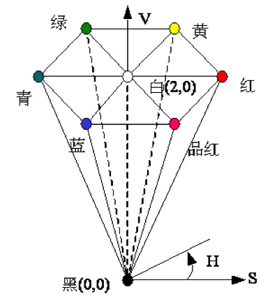

<script src="https://cdn.mathjax.org/mathjax/latest/MathJax.js?config=TeX-AMS-MML_HTMLorMML" type="text/javascript"></script>

# 《计算机图形学》复习提纲

## Introduction

1. **计算机图形技术范式的演化**：字符显示（文字加数字的伪图形）、矢量显示（清晰的笔画文字及线画图形）、二维光栅扫描显示、图形工作站及多视角投影.
2. **计算机图形学的基本问题**：在计算机中生成、操纵和存储几何对象，并在设备上实现图形显示. 客观世界$$\rightarrow$$对象模型$$\rightarrow$$图像三者间的一系列映射过程.
3. **图形绘制的难点**：巨量信息处理的实时性及对客观世界对象模拟的逼真度.
4. **计算机图形系统的处理流程**：建模坐标系$$\rightarrow$$世界坐标系$$\rightarrow$$观察坐标系$$\rightarrow$$规范化坐标系$$\rightarrow$$设备坐标系.
5. **计算机图形系统软件组成部分**：数据平台（对象描述模型）、支撑平台（图形支撑软件）、应用平台（应用软件）.
6. **计算机图形学目标**：在计算机系统内“逼真”地模拟各种客观世界的对象或场景. 计算机图形学中的**图形**：
	- 能采用数学表示方法表示
	- 能在计算机内表示和存储
	- 能在图形输出设备上绘制
7. 计算机图形学中的“图形”和“图像”：
	- **图形**：用矢量形式表示客观世界对象构成元素间的内在联系（主要用于交互建模）
	- **图像**：用点阵形式表示客观世界对象外观表现的设备输出结果（主要用于设备输出表示. 图像显示设备只以点阵方式输出图形，没有矢量图形交互能力）
8. **图形显示原理**：光栅扫描显示、随机扫描显示
	- **光栅扫描显示**——基本元素：像素点；基本过程：点排布；图像=离散点集；点集排布生成图像
	- **随机扫描显示**——基本元素：线条；基本过程：画线；图形=连续线集；线条绘制生成图形
9. **图形生成的基本要素**
	- **图形呈现**——光栅扫描：前/背景像素或阵列颜色设置；随机扫描：笔画线条颜色或风格设置
	- **图形生成**——光栅扫描：逐点设置像素点阵；随机扫描：逐条绘制笔画线条
	- **图形保持**——光栅扫描：逐个像素反复扫描整个屏幕；随机扫描：逐条笔画反复绘制整个图形
10. **计算机图形的点阵表示**：以矩形形式（点阵图）枚举图形构成像素点表示图形，强度图形由哪些点构成且这些点具有什么颜色. **缺点：点阵表示需要大量的存储空间；对点阵表示进行编辑、修改相对更困难；点阵表示的放大操作会使图形失真.**
11. **计算机图形的矢量表示**：以数学方程等数学形式对图形进行描述，用图形的形状参数（端点坐标等）和属性参数（颜色、线型等）来表示图形. **优点：所占空间小得多；各部分独立，以点线面体为基本构成元素（面向对象图形表示），便于编辑修改；输出与实际显示的分辨率无关，放大不会失真.** **缺点：看起来比较抽象，缺乏真实感；矢量输出必须采用矢量式输出设备.**
12. **计算机图形学的图形类别**
	- **第一类（点阵图形）：全灰度/彩色图形**——用整数元素矩阵表示
	- **第二类（点阵图形）：二值或少色图形**——用1比特元素矩阵表示
	- **第三类（矢量图形）：连续的曲线和直线**——用坐标及增量和差分链码表示
	- **第四类（矢量图形）：离散的点或多边形**——数据拟合/造型
13. **计算机图形学的图形转换**
	
	类内转换：第1、2类是滤波变换（对比度增强、高频噪声滤波等），第3、4类是坐标系统的改变（旋转、平移等）
	
14. **计算机图形学的相关学科**
	

## 图形系统显示原理

### CRT显示器的结构原理

1. **阴极射线管（CRT）：图形显示器的核心**. 基本工作原理：由电子枪发出的电子束(阴极射线)；通过聚焦系统聚焦和加速电极加速；由偏转系统控制射向涂覆荧光层的荧光屏上的指定位置；在电子束冲击的每个位置，荧光层发出一个小亮点；荧光屏上多个亮点就形成了可见图形. 概念：电子枪、聚焦系统、加速电极、偏转系统、荧光屏、荧光粉层、余辉时间.
2. **荧光屏的颜色取决于电子束激活荧光粉层的颜色种类数和强度等级**. **显示分辨率**：当两个荧光发光点间隔大于亮度衰减到最大值60%时的光点直径（两亮点是可分的）时，荧光屏在水平和垂直方向单位长度上所分布的最大光点数.

### CRT显示器的颜色原理

1. 光源用白色描述，混合成白色光的两种彩色光源称为**互补色**. 在颜色模型中用来生成其它颜色的两种或三种颜色称为**基色**（任意互不相关的三种颜色）. 混合颜色模型实用的三种颜色获得的一定范围颜色，称为模型的**颜色范围**.
2. **颜色表示**：红$$R$$，绿$$G$$，蓝$$B$$，则任意一种颜色$$F$$可表示为$$F=R[R]+G[G]+B[B]$$其中$$[R, G, B]$$为$$F$$的颜色坐标. $$F$$的亮点是其分量亮度和：$$Y_F=RY_R+GY_G+BY_B$$
3. **颜色匹配公理**
	- $$F_1+F_2=(R_1+R_2)[R]+(G_1+G_2)[G]+(B_1+B_2)[B]$$
	- $$kF=kR[R]+kG[G]+kB[B]$$
	- 若$$F_1=F_2,F_2=F_3$$，则$$F_1=F_3$$.
4. **颜色的三种特征：色度（色相）、彩度（饱和度）、明度（亮度）**. 都是主观量，是颜色的非精确描述.
	- **色度**：颜色的基本色彩，一种颜色区别于另一种颜色的最重要特征. **沿圆周变化**.
	- **饱和度**：颜色表现的纯度，加入白色降低饱和度. **沿半径变化**.
	- **亮度**：人感受到的物体光亮度，单位时间、单位角度及单位投射面上光源辐射的能量. **沿颜色空间的中心线变化**.
5. **CIE-XYZ模型**：定义各种颜色的**加色空间**，$$X, Y, Z$$三基色是虚颜色，定义了一组彩色匹配函数.$$F=X[X]+Y[Y]+Z[Z]$$其中$$[X],[Y],[Z]$$表示三位加色空间向量（三基色），$$X,Y,Z$$表示匹配$$F$$所需的基色的权. 归一化平面：$$X+Y+Z=1$$. 通过基色权向量的规范化来定义色度坐标. $$Y$$为亮度值. 规范化定义：$$x=X/(X+Y+Z),y=Y/(X+Y+Z),z=Z/(X+Y+Z)$$z$$决定颜色的“色彩”和“纯度”参数. 一种颜色的完整表述需要三个值$$(x,y,Y)$$X=\frac{x}{y}Y,Y=Y,Z=\frac{1-x-y}{y}Y$$
	- 色度图：将$$X+Y+Z=1$$平面投影到$$XY$$平面上.
	
	舌状曲线——边界和内部表示所有可见光色度值；边界上的点——色纯度为100%的纯彩色；内部点——所有可能的可见颜色的组合；C点——照明体白色位置，坐标近似为$$(1/3,1/3,1/3)$$；紫红线：连接红色和紫色点的直线，不属于光谱.
	- 两点$$C_1,C_2$$连线可表示混合适量的$$C_1,C_2$$颜色. 三点$$C_3,C_4,C_5$$的颜色范围是它们连成的三角形. 三基色只能产生在三角形内部或边上的颜色. **不可能有一个三角形能包含所有颜色.**
	- **互补色：色度图上位于$$C$$的两侧且通过$$C$$的直线上两个点$$C_3,C_4$$.** **主波长**：$$C$$与$$C_1$$连线与光谱曲线相交的$$C_s$$. **颜色纯度**：$$d_{CC_1} / d_{CC_s}$$. 若$$C_s$$在紫红线长，则主波长取反向延长线与光谱曲线的交点.

6. **颜色模型**：三维颜色空间的一个子集，包含某色域中的所有颜色.
	- 面向计算：颜色表示空间间的转换（Lab模型）
	- 面向设备：图形输出设备的颜色（RGB和CMY模型）
	- 面向用户：给用户提供直观的接口（HSV和HLS模型）
7. **CIE Lab模型**：描述正常视力的人能看到的颜色，$$L$$表示亮度成分，$$a,b$$表示色度成分（$$a$$为红到绿的变化，$$b$$为黄到蓝的变化，两者值域都是$$+120\sim-120$$. 与设备无关，包含了RGB, CMY的所有色域，弥补了RGB色彩模型色彩分布不均.
8. **RGB模型**：单体立方体描述颜色，$$F=R[R]+G[G]+B[B]$$. 明暗度：原点到白色顶点的主对角线. 对角线上每一点是基色等量混合.


9. **CMY模型**：以青（$$C$$)、品红（$$M$$）、黄（$$Y$$）三基色描述设备输出的减色模型. 主对角线上生成灰色. 注：油墨存在杂志，三种油墨混合实际产生土棕色. 四色油墨打印（青、品红、黄、黑）：CMYK模型.

10. **RGB-CMY转换** $$(C,M,Y)=(1,1,1)-(R,G,B)$$(R,G,B)=(1,1,1)-(C,M,Y)$$
11. **HSV模型**：描述彩色与黑白颜色混合的明暗、色泽、色调. 颜色参数：色彩（$$H$$）、饱和度（$$S$$）、明度值（$$V$$）.


	- 加白色：$$S$$减小，$$V$$不变，调节色泽
	- 加黑色：$$V$$减小，$$S$$不变，调节明暗
	- 加白色和黑色：$$V,S$$同时减小，指定各种色调
	- 使用方法，先指定春色彩（色彩角$$H$$且$$V=S=1$$），再调节$$V$$和$$S$$
>疑点：课件中P23和P27的那两坨公式

12. **HSV-RGB转换**
	- HSV六棱锥底部$$\rightarrow$$立方体六边形色彩边界
	- 六棱锥的$$V$$轴$$\rightarrow$$立方体黑白对角线
	- 六棱锥剖切面区域$$\rightarrow$$立方体每一子立方体
	- $$V$$取一组RGB的最大值，$$S$$取到$$V$$轴的相对距离，$$H$$取该点在六边形的六等分中的相对位置.


13. **HLS模型**
	- 色彩：含义与HSV模型相同，$$H=0^{\circ}$$与蓝色相对应.
	- 纯色彩位于$$L=0.5$$的平面上.
	- 当$$S=0$$时，仅有灰度.

### CRT显示器的扫描原理

1. **光栅扫描显示**
	- 刷新式CRT光栅扫描：电子束从左到右、由上而下逐个像素反复扫描整个屏幕.
	- **扫描线**：从左到右扫描一次生成一条扫描线.
	- **一帧**：顶端到底部所有扫描线构成一帧图像.
	- **图形**：前景像素置图形颜色.
	- **图形背景**：背景像素置背景色.
	- **不同颜色**：控制电子束的强度.
	- **水平回归**：扫描到每条扫描线末端时，返回到屏幕左边开始下一条扫描线.
	- **垂直回归**：扫描完最后一条扫描线时，返回屏幕左上角开始下一帧. 回扫过程中，电子束几乎不发射电子，而且速度很快.
2. **隔行扫描**：第1趟是奇场扫描，第2趟是偶场扫描，只需逐行扫描一半的时间即可看到整个屏幕显示，相邻扫描线包含类似显示信息的场合，降低成本而不增加闪烁感.
3. **刷新频率**：光栅扫描显示其每秒刷新的循环数（Hz），与物体的复杂度无关.
4. **帧缓冲器**：存储图像所有像素的颜色和强度值. 存储单元个数至少与显示器能显示的像素总数相同，且对应于可寻址的屏幕像素位置.
	- 每像素一位（二值/黑白）系统中的帧缓冲器称为**位图**.
	- 彩色/单色多灰度显示系统中的帧缓冲器称为**像素图**.  
	
	基本指令：
	
	- `read(I, x, y, z)`：读存储器的位置`I`确定的屏幕位置`(x, y)`中颜色/灰度等级`z`的内容.
	- `write(x, y, z)`：完成屏幕上对应位置的显示.
	- 显示过程的主要显示循环：对所有存储器存储单元`I`，先后执行`read`和`write`.

	**帧缓冲器存储单元位长为$$n$$\rightarrow$$帧缓冲器能支持一幅画面上同时显示的灰度等级数或颜色种类数为$$2^n$$.** 每个像素具有24个存贮位的RGB彩色系统通常称为全彩色系统或真彩色系统. **一幅画面上能同时显示的颜色种类数 $$\le$$ 物理屏幕像素总数**
	
	- 显示器分辨率为$$m\times n$$，需要同时显示$$k$$种颜色$$\rightarrow$$帧缓冲器的容量$$v$$至少为$$v=m\times n\times\lceil\lg k\rceil$$
	- 显示器分辨率为$$m\times n$$，帧缓冲器容量为$$v$$\rightarrow$$可以同时显示颜色种类数$$k=2^{\frac{v}{m\times n}}$$
	
	**帧缓冲器分页**：帧缓冲器区域分成若干页面，每个页面存放一幅屏幕画面，此时帧缓冲器可同时存放多幅画面的像素图，通过控制器实现不同画面的切换. 通过上下滚动和左右移屏等操作，可看到帧缓冲器中的整个画面.
	
	**帧缓冲器结构**
	
	- 组合像素结构：每个像素的所有位均集中存储在单个存储器中.
	- 位平面结构：使用多个存储题，像素每一位各自存放在不同的存储体中. 一幅画面上所有相同位的像素存储在同一存储体内形成**位平面**. 若帧缓冲器的位平面数目为$$n$$，则一幅画面上可同时显示的颜色种类为$$2^n$$.

5. **彩色查找表技术**：在帧缓冲器与显示屏的数模转换器间增加一个彩色查色表（调色板），对显示颜色进行索引.
	- 一维线性表
	- 彩色表地址长度由帧缓冲器每个存储单元的位数决定（决定能同时显示的颜色种类数）
	- 每一对元素应一种颜色，元素位长可由用户确定.（决定显示器可选择显示的颜色种类总数）
	- **此时帧缓冲器中每个单元存储的是对应于某一像素的颜色地址，而不是颜色值**
	- **功用：彩色表中元素的位数可以取得很大，每一种独立颜色成分可定义为更高的精度，颜色可以变化得更细致.**

6. **随机扫描显示**
	- 也称为向量/笔划/笔迹显示器.
	- 图形定义：存放在刷新显示文件存储区的一组画线命令. 采用以线段或笔画为单位指令序列$$S_i$$来表示物体形状.
	- 图形显示过程：显示处理器解释显示列表并控制显示.**（系统周期地按显示列表中的一组画线命令依次画出其组成线条）**
	- 电子束只在屏幕的图形部分移动
	- **刷新频率依赖于图形组成的线条数目**
	- **基本指令**：`P(x, y)`将电子束定位在点`(x, y)`位置上，`S(Z)`置电子束的亮度值为`Z`.
	- **特点**：随机扫描系统是为画线应用设计的，不能显示逼真的、有阴影场景. 一般具有比光栅系统更高的分辨率. 随机扫描CRT电子束直接按线条路径画线，能生成光滑线条.

7. **光栅扫描系统**
	- **帧缓冲器**在系统存储器的任意位置，使用系统存储器的固定区域，由视频控制器直接访问. **视频控制器**用于屏幕的基本刷新操作，两个寄存器用来存放屏幕像素的坐标，开始时X寄存器置为0，Y寄存器置为$$Y_{\mathrm{max}}$$. $$X=X+1\rightarrow X=X_{\mathrm{max}},Y=Y+1$$. 存储在帧缓冲器中该像素对应位置的值被取出，并用来设置CRT电子束的强度值.
	
	- **优点**：刷新频率固定，与图形复杂度无关；易于绘制填充图形，具有丰富的颜色.
	- **缺点**：图形显示时需要扫描转换，过程相当费时；有直线段不直，图形边界呈阶梯状等走样现象.
	- **复杂光栅扫描系统**：运用其它处理器作协处理器和加速器并执行各种图形操作.
	

8. **随机扫描系统**
	- 系统存储器：存放应用程序与图形软件
	- 显示缓存：应用程序的图形命令由图形软件包翻译成显示文件并存入帧缓冲器(显示缓存)
	- 显示处理器：访问应用程序显示文件以刷新屏幕
	

### 液晶显示器的基本原理
1. 物理特性：通电时，液晶呈现透明，光线容易通过；不通电时，液晶变得浑浊，阻止光线通过.
2. 类型
	- 无源矩阵式（扭曲向列型）：借助时序扫描信号直接驱动液晶，各扫描线间会产生串扰，降低图像质量，成本低；
	- 激活矩阵式（薄膜晶体管型）：将薄膜单元配置与各像素，完全避免像素间串扰，扫描线数不影响图像质量，高清晰，制作成本高.
3. 优点：环保、平面化、可视范围大、高亮度、省空间

### 数字墨水显示的基本原理
1. 核心：**人可以按照自己所习惯的方式自由地输入，**以人为中心.
2. 显示原理：数字墨水是由双稳定性元件构成的显示器，包含数百万个微小粒子（通电后会上下漂动）. 它们包含两类颗粒：**带正电荷的白色颗粒和带负电荷的黑色颗粒.**
	- 施加负电场$$\rightarrow$$白色颗粒上浮$$\rightarrow$$在显示器表面呈白色
	- 施加正电场$$\rightarrow$$黑色颗粒上浮$$\rightarrow$$在显示器表面呈黑色

	微小粒子悬浮在液态的“传载媒体”上. 允许几乎任何表面称为显示平面.
3. 特点：极佳可读性、极低能耗、超便携性.
4. 主要趋势：彩色显示、显示的灵活性和电子纸.

## 输出图元生成

- **输出图元**
	+ 描述图形构成基本几何结构的子程序（点、线、字母、彩色阵列定义的区域等）.
	+ 用于构成更复杂图形提供基本工具.
	+ 输出图元生成属于图形的设备级算法. 
	+ 输出图元两大类：线画图元（用矢量表示的二维图形）；填充图元（用点阵表示的二维图形）
	 - **线画图元**：将表示图形的数学方程离散化为适于光棚扫描显示的点阵表示，过程即为扫描转换过程.
	 - **填充图元**：确定定义图形点阵区域的内部点表示.
	 
### 线画图元生成
- **扫描转换**：连续线段$$\rightarrow$$离散点集
- **基本思想**：根据直线的数学方程计算出落在直线段上或充分靠近直线段的像素集，并以此像素集近似替代原来的直线段在屏幕上显示.
- **实现方式**：在离散位置上对数学表示的线段取样，并在每个取样位置上确定距线段最近的像素.
- **图元像素编制方案**
	+ **像素网格坐标**：每个点的坐标位置在像素中心.
	
	+ **屏幕网格坐标**：每个像素区域由左下角整数网格坐标来指定.
	
- **随机扫描线画图元生成**：$$\Delta x, \Delta y$$决定偏转电压，斜率$$\mid m\mid $$与1的关系决定了水平/垂直偏转电压的设置，以及另一偏转电压由$$\Delta y,\Delta x$$计算决定.

1. **直线生成DDA算法**
	- 描述：利用光棚特性（屏幕单位网格表示像素列阵），使用$$x$$或$$y$$方向单位增量（$$\Delta x$$或$$\Delta y=\pm1$$）来离散取样，并逐步计算沿线路径各像素位置.
	- 分类讨论
		- $$\mid m\mid \le1$$：以$$\Delta x=\pm1$$取样，计算$$y_{k+1}=y_k\pm m$$.
		- $$\mid m\mid >1$$：以$$\Delta y=\pm1$$取样，计算$$x_{k+1}=x_k\pm\frac{1}{m}$$.
	- 特性
		- 消除直线方程中的乘法，比直接使用直线方程快.
		- 求每一个像素点位置时都必须进行取整操作.
		- 取整操作和浮点运算仍很耗时：将增量$$m$$和$$1/m$$分离成整数和小数部分简化所有的计算为整数操作以改善性能.

2. **中点画线法**
	- 起点$$(x_0, y_0)$$、终点$$(x_1,y_1)$$、直线方程$$F(x,y)=ax+by+c$$\rightarrow$$a=y_0-y_1,b=x_1-x_0,c=x_0y_1-x_1y_0$$. 
	- 对于某个整数点$$(x_i,y_i)$$，要确定下一个横坐标$$x_i+1$$对应的纵坐标，即考察$$d=F(M)=F(x_i+1,y_i+0.5)$$的符号（负取$$y_i+1$$、非负取$$y_i$$）. $$d\ge0$$时$$d$$的增量为$$a$$，否则增量为$$a+b$$. 初始值为$$d_0=a+0.5b$$. 一般用$$2d$$代替$$d$$的计算.

3. **直线生成的Bresenham算法**
	- 采用整数增量运算，通过对整形参量值符号的检测，选择候选像素中离实际线路近的像素作为线的一个离散点.
	- 假设$$0<m\le1$$. 在第$$k$$步确定的像素位置为$$(x_k,y_k)$$，则在$$k+1$$步选择的位置只可能是$$(x_{k+1},y_k)$$或$$(x_{k+1}, y_{k+1})$$. 垂直偏移分别为$$d_1=y-y_k$$和$$d_2=y_{k+1}-y$$，差值为$$d_1-d_2=2m(x_k+1)-2y_k+2b-1$$. 将$$m=\Delta y/\Delta x$$（用首尾点坐标计算）代入得到**第$$k$$步的决策参数**：$$p_k=\Delta x(d_1-d_2)=2\Delta yx_k-2\Delta xy_k+c$$
		+ $$p_k>0$$ $$\rightarrow$$ 选择较高像素$$(x_{k+1},y_{k+1})$$.
		+ $$p_k<0$$ $$\rightarrow$$ 选择较低像素$$(x_{k+1},y_k)$$.
	
	- **决策参数的增量公式**$$p_{k+1}=p_k+2\Delta y-2\Delta x(y_{k+1}-y_k)$$当$$p_k>0$$时$$y_{k+1}-y_k=1$$;当$$p_k<0$$时$$y_{k+1}-y_k=0$$. 起始位置$$(x_0,y_0)$$的决策参数$$p_0=2\Delta y-\Delta x$$.
	- **斜率绝对值是否大于1决定离散取样方向，起始端点决定直线生成方向和相应坐标值的增量正负.**
	- **特殊情况**：水平线、垂直线、对角线直接装入帧缓冲器，无需进行画线算法处理.

4. 并行画线算法
	- 关键：平衡各可用处理器间的处理负载.
	- 方法：将直线按一定策略分割成多个子段，每个子段采用Bresenham画线算法，并同时生成线段.
		+ 子段分割分配：把线段按处理器数目进行分段
		+ 扫描线像素分配：根据线段斜率，按扫描线或像素列为每个处理器分配线段子段
		+ 区域像素分配：按直线覆盖的区域为每个处理器分配某个屏幕子区域的子段

5. **圆和椭圆的中点算法**
	- **中点圆生成算法**
		+ 思想：避免平方根运算，直接采用像素与圆距离的平方作为判决依据，通过检验两候选像素中点与圆周边界的相对位置关系来选择像素.
		+ 好处：适应性强（易应用于其它圆锥曲线）、误差可控（半个像素以内）
		+ **减少计算量**：运用平移和对称
		+ **生成顺序**：从$$y$$轴上圆周点$$(0,r)$$顺时针方向生成第一象限内八分之一圆周（在$$x$$轴方向取样，$$x$$方向值递增，$$y$$方向值递减）
		+ **定义圆函数**：$$f_{circle}(x, y)=x^2+y^2-r^2$$.
		+ **决策参数判断**：决策参数$$p_k=f_{circle}(x_{k+1}, y_k-1/2)$$. 若$$p_k\ge0$$，则取低像素$$(x_{k+1},y_{k}-1)$$，否则取高像素$$(x_{k+1}, y_{k})$$.
		+ **下一个决策参数**：对于第$$k+1$$个决策参数，若$$p_k<0$$，则$$p_{k+1}=f_{circle}(x_{k+2}, y_k-1/2)$$. 否则$$p_{k+1}=f_{circle}(x_{k+2}, y_k-3/2)$$.
		+ **决策参数的初始值**：$$p_0=5/4-r$$.**增量**：若$$p_k<0$$，则$$p_{k+1}=p_k+2x_{k+1}+3$$，否则$$p_{k+1}=p_k+2x_{k+1}+5-2y_{k+1}$$.
		+ **改进策略**：用$$e=p-0.25$$代替$$p$$（在算法中全部使用整数）

```C
void MidpointCircle2(int R) {
	int x, y, deltax, deltay, d;
	x = 0; y = R; d = 1 - R;
	deltax = 3;
	deltay = 5 - R - R;
	setPixel(x, y);
	while (x < y) {
		if (d < 0) {
			d += deltax;
			deltax += 2;
			deltay += 2;
			x++;
		}
		else {
			d += deltay;
			deltax += 2;
			deltay += 4;
			x++;
			y--;
		}
		setPixel(x, y);
	}
} 
```  

```C
void BresenhamCircle(int R) {
	int x, y, p;
	x = 0; y = R;
	p = 3 - R - R;
	for (; x <= y; x++) {
		setPixel(x, y);
		if (p >= 0) {
			p += 4 * (x - y) + 10;
			y--;
		}
		else {
			p += 4 * x + 6;
		}
	}
}
```

- 接上
	- **中点椭圆生成**
		+ **椭圆方程**：$$(\frac{x-x_c}{r_x})^2+(\frac{y-y_c}{r_y})^2=1$$
		+ **定义椭圆函数**：$$f_{ellipse}(x, y) = r_y^2x^2+r_x^2y^2-r_x^2r_y^2$$.
		+ **区域划分**：第一象限的椭圆斜率为$$dy/dx=-2r_y^2x/2r_x^2y$$. 在两区域交界处有$$dy/dx=-1$$即$$2r_y^2x=2r_x^2y$$. 下面考察从$$(0, r_y)$$开始顺时针方向生成椭圆的过程.
		
		+ **区域1算法**：决策参数$$p_{1k}=f_{ellipse}(x_{k+1},y_k-1/2)$$
			- $$p_{1k} < 0$$\rightarrow$$选择像素位置$$(x_{k+1}, y_k)$$.
			- $$p_{1k}\ge0$$\rightarrow$$选择像素位置$$(x_{k+1}, y_{k-1})$$.
		+ **区域2算法**：决策参数$$p_{2k}=f_{ellipse}(x_k+1/2,y_{k-1})$$
			- $$p_{2k} < 0$$\rightarrow$$选择像素位置$$(x_{k+1}, y_{k-1})$$.
			- $$p_{2k}\ge0$$\rightarrow$$选择像素位置$$(x_{k},y_{k-1})$$.

			
6. **线画图元属性定义**
	- 属性参数：任何影响图元显示方法的参数.
	- **线画图元的主要属性：线型、宽度和颜色.**
	- **线型**
		+ 虚线：在实线段之间插入与实线段等长的空白段.
		+ 划线：长度和空白段长度常作为用户选项来指定.
		+ 点线：很短的划线和等于或大于划线大小的空白段.
		+ 段长度和中间空白段的像素数目也可用像素掩模指定.
	- **线宽**
		+ 标准线宽：每个放样位置处用一个像素来生成.
		+ 其它线宽：作为标准线的正整数倍，通过沿相邻平行线路径画额外像素而显示.
		+ 线的显示线宽（取决于斜率）
			- 斜率绝对值小于1$$\rightarrow$$在垂直段交替地拾取线段路径上边和下边的像素形成粗线.
			- 斜率绝对值大雨1$$\rightarrow$$在水平段交替地拾取线段路径左边和右边的像素形成粗线.
		+ 生成粗线的其它方法：将显示线段看作填充长方形，用选定的笔或刷样式来生成线段.
	- **线帽**
		+ 调整线端的形状，给出更好的外观
		+ 方帽、圆帽、突方帽
	- **线连接**
		+ 斜角连接、圆连接、斜切连接
	- **笔刷选择和颜色**：笔刷形状、尺寸、式样，颜色和亮度等级选择.

7. **线画图元的反走样技术**
	- **走样**：由于低频取样不充分而造成的信息失真（锯齿形、台阶状）.
	- **反走样**：校正不充分取样过程，避免从周期性对象中丢失信息.
		+ Nyquist取样频率$$f_s$$：把取样频率至少设置为出现在对象中的最高频率的两倍：$$f_s=2f_{max}$$.
		+ 取样区间：不超过循环区间的一半，$$\Delta x_s=\Delta x_{cycle}/2$$，其中$$\Delta x_{cycle}=1/f_{max}$$.
	- **反走样方法：非加权区域采样**
		+ 原则：**一个像素亮度对直线段的贡献与两者相交程度成正比**.
		+ 基本思想：将直线段看成具有一定宽度的狭长矩阵，当直线段与像素有交时，求出两者相交区域，根据相交区域确定该像素的亮度等级.
		+ 实现原理：像素面积设为单位面积；相交区域面积是介于0、1间的实数；**像素实际显示的亮度值为相交区域面积和像素可设置的最大亮度值的乘积；**方法间的差异体现在相交区域面积的定义和计算.
	- **反走样方法：直线段过取样**
		+ 原则：**像素亮度对线段的贡献程度取决于其与线段相交的子像素数目**
		+ 方法：**高分辨率**对线段取样，**低分辨率**显示结果，将屏幕看成比实际更细的子像素网络来增加取样率.
		+ 细节处理：考虑线宽度时，将每个像素亮度设置成正比于线区域内的子像素数目来过取样；有颜色显示时，对子像素亮度进行平均来得到像素颜色设置.
	- **反走样方法：区域取样与亮度校正**
		+ 区域取样（前滤波）：每个像素亮度设置成正比于像素与有限宽线的重叠区域（通过采用更细子像素网格）.
		+ 线亮度差校正：相同数目像素所画两条线，对角线比水平线长（对角线显得比水平线要暗）.
		+ 按照斜率调整亮度：水平和垂直线以最低亮度显示，45度线以最高亮度显示，考虑线宽时线以正比于其长度的整体亮度显示.
	- **反走样方法：加权区域采样**
		+ 原则：**一个像素亮度对直线段的贡献程度正比于相交区域与像素中心的距离.**
		+ 基本思想：将直线段看作是具有一定宽度的狭长矩形，相交区域与像素中心的距离决定像素亮度对直线的贡献程度.
		+ 基本方式：设置相交区域面积元与像素中心距离的权函数（如高斯函数等）反映相交面积元对整个像素亮度的贡献. 利用权函数积分求相交区域面积，相交区域面积乘以像素可设置的最大亮度值即为像素实际显示的亮度值.
	- **反走样方法：加权掩模与过滤**
		+ **像素加权掩模**：接近于像素区域中心的子像素有更大的权.
		+ **过滤技术**：假象一个连续的加权曲面覆盖像素，将像素曲面集成得到加权的平均亮度的，为减少计算量，常用查表法求整数值.
	- **硬件反走样：像素移相**
		+ 将像素区域显示位置移动而实现反走样（将电子束微定位到更接近由物体几何指定的近似位置）
	- **区域边界反走样**
		+ 通过分割整体区域，并决定区域边界内的子像素数目，以像素区域覆盖率为基础来调整每个边界位置处的像素亮度.
		+ **边界覆盖计算**：确定在边界内像素区域百分比
		
		
### 填充图元生成

1. **扫描填充图元生成**
	- **基本原理**：从多边形的顶点信息出发，求出位于内部的各个像素，并将其各个像素的颜色值写入帧缓冲器中相应的单元.
	- **基本过程**：对每条横越多边形的扫描线求交点、按横坐标排序、配对存储、取整和填充.
	- **奇偶规则**：从任何位置$$p$$到区域范围以外远距离画一射线，若与区域多边形边界的交点数目为奇数，则$$p$$是内部点，否则是外部点（确保射线不与任何多边形顶点相交）.
	- **扫描线与顶点相交处理**：若共享顶点的两条边位于扫描线同侧，则视为扫描线与偶数条边相交，否则需要额外处理才能确定正确的内部像素点.
		+ **拓扑关系判别**：跟踪多边形边界，观察从一条边经共享顶点移到另一条边时它们端点$$y$$坐标变化，若单调递增或递减，则将扫描线与多边形的交点数计为1个，否则计为2个.
		+ **分离处理**：缩短多边形某些边，分离应计为一个交点的顶点. 顺/逆时针处理多边形边界中的非水平边. 对任一条边，检测该边与下一条非水平边共享顶点时是否有单调递增或递减的端点$$y$$值，若有，**将较低一条边缩短一个单位值**，以保证通过这两条边共享顶点的扫描线仅产生一个交点. 若单调递减，则**当前边**较高端点$$y$$值缩短一个单位，否则**跟随边**较高端点$$y$$值缩短一个单位.
	- **求交点的增量计算**
		+ **直线连贯性**：直线穿越两条相邻扫描线时其斜率不变.
		+ 两相邻扫描线间坐标变化：$$y_{k+1}-y_k=1,x_{k+1}-x_k=1/m$$
	- **求交过程的活动边表**
		+ **边表（ET）**：按下端点$$y$$坐标对非水平边进行分类的指针数组，对多边形所有边按下端点$$y$$坐标值进行$$y$$桶分类，同一类中的边按$$x$$或$$\Delta x$$值递增的顺序排列成链表，包含**该边最大$$y$$值、边下端点$$x$$坐标值、边斜率的倒数**. 作用：排除不必要的求交测试.  
	- **活动边表**
		+ **活化边表（AET）**：记录多边形沿扫描线的交点序列，简化后续计算过程. 对第$$k$$条扫描线，首先将对应于当前扫描线以下类$$c(c=1,2,\dots,k-1)$$所有边插入活化边表，再删除满足$$y_{max}<y_k$$的边，其它边的$$x$$域根据$$x_{k+1}=x_k+((y_k-y_c)/m)$$确定交点. 活化边表的每个节点包含**该边最大$$y$$值、与扫描线交点的$$x$$坐标值和边斜率倒数.**

	```C
	Polygonfill(EdgeTable ET, ColorRef color) {
		1. y=边表ET中各登记项对应的y坐标中最小的值;
		2. 活跃边表AET初始化为空表；
		3. while (ET表中仍有扫描线未被处理） // 处理ET表中每一条扫描线 {
			3.1 按ET中登记项y对应的各个桶合并到表AET中，将AET中各桶按x坐标递增排序;
			3.2 在扫描线y上，按照AET表提供的x坐标对，用color实施填充;
			3.3 将AET表中有y=y_{max}的各项清除出表;
			3.4 对AET中留下的各项，分别将x换为x+1/m，这时求出了AET中各边与下一条扫描线交点的x坐标;
			3.5 前一步可能破坏AET表中各项x坐标的递增次序，故按x坐标重新排序;
			3.6 y=y+1，去处理下一条扫描线.
		}
	}
	```
2. **区域填充图元生成**
	- **区域的表示**：区域是表示成点阵形式的填充图形，是像素的集合.
		+ 内点表示：枚举出给定区域内的所有像素，区域内所有像素着同一颜色，边界上像素着不同颜色.
		+ 边界表示：枚举出给定区域内所有边界上像素，边界上像素着同一颜色，区域内像素着不同颜色.
	- **区域填充原理**：从区域的一个种子点开始，赋予指定的颜色并将该颜色扩展到整个区域.
		+ 边界填充：对边界表示的区域进行填充.
		+ 泛滥填充：对内点表示的区域进行填充.
		+ 填充区域的基本要求：**区域是连通的.**（区域连通性）
		+ 填充区域的起始要求：**内点为种子点.**（内外点测试）
	- **像素连通定义**
		+ **像素4连通**：定义城区距离$$d_4(p,r)=\mid x_p-x_r\mid +\mid y_p-y_r\mid $$. 则像素$$p(x_p,y_p)$$的4连通区域或4邻域$$N_4(p)$$定义为$$N_4(p)=\{r\mid d_4(p,r)=1\}$$.
		+ **像素8连通**：定义棋盘距离$$d_8(p,r)=\mathrm{max}(\mid x_p-x_r\mid ,\mid y_p-y_r\mid )$$. 则像素$$p(x_p,y_p)$$的8邻域$$N_8(p)$$定义为$$N_8(p)=\{r\mid d_8(p,r)=1\}$$.
		+ **像素16连通**：定义马步距离$$d_k(p,r)$$为国际象棋马从一格运动到另一格所需步数计算，$$N_k(p)=\{r\mid d_k(p,r)=1\}$$. 定义像素$$p(x_p,y_p)$$的16邻域$$N_{16}(p)$$为$$N_{16}(p)=N_8(p)\cup N_k(p)$$.
		+ **连通区域定义问题**：同时考虑内部像素和边界像素的连通性.
			- **像素4连通的区域的边界像素只需是8连通.**
			- **像素8连通的区域的边界像素必须是4连通.**
	- **边界填充算法**
		+ 输入：内部种子点坐标、填充颜色和边界颜色. 边界以单一颜色指定，按像素连通性逐个像素处理，直到遇到边界颜色为止.
		+ **递归边界填充**：从区域的一个种子点开始，根据内部像素连通性检测相邻位置是否为边界颜色，并递归地扩展到整个区域，若不是，用填充颜色涂色，并按连通性扩展检测其相邻位置；递归地进行此过程，直到检测完区域边界内的所有像素为止. **缺陷**：需要较大的存储相邻点的栈空间；假如内部像素颜色和填充颜色相同，则导致该递归分支终止，因此要先改变那些初始颜色为填充颜色的内部像素颜色.
		+ **扫描线边界填充**：填充种子点像素所在扫描行的连续像素段，再将相邻扫描线上各段的起始点位置像素进栈，各起始点依次按先进后出从栈中取出，并填充该点所在水平段像素，重复如此过程.
		+ **泛滥填充算法**：区域内部用单一颜色定义的区域填充. **递归填充**：从种子点开始，按像素连通定义，递归检测和扩展区域内部像素，并将填充颜色赋给这些像素，直到所有内部点均被着色. **扫描线转换填充**：从每个区间第一个位置开始，按扫描线逐步将区域内扫描线上每个像素颜色替换为填充颜色，直到所有内部点均被着色.

3. **图像区域填充生成**
	- 对区域内的某一像素，首先查询它对应位图或像素图中的像素单元，再根据填充方式以合适的像素颜色值显示该像素单元.
		+ 当按**位图不透明**方式填充时，若图像单元为1，以区域前景色显示像素；否则用区域背景色显示像素.
		+ 当按**位图透明**方式填充时，若图像单元为1，以区域前景色显示像素；否则不改变区域像素的颜色.
		+ 当按**像素图**方式填充时，以像素图单元的颜色值显示像素.

4. **图像填充的效果处理**
	- 若图像尺寸是$$M\times N$$. 存放在数组$$pattern[M][N]$$中，通过周期性排列构成图像空间.

5. **扫描填充与区域填充转换**
	- 多边形扫描转换$$\rightarrow$$区域填充：已知顶点表示的多边形内一点作为种子点，并用扫描转换直线算法将多边形边界表示为8连通区域.
	- 区域填充$$\rightarrow$$多边形扫描转换：若已知给定区域是多边形区域，通过一定的方法求出顶点坐标.

6. **扫描填充与区域填充区别**
	- **基本思想不同**——多边形扫描转换：将多边形顶点表示转化为点阵表示；区域填充：只改变区域填充颜色，不改变其表示.
	- **边界要求不同**——多边形扫描转换边界可以不封闭；区域填充中，8连通区域的边界为封闭的4莲蓉区域.
	- **基于的条件不同**——多边形扫描转换基于多边形顶点信息；区域填充基于给定区域内的种子点.

#### **填充图元属性定义**

1. **填充模式**
	- **具有颜色边界的空心区域**：仅显示边界轮廓并保留其内部颜色与背景色相同.
	- **用实颜色填充的实心区域**：以单一颜色填充区域内部，也可包含其边界.
	- **指定图案或设计图形填充的图案区域**.
2. **图案填充**
	- **填充颜色组**：按多种方法将填充图案和背景颜色组合
		+ 位图图案：设置1和0为两种颜色图案，透明和不透明方式进行填充.
		+ 像素图案：用图案颜色替代背景色；图案和背景色布尔操作混合.
3. **软填充**
	 - 使填充颜色和背景色结合的方法. 对原来用半透明填充的颜色区域进行重涂，减弱在模糊对象边界处的填充颜色.
	 - **线型软填充算法**：设前景色为$$F$$，背景色为$$B$$，则要重新填充的颜色$$P$$是$$P=tF+(1-t)B$$，其中透明度系数$$t$$对每个像素其值在0与1之间.

### 字符表示与生成

1. **点阵字符**：由**像素图**表示和保存. 显示步骤——从字库中将像素图检索出来，将检索到的像素图写到帧缓存中，再利用光棚扫描系统显示字符.
2. **矢量字符**：记录了字符的**笔画信息**. 一个矢量字符只需要所有笔画端点坐标及其是否连线标志，加上一些字型和管理信息等. 显示步骤——根据给定字符编码从字库中检索出表示该字符的数据，取出端点坐标，对其进行适当的几何变换，再根据端点的标志显示出字符.
3. **点阵字符与矢量字符的区别**：**字符变换不同**（点阵字符：位图，图像变换会失真；矢量字符：端点坐标，几何变换不影响显示效果）；**占用空间不同**；**矢量字符美观**；**矢量字符的优点得到越来越广泛的应用.**
4. **字符属性**
	- **字体和颜色**：**字体**是从一组预先定义的网格图案或一些用多边形和样条曲线设计的字符集中选择. 显示文本的**颜色**设置存储在系统属性表中并由软件来控制管理.
	- **大小**：通过字符整体尺寸（高/宽）或仅缩放字符宽度来实现. 字符高度为字符基线和帽线间的距离. 相同大小的不同字体有不同大小.
	- **方向和路径**
		+ 方向：以字符基线到帽线的向上矢量的方向显示.
		+ 间隔：确定沿打印线的字符体间间距. 负值——字符体的重叠；正值——插入空隙以拉开显示的字符；零值：使得显示的文本在字符间无空隙. 实际的字符间隔值由值乘以字符高度得到.
		+ 路径：产生倾斜的文本（向量与文本路径说明结合）
	- **对齐和精度**
		+ 对齐：指定文本如何按起始坐标定位（取决于对文本路径的当前设置）
		+ 精度：`string`、`char`、`stroke`. 设置`stroke`值显示最高质量的文本，设置最低质量的`string`用于快速显示字符串.

## 二维观察与变换

- 从世界坐标系到设备坐标系的一系列图形变换$$\rightarrow$$**基本几何变换**
- 用于指定观察方式，确定图形要显示范围和方位$$\rightarrow$$**观察坐标系**
- 对显示区域范围以外的部分进行图形裁剪$$\rightarrow$$**二维图形裁剪**

### 二维几何变换

1. **基本几何变换：平移**
	- 原始位置$$P(x, y)$$按平移距离$$t_x$$和$$t_y$$到新位置$$P_1(x_1,y_1)$$的移动. 满足$$x_1=x+t_x,y_1=y+t_y$$.
	- 平移的矩阵方程：$$P_1=P+T$$，其中$$T=(t_x,t_y)^{\textrm{T}}, P=(x,y)^{\textrm{T}}, P_1=(x_1, y_1)^{\textrm{T}}$$.
	- 不产生变形的刚体变换（物体上的每个点移动相同的坐标）
2. **基本几何变换：旋转**
	- 指定旋转基准点位置$$(x_r, y_r)$$和旋转角$$\theta$$. 对于任意基准点，满足$$x_1=x_r+(x-x_r)\cos\theta-(y-y_r)\sin\theta, y_1=y_r+(x-x_r)\sin\theta+(y-y_r)\cos\theta$$.
	- 旋转的矩阵方程：列向量矩阵为$$P_1=R\cdot P$$，行向量矩阵为$$P_1^{\textrm{T}}=(R\cdot P)^{\textrm{T}}=P^{\textrm{T}}\cdot R^{\textrm{T}}$$. 其中$$R=\left[\begin{matrix}\cos\theta & -\sin\theta \\ \sin\theta & \cos\theta\end{matrix}\right]$$
	- 不产生变形的刚体变换（物体上的每个点旋转相同的角度）
3. **基本几何变换：缩放**
	- 相对于原点的缩放：指定缩放系数$$s_x,s_y$$，产生变换坐标$$(x_1,y_1)$$，有$$x_1=x\cdot s_x, y_1=y\cdot s_y$$. 矩阵形式为$$P_1=S\cdot P$$，其中$$S=\left[\begin{matrix}s_x & - \\ 0 & s_y\end{matrix}\right]$$当$$s>1$$时缩小，当$$s<1$$时放大，当$$s_x=s_y$$时一致缩放，当$$s_x\neq s_y$$时差值缩放.
	- 固定点缩放：选择变换后不改变物体位置的点$$(x_f,y_f)$$进行缩放，有$$x_1=x\cdot s_x+x_f(1-s_x)$$, $$y_1=y\cdot s_y+y_f(1-s_y)$$. 相当于原点缩放+平移.
4. **变换的矩阵表示**
	- **通用矩阵形式**：$$P_1=M_1\cdot P+M_2$$. 其中坐标位置$$P_1$$和$$P$$为列向量.
	- **齐次坐标**：用三维表示二维，将$$(x,y)$$表示为$$(h\cdot x,h\cdot y,h)$$，其中$$h$$可取任何非零值，一般取1. 齐次坐标变换可将变换过程表示为矩阵乘法.
		+ 平移变换 $$T=\left[\begin{matrix}1 & 0 & t_x \\ 0 & 1 & t_y \\ 0 & 0 & 1\end{matrix}\right]$$
		+ 旋转变换 $$T=\left[\begin{matrix}\cos\theta & -\sin\theta & 0 \\ \sin\theta & \cos\theta & 0 \\ 0 & 0 & 1\end{matrix}\right]$$
		+ 缩放矩阵 $$S=\left[\begin{matrix}s_x & 0 & 1 \\ 0 & s_y & 1 \\ 0 & 0 & 1\end{matrix}\right]$$
5. **复合变换**
	- 矩阵的合并或复合：利用矩阵表示，通过计算单个变换矩阵的乘积，将任意顺序变换的矩阵建立为复合变换矩阵. 每个随后的变换矩阵左乘前面的变换矩阵.
	- **复合平移**：$$P_1=\{T(t_{xn},t_{yn})\cdot\dots\cdot T(t_{x2},t_{y2})\cdot T(t_{x1},t_{y1})\}\cdot P$$.
	- **复合旋转**：$$P_1=\{R(\theta_n)\cdot\dots\cdot R(\theta_2)\cdot R(\theta_1)\}\cdot P$$.
	- **复合缩放**：$$P_1=\{S(s_{xn},s_{yn})\cdot\dots\cdot S(s_{x2},s_{y2})\cdot S(s_{x1},s_{y1})\}\cdot P$$.
	- **复合变换**（先缩放后平移再旋转）：$$P_1=\{R(\theta_n)\cdot T(t_{xn},t_{yn})\cdot S(s_{xn}, s_{yn})\}\cdot P$$. 只有在**两个变换类型相同**，或两者分别是**一致缩放**与**旋转变换**时，两者才可以交换.
6. **其它变换：对称/反射变换**
	- 产生物体镜像
	- 关于坐标轴及原点的反射/对称变换：变换矩阵的对应于坐标轴的元素值设置为$$\pm1$$. 大于1时镜像远离反射轴，小于1时接近反射轴.
	- 关于任意直线的反射/对称变换：**平移-旋转-反射变换及其逆变换的复合变换**.
7. **其它变换：错切变换**
	- 会使物体形状发生变化，错切过的物体由相互滑动的内部夹层组成.
	- 相对于$$x$$轴的$$x$$方向错切：$$x_1=x+\mathrm{sh}_x\cdot y,y_1=y$$. 坐标位置水平移动一个与它到$$x$$轴距离（$$y$$值）成$$\mathrm{sh}_x$$比例的量.$$\left[\begin{matrix}1 & \mathrm{sh}_x & 0 \\ 0 & 1 & 0 \\ 0 & 0 & 1\end{matrix}\right]$$
	- 相对于参考线$$y=y_{ref}$$的$$x$$方向错切：$$x_1=x+\mathrm{sh}_x(y-y_{ref}),y_1=y$$.$$\left[\begin{matrix}1 & \mathrm{sh}_x & -\mathrm{sh}_x\cdot y_{ref} \\ 0 & 1 & 0 \\ 0 & 0 & 1\end{matrix}\right]$$
	- 相对于参考线$$x=x_{ref}$$的$$y$$方向错切：$$x_1=x,y_1=\mathrm{sh}_y(x-x_{ref})+y$$. $$\left[\begin{matrix}1 & 0 & 0 \\ 0 & \mathrm{sh}_y & -\mathrm{sh}_y\cdot x_{ref} \\ 0 & 0 & 1\end{matrix}\right]$$

### 二维观察问题

1. **二维观察问题**
	- 窗口：指定图形要显示部分的区域（由世界坐标系中定义的观察坐标系内确定），定义显示的图形内容.
	- 视区：窗口指定区域映射到输出设备上的区域，定义输出方式.
2. **观察坐标系**
	- 用来任意设置世界坐标系窗口方向（选原点，建立坐标轴方向，计算单位向量）.
	- 从世界坐标系到观察坐标系的复合变换矩阵：平移+旋转.
3. **视区的功用**
	- 显示一或多个区域，改变视区的位置，改变视区的尺寸（缩放效果），产生扫描或摇景效果.
4. **窗口到视区变换**：通过保持对象在规范化坐标系和在观察坐标系中有同样相对位置来实现.
	- 满足条件$$\frac{x_v-x_{v(min)}}{x_{v(max)}-x_{v(min)}}=\frac{x_w-x_{w(min)}}{x_{w(max)}-x_{w(min)}}$$\frac{y_v-y_{v(min)}}{y_{v(max)}-y_{v(min)}}=\frac{y_w-y_{w(min)}}{y_{w(max)}-y_{w(min)}}$$其中$$(x_w,y_w)$$表示窗口内的点，$$(x_v,y_v)$$表示视区内的点.
5. **工作站变换**
	- 对象从规范化坐标系映射到不同的显示设备上. 可以控制场景中部分，使之定位到不同输出设备上. 也可以通过工作站变换分离一个视图，使规范化空间的不同部分在不同的输出设备上显示.

### 二维图形裁剪

- **裁剪**：识别图形在指定区域的内、外部分的过程.

1. **点裁剪**
	- 点$$P(x, y)$$满足下列不等式，则保存点$$P$$，否则裁剪.$$\left\{\begin{aligned}xw_{min}\le x\le xw_{max} \\ yw_{min}\le y\le yw_{max}\end{aligned}\right.$$

2. **线段裁剪**
	- 裁剪算法的目的：**在减少计算量的基础上，有效判别给定线段与裁剪窗口相对位置关系.** 对于不能确定的线段，先计算它与裁剪边界的交点，再通过对线段的端点进行“内-外检测”来处理线段.
	- **Cohen-Sutherland裁剪算法**
		+ 核心思想：**通过编码测试来减少要计算交点的次数——编码算法**.
		+ 编码：按区域赋以四位二进制码，**从1到4位分别表示是否是上、下、右、左边界.**
		+ 区域码生成：将端点坐标值与裁剪窗口边界坐标比较确定其编码.
		+ 判断线段位置：若两端点区域码都为0000，则完全在窗口边界内；若两端点区域码的逻辑与不为0000，则完全在裁剪矩形外. 否则进行**求交运算**，按照左-右-上-下顺序用裁剪边界检查线段端点，直到该线段被完全舍弃或找到位于窗口内的一段线段为止.
	- **梁友栋-Barsky参数裁剪算法**
		+ 线段的参数方程表示$$\left\{\begin{aligned}x=x_1+u(x_2-x_1)=x_1+u\cdot\Delta x \\ y=y_1+u(y_2-y_1)=y_1+u\cdot\Delta y\end{aligned}\right.$$其中$$\Delta x=x_2-x_1,\Delta y=y_2-y_1$$，参数$$u$$在0到1之间取值.
		+ 如果$$P(x,y)$$位于窗口内，则满足$$u\cdot p_k\le q_k,k=1,2,3,4$$. 其中$$\left\{\begin{aligned}\quad p_1=-\Delta x\quad q_1=x_1-x_{min} \\ p_2=\Delta x \quad q_2=x_{max}-x_1 \\ p_3=-\Delta y \quad q_3=y_1-y_{min} \\ p_4=\Delta y\quad q_4=y_{max} - y_1\end{aligned}\right.$$
		+ 当$$p_k=0$$时，直线平行于窗口的左/右/下/上边界. 此时若$$q_k<0$$则线段完全在边界外，否则线段平行于窗口某边界并在窗口内.
		+ 当$$p_k<0$$时，线段从裁剪边界延长线的外部延伸到内部；当$$p_k>0$$时，从内部延伸到外部. 此时可计算出参数$$u$$的值，有$$u=q_k/p_k$$. 要计算的参数$$u_1$$和$$u_2$$定义如下：
			- $$u_1$$取决于**由线段从外到内遇到的矩形边界**，对它们计算$$r_k=q_k/p_k$$，其中$$u_1$$取0和各个$$r$$中的最大值.
			- $$u_2$$取决于**由线段从内到外遇到的矩形边界**，对它们计算$$r_k=q_k/p_k$$，其中$$u_2$$取1和各个$$r$$中的最小值.
			- 若$$u_1>u_2$$，则线段完全落在裁剪窗口之外，否则被裁剪线段的端点可以由$$u_1$$和$$u_2$$计算出来.
		+ 算法分析：减少了交点计算次数，更新参数$$u_1,u_2$$仅需一次除法，线段与窗口的交点仅计算一次就计算出$$u_1,u_2$$的最后值.
	- **Nicholl-Lee-Nicholl裁剪算法**
		+ 通过在裁剪窗口周围创立多个区域进行更多的区域测试，来避免对一个直线段多次裁剪，从而减少求交计算. 比较和除法次数减少. 仅用于二维直线裁剪.
		+ 对于端点为$$P_1P_2$$的线段，从$$P_1$$点向裁剪窗口四个角点画四条射线，**它们和裁剪窗口四条边界一起将二维平面划分为更多的小区域.** 比如下图（自己体会）
		
	- **非矩形窗口裁剪处理方法**
		+ **参数化线段裁剪算法（如liang-Barsky算法）都可扩充到任意形状的凸多边形窗口.** 凹多边形可在分解为一组凸多边形后再使用参数化裁剪方法.
		+ **凹多边形的定义**：绕多边形边界计算相邻边界向量的叉乘结果可识别出凹多边形，如果一些叉乘结果的$$z$$分量为正，另一些为负，则为凹多边形，否则为凸多边形. **前提：没有三个相邻点是共线的.**
		+ **分解凹多边形：向量法**——按逆时针计算边矢量的叉乘结果，如果$$z$$分量变为负值，则将该向量延长，确定与另一边的交点，将多边形分为两个.
		+ **分解凹多边形：旋转法**——将多边形某一顶点$$V_k$$平移到坐标原点，顺时针旋转，使下一点$$V_{k+1}$$在$$x$$轴上，若再下一点$$V_{k+2}$$在$$x$$轴下，则多边形为凹多边形，此时沿$$x$$轴将多边形分割为两个新多边形，继续对这两个新的多边形重复进行凹多边形测试；否则，继续旋转$$x$$轴上的顶点，测试顶点$$y$$值.
	- **多边形裁剪**
		+ 多边形定义：封闭的二维区域.
		+ 重点问题
			- **凸多边形**：用线段裁剪处理的凸多边形边界显示为一系列不连接的直线段.（多边形的边被裁剪后一般不再封闭，需要用窗口边界的适当部分来封闭它），如何确定这部分边界？
			- **凹多边形**：可能被裁剪成几个小多边形，如何确定这些小多边形的边界？
		+ **Sutherland-Hodgman算法**
			- 对多边形顶点集初始化，依次用裁剪窗口左右上下边界对多边形裁剪，每次裁剪结果依次作为下次裁剪的输入.
			- **基本思想**：将二维空间中的凸多边形区域看成是其各边所在直线形成的多个半空间的交. 裁剪窗口边界所在直线将二维空间分成两个半空间：内侧空间、外侧空间.
			- **算法原理**：起点在外，终点在内，输出交点和终点；起点和终点都在内，输出终点；起点在内，终点在外，输出交点；起点和终点都在外，不输出. 按顺/逆时针处理，最后将这些顶点按与处理过程相同的顺序连接起来，就得到裁剪结果多边形.
			- **算法改进**：采用**点裁剪**可减少中间输出顶点. 只有当一个点被窗口四个边界都判定在窗口内或窗口边界上时，才输出到结果顶点表.
			- **存在问题**：对凸多边形裁剪可获得正确的裁剪结果，而对凹多边形进行裁剪，可能出现多余的线. 应该将凹多边形分割成两个或更多凸多边形，然后分别处理各个凸多边形. **拓扑检测**：修改算法，沿任何一个裁剪窗口边界检查顶点表，每个顶点只连接两条边界，正确地连接顶点对.
		+ **Weilerr-Atherton算法**
			- **基本思想**：**按多边形处理方向，根据交点处多边形边界顶点穿越裁剪窗口边界的方式是由外到内还是由内到外来确定裁剪结果多边形正确的顶点连接方式**. 若顺时针处理，当交点为进点时，多边形边界顶点**由外到内**穿越裁剪窗口边界，按顺时针沿着**多边形边界**的方向连接；当交点为出点时，多边形边界顶点**由内到外**穿越裁剪窗口边界，按顺时针沿着**窗口边界**的方向连接.
			- **实现步骤**
				1. **预处理**：建立多边形顶点表和裁剪窗口顶点表；求出所有交点，并将这些交点按顺序插入两顶点表中；在两顶点表中的相同交点间建立双向指针.
				2. **裁剪过程**：任取一交点为起点，输出到结果表中，若为进点，跟踪多边形边界，否则跟踪窗口边界. 在跟踪多边形边界时，每遇到内侧空间的多边形顶点，加入结果表中，直到遇到新交点.  如此往复直到**多边形每条边都被遍历一次**.
			- **奇异情况**：与裁剪窗口边界重复的多边形的边不参与求交点；多边形边的顶点落在裁剪窗口边界上时，若该边在窗口内侧，则算作交点，否则不算.
		+ **任意多边形裁剪窗口**：Weiler-Atherton算法进一步发展为Weiler算法，裁剪结果是裁剪窗口多边形和被裁剪多边形的交集，裁剪过程是两个点集的求交.
		+ **曲线边界区域的裁剪**：对于圆或其它曲线边界对象，可用**外接矩形**测试是否与裁剪窗口有重叠. 对于一般裁剪窗口，可先用裁剪区域的外接矩形对对象的外接矩形进行裁剪，若两个区域有重叠，则要解直线-曲线联立方程组，得出裁剪交点.
	- **文字的裁剪**
		+ **字符串裁剪策略**：最快. 全部保留or全部舍弃
		+ **整个字符取舍**
		+ **单个字符本身裁剪**：用点裁剪或线段裁剪方法.
	- **外部裁剪**：保留落在裁剪窗口外的图形
		+ 例子：多窗口系统

## 曲线曲面基本理论

### 曲线曲面参数化

1. **曲线曲面的参数化**：给定一个具体的单(双)参数的矢函数，并据此给出一个具体的参数曲线(曲面)方程. 决定了所表示曲线(曲面)的形状，也决定了该曲线(曲面)上的点与其参数域内的点(参数值)间的一种对应关系.
2. **曲线参数化概念**
	- 空间曲线上一点$$P$$的每个坐标被表示为某个参数$$u$$的函数：$$x=x(u),y=y(u),z=z(u)$$. 三个坐标分量组成了曲线上该点的**位置矢量**，曲线可表示为参数$$u$$的矢函数：$$P(u)=(x(u),y(u),z(u))$$.
	- **参数区间**：描述形状的参数曲线**有界**，可用**参数区间**表示：$$u\in[u_1,u_2]$$.
	- 参数可能具有某种几何意义也可能不具有.
	- **对应关系**：曲线参数化确定了曲线上的点与参数域内的点间的对应关系. 仅在曲线取自身弧长或其线性函数为参数时，参数域内线段长度之比才与曲线上对应曲线段弧长相同.
	- **性质**：**导矢：曲线对参数$$u$$求导得到的矢量.** **切矢：一阶导矢**. **正则点：曲线上切矢为非零向量的点.** **正则曲线：在其参数域内处处切矢为非零向量的曲线.** 曲线的方向——曲线上参数增加的方向，曲线在一点的方向——曲线在该点的切矢方向. **若曲线某点的切矢为零向量，则该点的方向可由在该点处的最低阶的非零导矢的方向决定.** 

3. **曲面参数化概念**
	- 曲面可表示为参数$$u,v$$的矢函数$$P=P(u,v)$$描述. 既决定了所表示曲面的形状，又决定了该曲面上的点与其参数域内的点之间的一种对应关系.
	- **性质**：曲面上任一点处总有一个$$u$$向切矢$$\mathbf{p}_u$$和一个$$v$$向切矢$$\mathbf{p}_v$$. **正则点**：曲面上两切矢不平行的点.（否则称为奇点）. 曲面的奇点可能可由重新参数化消除.

4. **参数表示的优点**
	- 几何不变性、易于规定范围、易于仿射和投影变换、易于计算曲线曲面信息、易于处理多值问题、易于处理无穷大斜率、易于曲线分段分片描述、对形状控制提供较大自由度、为向高维问题推广提供可能性.

### 参数化样条曲线曲面概念

1. **曲线曲面的离散点表示**
	- 数学函数：规则曲线和曲面（圆、抛物线等）
	- 数据点：自由曲线和自由曲面. 当用离散坐标点指定物体形状时，要根据应用要求得到最贴近这些点的函数式描述，**样条**便是范例.

2. **样条曲线/曲面的概念**
	- 样条曲线模仿了柔软细长的弹性木条/金属条，指**由多项式曲线段连接而成的曲线**，在每段的边界处满足特定连续条件. **样条曲线由控制点定义、建模和管理.**

3. **参数样条及其表示方法**
	- 参数样条：用参数表示的样条曲线或曲面.
	- 三次样条曲线关于$$x$$坐标方程：
		+ 参数多项式：$$x(u) = a_xu^3+b_xu^2+c_xu+d_x(0\le u\le1)$$.
		+ 矩阵乘积：$$x(u)=\left[\begin{matrix}u^3 & u^2 & u & 1\end{matrix}\right]\left[\begin{matrix}a_x & b_x & c_x & d_x\end{matrix}\right]^{\textrm{T}}=U\cdot C$$.
		+ $$x(u)=U\cdot M_{spline}\cdot M_{geom}$$. $$M_{geom}$$是包含样条几何约束值（边界条件）的4元素列矩阵，包含控制点坐标值和其它已指定的几何约束. $$M_{spline}$$是$$4\times4$$矩阵，将几何约束值转化成多项式系数切提供样条曲线特征，称为**基本矩阵**.
	- **曲线曲面的基函数表示**$$p(\cdot)=\sum_{i=0}^{n}a_i\phi_i(\cdot)$$其中$$a_i$$为系数矢量，曲线的$$p(\cdot)$$与$$\phi_i(\cdot)$$分别为单参数的矢函数及义单参数为变量的基函数，曲面的$$p(\cdot)$$与$$\phi_i(\cdot)$$分别为双参数的矢函数及义双参数为变量的基函数. 表示曲线、曲面的数学方法不同表现在所采用的**基函数不同**.
	- **基函数表示的几何不变性**
		+ **规范基表示**：曲线或曲面上的整体满足柯西条件：$$\sum_{i=0}^{n}\phi_i=1$$.
		+ **部分规范基表示**：曲线或曲面上的部分段满足：$$\sum_{i=0}^{k<n}\phi_i=1$$.
		+ **非规范基表示**：除了上述的两种情况.
		+ 几何不变性：不依赖于坐标系选择，在旋转或平移变换下不变的性质. 前两者具有而后者不具有.
	- **参数样条类型**
		+ **插值样条曲线**：选取的多项式使所得曲线**通过每个控制点**.
		+ **逼近样条曲线**：选取的多项式使所得曲线**不一定通过每个控制点**.
	- **参数样条性质**
		+包围一组控制点的凸多边形边界称为**凸包**，提供曲线曲面与围绕控制点区域间偏差测量.
		对于逼近样条，连接有一定次序控制点的直线序列通常称作**曲线的控制图**或**控制多边形**.
	- **参数样条的连接性质**
		+ 参数连续性：0阶：曲线相连；1阶：一阶导数相同；2阶：一、二阶导数相同.
		+ 几何连续性（两曲线段在相交处的参数导数成比例而不是相等）：0阶：曲线相连；1阶：一阶导数成比例；2阶：一、二阶导数成比例（曲率连续）.
	- **曲线曲面的光顺性准则**
		+ 过同一数据点且**具有相同边界几何约束的两条平面插值曲线相对光顺的四项判据**：二阶几何连续、不存在奇点与多余的拐点、曲率变化较小、应变能较小.
		+ **边界几何约束**：边界条件中与参数无关的几何信息（切线方向与曲率）.
		+ 要求几何连续而不是参数连续的原因：参数连续不一定能保证切线方向与曲率连续.
	- **曲线曲面的光顺性应用**
		+ 光顺性大多由**相对曲率随弧长变化的图形（曲率图）来衡量**，若一条曲线的曲率图是连续的并且仅由一些单调段组成，则它是光顺的.
		+ **利用参数连续性的曲线光顺**：通过修改数据点以使生成的插值曲线或曲面光顺性得到改善. 主要针对插值曲线.
		+ **利用几何连续性的曲线光顺**：利用所提供的形状参数对曲线进行形状控制，除非特别需要，无需调整数据点.

### 插值曲线的生成

1. **三次插值样条曲线**
	- 三次样条的合理折衷：只需较少的计算和存储且较稳定，在模拟任意曲线形状时显得更灵活.
	- 性质：存在唯一性、收敛性、计算稳定、整体性、不存在额外的用于曲线形状控制的自由度、不易控制.
	- 类型：按基底划分，有分段/整体表示形式；按所取数据点的参数化方法划分，有均匀参数三次样条曲线（$$\Delta u$$为常数）、积累弦长参数三次样条曲线（$$u_0=0, u_i=u_{i-1}+\mid \Delta p_{i-1}\mid $$）、向心参数三次样条曲线（$$u_0=0,u_i=u_{i-1}+\mid \Delta p_{i-1}\mid ^{1/2}$$）、修正弦长参数三次样条曲线$$u_0=0,u_i=u_{i-1}+k_i\mid \Delta p_{i-1}\mid ,k_i\ge1$$）
2. **三次插值样条生成问题**
	- **基本思想**：给出一组控制点，可得到通过每个控制点的分段三次多项式曲线的三次插值样条. **$$n+1$$个控制点产生$$n$$个曲线段，每一段都要确定四个系数值，共需确定$$4n$$个多项式系数.**
	- **自然三次插值样条**：具有$$C^2$$连续性. 每一个**内控制点**具有四个边界条件（一阶、二阶导数相同、过控制点），生成$$4n-4$$个方程，过起始点生成2个方程. 此时可以再
		1. 设$$P_0$$和$$P_n$$处的二阶导数为0
		2. 或在控制点序列的两端增加两个“隐含”控制点，使得原先控制点成为内点.
		
		这样便有了$$4n$$个边界条件.
	- **主要缺点**：如果控制点中任意一个改动，会影响整个曲线（不允许局部控制）.
3. **Hermite插值曲线**
	- 每个曲线段仅依赖于端点约束，可局部调整.
	- **边界条件**：$$P(0)=P_k,P'(0)=DP_k,P(1)=P_{k+1},P'(1)=DP_{k+1}$$.将$$u=0,1$$代入Hermite曲线段矩阵方程可得到$$\left[\begin{matrix}P_k \\ P_{k+1} \\ DP_{k} \\ DP_{k+1}\end{matrix}\right]=\left[\begin{matrix}0 & 0 & 0 & 1 \\ 1 & 1 & 1 & 1 \\ 0 & 0 & 1 & 0 \\ 3 & 2 & 1 & 0\end{matrix}\right]\cdot\left[\begin{matrix}a \\ b \\ c \\ d\end{matrix}\right]$$矩阵方程可以写成：$$P(u)=\left[\begin{matrix}u^3 & u^2 & u & 1\end{matrix}\right]\cdot\mathbf{M}_H\cdot\left[\begin{matrix}P_k \\ P_{k+1} \\ DP_k \\ DP_{k+1}\end{matrix}\right]$$其中$$\mathbf{M}_H=\left[\begin{matrix}2 & -2 & 1 & 1 \\ -3 & 3 & -2 & -1 \\ 0 & 0 & 1 & 0 \\ 1 & 0 & 0 & 0\end{matrix}\right]$$
	- **基函数表示**$$P(u)=P_k(2u^3-3u^2+1)+P_{k+1}(-2u^3+3u^2)+DP_k(u^3-u^2+u)+DP_{k+1}(u^3-u^2)$$也即$$P(u)=P_kH_0(u)+P_{k+1}H_1(u)+DP_kH_2(u)+DP_{k+1}H_3(u)$$混合了边界约束值（终点坐标和斜率）来得到曲线上每个坐标点位置.
4. **Cardinal样条**
	- 插值分段三次曲线，不一定要给出终点的切线值，**一个控制点处斜率值由两个相邻控制点坐标来计算.** 由四个连续控制点给出，中间两个是曲线段端点，另两个点用来计算终点斜率.
	- $$P(0)=P_k;\quad P'(0)=(1-t)(P_{k+1}-P_{k-1})/2$$ $$P(1)=P_{k+1};\quad P'(1)=(1-t)(P_{k+2}-P_k)/2$$参数$$t$$控制松紧程度，称为**张量参数**. 矩阵方程：$$P(u)=\left[\begin{matrix}u^3 & u^2 & u & 1\end{matrix}\right]\cdot\mathbf{M}_C\cdot\left[\begin{matrix}P_{k-1} \\ P_k \\ P_{k+1} \\ P_{k+2} \end{matrix}\right]$$其中$$\mathbf{M}_C=\left[\begin{matrix}-t & 2-t & t-2 & t \\ 2t & t-3 & 3-2t & -t \\ -t & 0 & t & 0 \\ 0 & 1 & 0 & 0\end{matrix}\right]$$
	- **混合函数表示**$$P(u)=P_{k-1}CAR_0(u)+P_{k}CAR_1(u)+P_{k+1}CAR_2(u)+P_{k+2}CAR_3(u)$$
5. **Kochanek-Bartels样条**
	- Cardinal样条的拓展.
	- **边界条件**$$P(0)=P_k,P'(0)_{in}=\frac{1}{2}(1-t)((1+b)(1-c)(p_k-p_{k-1})+(1-b)(1+c)(p_{k-1}-p_k))$$P(1)=P_{k+1},P'(1)_{out}=\frac{1}{2}(1-t)((1+b)(1+c)(p_{k+1}-p_{k})+(1-b)(1-c)(p_{k+2}-p_{k+1}))$$其中$$t$$是张量参数，$$b$$是偏离参数，$$c$$是连续参数. 导数在曲线段边界处不一定连续.

### Bezier曲线曲面

1. **Bezier曲线定义**
	- **混合函数形式**：给定$$P_k=(x_k,y_k,z_k)$$共$$n+1$$个控制点，它们混合产生下列位置向量$$P(u)$$，用来描述$$P_0$$和$$P_n$$间的逼近Bezier多项式函数的路径（Bezier曲线）$$P(u)=\sum_{k=0}^{n}P_kBEZ_{k,n}(u),0\le u\le1$$其中Bernstein多项式$$BEZ_{k,n}(u)$$可表示为$$BEZ_{i,n}(u)=C(n,i)u^i(1-u)^{n-i}$$
2. **Bezier曲线拟合特性**
	- 可拟合任何数目的控制点，曲线被表示为各控制点的加权和（权是Bernstein基函数），曲线次数要比控制点个数小1.
	- **三个共线控制点**生成一个直线段的Bezier曲线.
	- **具有相同坐标控制点**生成的Bezier曲线是一个点.
3. **Bezier曲线的交互特性**：要改变曲线只需改变控制多边形顶点的位置.
4. **Bezier曲线性质**
	- 端点位置：**以$$P_0$$为起点，$$P_n$$为终点**，即$$P(0)=P_0,P(1)=P_n$$.
	- 端点切矢量：**在起点和终点分别与控制多边形的第一条边和最后一条边相切**，即$$P'(0)=n(P_1-P_0),P'(1)=n(P_n-P_{n-1})$$.
	- **对称性**：若保持全部控制点位置不变，次序颠倒，则Bezier曲线形状不变，参数变化方向相反.
	- **仿射不变性**：某些几何性质（形状、曲率等）不随坐标变换而变化.
	- **凸包性**：Bezier曲线位于其控制顶点的凸包内.（将曲线限制在一定范围内，使曲线形状控制更加方便）
	- **直线再生性**：若所有控制顶点落于一条直线上，则该曲线为一条直线（由凸包性）.
	- **平面曲线的保型性**：若所有控制顶点位于一张平面内，则该曲线是平面曲线. 此时有两个性质：
		+ **保凸性**：若控制多边形是凸的，则该Bezier曲线也是凸的.
		+ **变差缩减性**：平面内任一直线与Bezier曲线的交点数不多于该直线与Bezier曲线控制多边形的交点数目.$$\rightarrow$$Bezier曲线比其控制多边形波动小，更光顺.
	- **拟局部性**：当移动一个控制顶点$$P_k$$时，对应参数$$u=k/n$$的曲线上的点变动最大，远离$$u=k/n$$的曲线点变动越来越小.
5. **Bezier曲线离散点生成**
	- **de Casteljau算法**：从参数$$u$$计算$$n$$次Bezier曲线型值点$$P(u)=P_0^n$$的过程$$P_i^r=\left\{\begin{aligned}P_i,\quad r=0 \\ (1-u)P_i^{r-1}+uP_{i+1}^{r-1}\end{aligned}\right.$$
	
6. **Bezier曲线的分割**
	- **分割定理**：任意$$u'\in(0,10$$，$$P(u')$$将Bezier曲线分为两段$$Q$$和$$R$$，两者仍可表示为Bezier曲线，其控制顶点由de Casteljau算法产生.
	- $$Q$$的控制顶点$$\{P_0^i\}$$构成直角三角形水平边，$$R$$的控制顶点$$\{P_i^{n-i}\}$$构成直角三角形斜边. 原曲线的控制顶点构成直角三角形的垂直边.
7. **Bezier曲线的逼近**
	- **生成Bezier曲线的逼近算法**：按分割定理分割曲线，并计算误差，对生成线段如此重复.
	- 误差：曲线与其控制多边形的距离. 简化误差：$$P_i$$到直线$$P_0P_n$$的距离$$d(P_i, P_0P_n)$$的最大值.
8. **Bezier曲线的封闭和重合**
	- **封闭Bezier曲线**：由重合第一个和最后一个控制点位置来生成.
	- **控制点重合**：给重合的位置更多的权.
9. **Bezier曲线段的拼接**
	- 复杂曲线由较低次Bezier曲线段拼接而成
	- **0阶连续**：通过端点的拼接
	- **1阶连续**：新段中的控制点$$P_0′$$和$$P_1′$$与前段中的控制点$$P_{n-1}$$和$$P_n$$在同一条直线上. 如果两个曲线段有相同数目的控制点，则选择前段中最后一个控制点为新段中的第一个控制点，新段中的第二个控制点定位成$$(P_n+P_n-P_{n-1})$$，则三个控制点共线且有相同的间隔，就可得到$$C^1$$连续.
	- **2阶连续**：让新段中的第三个控制点用前段最后三个控制点定位成$$P_{n-2}+4(P_n-P_{n-1})$$. 低次Bezier曲线段并不一定需要二阶连续性.
10. **Bezier曲线的升降阶**
	- **升阶**：保持曲线形状与定向不变（实际次数不变），增加其控制顶点数. 降低“刚体”，增加“柔性”. 新顶点按分段线性插值从老控制多边形得出. 新控制多边形比老控制多边形更靠近曲线.
	- **降阶**：准确降阶是不可能的，仅能看作是一条曲线被较低次的曲线逼近.
11. **Bezier曲线的局限性**
	- 特点
		+ 几何意义明确，形状构造容易
		+ 形状控制简单：改变控制顶点的位置
	- 不足
		+ **缺少局部性**：修改某一控制顶点将影响整条曲线
		+ **控制多边形与曲线的逼近程度较差**：次数越高，逼近程度越差.
		+ **表示复杂形状相当复杂**

### B样条曲线曲面

1. **B样条基函数**
	- 给定参数$$u$$轴上的节点分割$$U_{n,k+1}=\{u_i\}(i=0,1,2,\dots,n+k+1)$$. 由下列deBoox-Cox递推公式所确定的$$B_{i,k+1}(u)$$为$$U_{n,k+1}$$上的$$k+1$$阶（或$$k$$次）B样条基函数.$$B_{i,k+1}(u)=\frac{u-u_i}{u_{i+k}-u_i}B_{i,k}(u)+\frac{u_{i+k+1}-u}{u_{i+k+1}-u_{i+1}}B_{i+1,k}(u)$$其中$$i=0,1,\dots,n$$. 当$$u\in[u_i,u_{i+1})$$时，$$B_{i,1}(u)=1$$，否则$$B_{i,1}(u)=0$$.
	- $$u_i$$称为**节点**，$$U_{n,k+1}$$称为**节点向量**. **$$r$$重节点**：若$$u_{j-1}<u_j=u_{j+1}=\dots=u_{j+r-1}<u_{j+r}$$，则从$$u_j$$到$$u_{j+r-1}$$的节点为$$r$$重节点.
	- **主要性质**
		+ **局部性**：$$B_{i,k+1}(u)$$只在区间$$(u_i,u_{i+k+1})$$取正值，在其它地方为零. 反之，对每个区间$$(u_i,u_{i+k})$$，至多只有$$k$$个基函数在其上非零.
		+ **权性**：$$\sum B_{i,k+1}(u)\equiv1(i=0,1,2,\dots,n)$$.
		+ **连续性**：$$B_{i,k+1}(u)$$在$$r$$重节点处至少为$$k-r$$次连续.
		+ **线性无关性**：$$B_{i,k+1}(u)(i=0,1,\dots,n)$$线性无关.
		+ **分段多项式**：$$B_{i,k+1}(u)$$在每个长度非零的区间$$[u_j,u_{j+1})$$上都是次数不高于$$k$$的多项式，它在整个参数轴上是分段多项式.

2. **B样条曲线定义**
	- 给定$$n+1$$个控制顶点$$\{P_i\}(i=0,1,\dots,n)$$，和$$n+k+2$$个参数节点向量$$U_{n,k}=\{u_i\mid i=0,1,\dots,n+k+1,u_i\le u_{i+1}\}$$.
	- 如下形式的参数曲线$$P(u)$$为$$k+1$$阶（$$k$$次）B样条曲线$$P(u)=\sum_{i=0}^{n}P_iB_{i,k+1}(u),u\in[u_k,u_{n+1}]$$其中$$B_{i,k+1}(u)$$为$$k$$次B样条基函数.

3. **B样条曲线分段特性**
	- B样条曲线是分段曲线. 一条$$k$$次B样条曲线使用$$n+1$$个$$k$$次B样条，由$$n+1$$条$$k$$次B样条曲线段组成.
	- **节点矢量决定了曲线段数目**，每个分段的性质与参数节点向量区间及控制顶点序列有关.

4. **B样条曲线的支撑区间**
	- 第$$i$$个$$k$$次B样条$$B_{i,k+1}(u)$$的支撑区间：$$[u_i,u_{i+k+1}]$$. 共需$$k+2$$个参数节点.
	- 移动顶点$$P_i$$至多影响B样条基函数支撑区间$$[u_i,u_{i+k+1}]$$定义的曲线段.

5. **B样条曲线的节点区间**
	- 对于支撑区间的节点区间$$[u_i,u_{i+1}]$$. 一个支撑区间的节点区间数（含零长度）与次数$$k$$有关. 
	- 任意$$u\in[u_i, u_{i+1}]$$处至多有$$k+1$$个非零$$k$$次B样条，其它$$k$$次B样条在该处为零. 
	- $$k$$次B样条的支撑区间包含$$k+1$$个节点区间.
	- 任意节点区间内的曲线只与$$k+1$$个控制顶点有关（该参数节点对应的顶点$$P_i$$及前$$k$$个顶点）.

6. **B样条曲线的定义域**
	- **$$n+1$$个顶点定义的$$k$$次B样条曲线有$$n-k+1$$段.** 在不含重节点的情况下，每增加一个顶点，曲线的段数就加1.
	- **一条$$k$$次B样条曲线的定义域：$$u\in[u_k, u_{n+1}]$$.** 每个曲线段两端各$$k$$个节点区间不能为该曲线段的定义区间.
	- **$$k$$次B样条曲线节点向量确定方式**：首先确定$$n-k+2$$个节点，然后从首尾节点各向外延伸$$k$$个节点，共$$n+k+2$$个节点，构成节点矢量，定义$$n+1$$个B样条基函数.

7. **B样条的性质**
	- **局部性**：$$k$$次B样条曲线在区间$$[u_i,u_{i+1})(k\le i\le n)$$上的点$$P(u)$$至多与$$k+1$$个控制顶点$$P_{i-k},P_{i-k+1},\dots,P_i$$有关，与其它顶点无关.
	- **凸包性**：曲线段$$P(u)$$在参数区间$$[u_i,u_{i+1})(k\le i\le n$$上的部分位于$$k$$个控制顶点$$P_{i-k},P_{i-k+1},\dots,P_i$$的凸包$$ch_i$$内. 整条曲线位于各凸包的并集$$\cup ch_i(i=k,k+1,\dots,n)$$内.
	- **直线再生性**：若$$k+1$$个控制顶点$$P_{i-k},P_{i-k+1},\dots,P_i$$落在直线上，区间$$[u_i,u_{i+1}]$$内的曲线是直线段.
	- **分段参数多项式曲线**：曲线$$P(u)$$在参数区间$$[u_i,u_{i+1})(k\le i\le n)$$上是次数不高于$$k$$的多项式曲线.
	- 磨光性质：同组控制顶点定义的B样条曲线，随次数增加而更光滑.
	- 仿射不变性：对任意仿射变换$$A$$，曲线的表示形式不变，某些几何性质保持不变.
	- **平面曲线的保型性**：若B样条曲线的所有控制顶点位于平面内，则它是平面曲线.
		+ **保凸性**：若控制多边形是凸的，则该B样条曲线也是凸的.
		+ **变差缩减性**：平面内任一直线与B样条曲线的交点数不多于该直线与曲线控制多边形的交点数目.
	- **顶点重合**：当顺序$$k+1$$个顶点项重时，所定义的那段曲线就退化为那个重合点. 前后邻段又因$$k+1$$个顶点形成共线而形成两直线段，从而在退化点处形成尖角（参数曲线在这样的**非正则化**点处，参数连续性和几何连续性可能不一致）.
	- **连续性**：$$P(u)$$在$$r$$重节点$$u_i(k\le i\le n)$$处至少是$$C^{k-1-r}$$. 整条曲线连续性不低于$$k-1-r_{max}$$.
		+ $$k=1$$\rightarrow$$曲线$$P(u)$$不连续，退化为离散控制顶点.
		+ $$k=2$$\rightarrow$$曲线$$P(u)$$是$$C^0$$，为控制多边形自身.
		+ $$k=3$$\rightarrow$$曲线$$P(u)$$是$$C^1$$的.

8. **B样条曲线离散生成**
	- deBoor-Cox算法：从给定参数区间$$[u_k,u_{n+1}]$$中划分出一个参数$$u\in[u_j, u_{j+1}]$$计算B样条曲线型值点$$P(u)$$的过程.

9. **B样条曲线类型（顶点）**
	- **闭曲线/开曲线**：是否首末端点相重.
	- **B周期混合函数**：给定$$n$$和$$k$$值，所有混合函数有相同形状. $$B_{i,k}(u)=B_{i+1,k}(u+\Delta u) = B_{i+2, k}(u+\Delta u)$$.

10. **B样条曲线的控制顶点**
	- 控制点$$P_{i-3},P_{i-2},P_{i-1},P_i$$位于一直线上$$\rightarrow$$P(u)$$在$$[u_i,u_{i+1}]$$部分也为直线段.
	- $$P_{i-3},P_{i-2},P_{i-1},P_i$$\rightarrow$$P(u)$$在$$[u_i,u_{i+1}]$$的部分退化为点$$P(u_i)$$，凸包$$ch_{i-1}$$落在直线段$$P_{i-4}P_{i-1}$$上. $$P(u)$$在$$[u_{i-1},u_i]$$的部分落在$$P_{i-4}P_i$$上. $$P(u)$$在$$[u_{i+1}, u_{i+2}]$$的部分落在$$P_{i-2}P_{i+1}$$上.
	- $$P_{i-2}=P_{i-1}=P_i$$且$$u_{i+1}$$重数$$\le3$$\rightarrow$$P(u_{i+1})=P_1$$. $$ch_i$$和$$ch_{i+1}$$分别在直线段$$P_{i-3}P_{i-1}$$和$$P_{i-2}P_{i+1}$$上，曲线在$$u=u_{i+1}$$处连续，有$$ch_i\cap ch_{i+1} = P_i$$. 又因为$$P(u_{i+1})\in ch_i$$且$$P(u_{i+1})\in ch_{i+1}$$，所以$$P(u_{i+1}) = P_1$$.
	- $$P_{i-2}P_{i-1}P_i$$共线且节点$$u_{i+1}$$重数$$\le2$$\rightarrow$$曲线与直线段$$P_{i-2}P_i$$相切.

11. **B样条曲线类型（节点）** 
	- **均匀B样条**：$$\Delta_i=u_{i+1}-u_i=常数>0(i=0,1,2,\dots,n+k)$$.
	- **准均匀B样条**：两端节点具有重复度$$k+1$$：$$u_0=u_1=\dots=u_k,u_{n+1}=u_{n+2}=\dots=u_{n+k+1}$$. 所有内节点均匀分布，具有重复度1.
	- **分段Bezier曲线**：节点向量定义为分段Bernstein基. 两端节点重复度为$$k+1$$，所有内节点重复度为$$k$$. $$i=\lambda k$$时，$$\Delta i=$$常数$$>0$$；$$i=\lambda k+j$$时，$$\Delta i=0$$，其中$$i=0,1,\dots,n-1,\lambda=1,\dots,n/k$$. 选用该类型有个限制条件：控制顶点数减1必须等于次数的正整数倍，即$$n/k=$$正整数.
	- **非均匀B样条曲线**：任意分布的节点向量$$U=\{u_0, u_1,\dots,u_{n+k+1}\}$$只要在数学上成立(其中节点序列非递减，两端节点重复度$$\le k+1$$，内节点重复度$$\le k$$)都可选取.

12. **三次均匀B样条曲线**
	- 令$$\Delta>0,u_0=0$$且节点向量为$$U_{n,k}=\{u_i\mid u_i=i\}(i=0,1,2,\dots,n+k)$$. $$U_{n,k}$$上的B样条基函数为$$N_{i,k}(u)=\frac{u-i}{k-1}N_{i,k-1}(u)+\frac{i+k-u}{k-1}N_{i+1,k-1}(u),k>1$$. 当$$u\in[i,i+1)$$时有$$N_{i,1}(t)=1$$，否则$$N_{i,1}(t)=0$$.
	- 平移性质：$$N_{i,k}(t)=N_{0,k}(t-i)$$.
	- **注意：当选择均匀B样条时，就放弃了利用参数节点控制曲线形状的能力.**

13. **三次非均匀B样条曲线**
	- 基函数不具有平移性质，计算量大，可自由调节节点的值来控制曲线形状.

14. **B样条曲线的重节点**
	- 在B样条**定义域内**的重节点重复度每增加1$$\rightarrow$$曲线段数减1，样条曲线在该重节点处的可微性或参数连续阶降1.
	- 对于一条位置连续的$$k$$次B样条曲线，**内节点**所取的**最大重复度**为$$k$$，端节点的最大重复度为$$k+1$$. 在定义域内有$$r=k$$的节点时，曲线插值于相应的控制顶点（尖点与尖角），可以保持曲线的正则性，不致引起曲线在该点处切矢消失.
	- **$$k$$次Bezier曲线是$$k$$次B样条曲线的特例**
		+ 端节点重复度为$$k$$：B样条曲线端点与控制多边形端点相重，并在此相切.
		+ 端节点重复度为$$k+1$$：B样条曲线和Bezier曲线有相同端点几何性质.
		+ 定义域内相邻两节点都具有重复度$$k$$：生成定义在该节点区间上的那段B样条曲线的Bezier曲线.
		+ 端节点重复度为$$k+1$$、定义域内仅有一个非零节点区间：$$k$$次B样条曲线就是Bezier曲线.

15. **B样条曲线的节点应用**