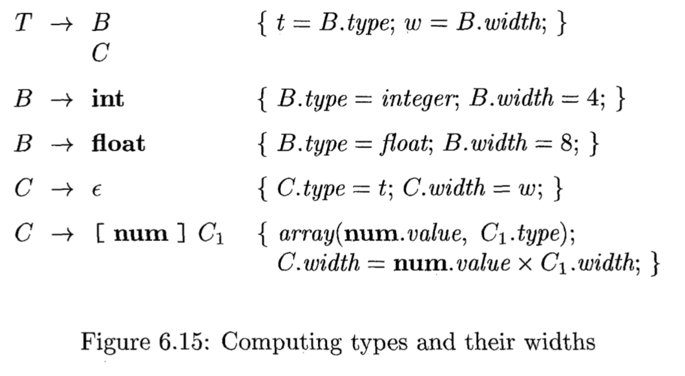
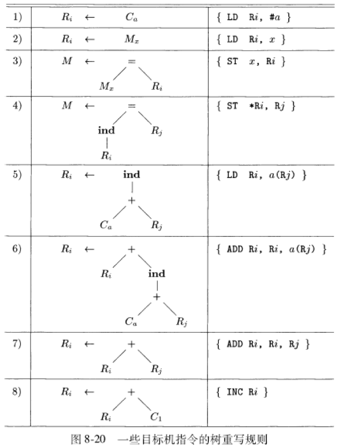

# 《编译原理》期末复习 

## 习题重点

1. 正则表达式 $$\rightarrow$$ NFA $$\rightarrow$$ DFA
2. 给出一段文法，要求提取左公因子、消除左递归、判定二义性
3. LL(1)：计算$$FIRST,FOLLOW$$，预测分析表的构建和二义性的判断
4. 指出最右句型的句柄的方法：写出最右推导，观察最后利用的产生式体.
5. 说明自底向上语法分析过程：写移入-归约语法分析过程（栈、输入、动作）
6. 构造SLR项集、计算GOTO函数、写出语法分析表、判断是否为SLR文法. 据此处理输入（栈（格局）、符号、输入、动作）
7. 判断一个文法是否是LL(1)的：用LL(1)文法的定义.
8. 构造LR(1)、LALR(1)语法分析表.
9. 画出注释语法分析树
10. 按题意定义一个SDD，并分析是否是S属性SDD/L属性SDD.
11. 消除一个SDT的左递归.
12. 为一个表达式构造DAG、四元式序列
13. 确定声明序列（含record）各个标识符的类型和相对地址
14. 根据提供的语法制导翻译方案翻译数组
15. 根据数组的存放方式和下标范围计算某个元素的位置.
16. 含类型转换的表达式翻译
17. 为现有的语法制导定义添加规则（如`repeat`）
18. 修改语义规则使之允许控制流穿越，并根据语法制导方案翻译控制流
19. 根据回填方案的翻译过程
20. 画出活动树、运行时刻栈和活动记录、访问链
21. 对象网络变化时引用计数的变化
22. 标记-清扫式垃圾回收器的处理步骤
23. 为三地址语句生成代码
24. 使用栈式分配时，过程调用语句生成的代码
25. 使用栈式分配时，为数组生成代码（􏰕􏱕􏱞􏰖SP+􏰉􏰘􏱜􏱂􏰒偏移量）
26. 将源程序翻译成三地址语句序列，再构造流图，找出循环
27. 涉及到全局公共子表达式和消除死代码、数组引用的DAG图表示
28. 由语句构造抽象语法树（树翻译方案），以及对应的语法制导方案翻译
29. 对于流图分析复制传播、全局公共子表达式、归纳变量、循环不变计算
30. 尽可能优化一个中间代码（消除公共子表达式、强度消减、消除归纳变量等）
31. 到达定值的$$gen,kill,IN,OUT$$计算
32. 活跃变量分析的$$def,use,IN,OUT$$计算
33. 可用表达式问题的$$e\_gen,e\_kill,IN,OUT$$计算
34. 画一个流图的支配结点树
35. 计算预期执行的表达式、可用表达式、可后延表达式和被使用的表达式

## 词法分析

1. **功能和作用**：读入源程序的输入字符、将它们组成词素，生成并输出一个词法单元序列，输出到语法分析器中进行语法分析.
2. **相关概念**
	- **字母表**：有限的符号集合. 如ASCII.
	- **串**：字母表中符号的一个有穷序列，串$$s$$的长度记为$$|s|$$.
	- **语言**：某个给定字母表上一个任意的可数的串集合.
	- 串的（真）前缀、（真）后缀、（真）子串、子序列.
	- 语言的闭包、Kleene闭包和正闭包.
3. **正则表达式及其描述的语言**
	- 字母表$$\Sigma$$上的正则表达式的递归定义
		+ 归纳基础：$$\epsilon$$是一个正则表达式，$$L(\epsilon)=\{\epsilon\}$$. 若$$a$$是$$\Sigma$$上的一个符号，则$$\mathbf{a}$$是正则表达式并且$$L(\mathbf{a})=\{a\}$$.
		+ 归纳步骤：假设$$r,s$$都是正则表达式，分别表示语言$$L(r)$$和$$L(s)$$，则：$$(r) | (s)$$、$$(r)(s)$$、$$(r)^*$$、$$(r)$$都是正则表达式，分别表示语言$$L(r)\cup L(s)$$、$$L(r)L(s)$$、$$(L(r))^*$$、$$L(r)$$.
		+ 规定优先级：$$*>$$连接$$>|$$，并且都是左结合，可丢掉一些括号.
	- **正则定义**：具有如下形式的定义序列：$$d_1\rightarrow r_1, d_2\rightarrow r_2, \dots, d_n\rightarrow r_n$$. 其中每个$$d_i$$都是新符号，它们不在$$\Sigma$$中且各不相同. 每个$$r_i$$是$$\Sigma\cup\{d_1,d_2,\dots,d_{i-1}\}$$上的正则表达式.
	- 扩展：一个或多个实例`+`；零个或一个实例`?`；字符类$$[a_1a_2\dots a_n]$$.
4. **状态转换图**
	- 重要约定：接受状态（找到了一个词素，用双层圈表示）；回退$$forward$$指针（加上`*`号）；初始状态（无出发结点标号为`start`的边）
	- **保留字和标识符的识别**
		+ 方法一：初始化时就将各个保留字填入符号表中.
		+ 方法二：为每个关键字建立单独的状态转换图.

5. **有穷自动机**
	- 不确定的有穷自动机（NFA）：对其边上的标号没有任何限制. 一个符号标记离开同一状态的多条边，且$$\epsilon$$可作为标号.
	- 确定的有穷自动机（DFA)：对于每个状态及自动机输入字母表中的每个符号，有且只有一条离开该状态、以该符号为标号的边.

6. **NFA和DFA识别串的模拟**
	- NFA的组成：一个有穷的状态集合$$S$$、一个输入字母表$$\Sigma$$、一个转换函数（为每个状态和$$\Sigma\cup\{\epsilon\}$$中每个符号给出后继状态的集合）、初始状态$$s_0\in S$$、接受状态集合$$F\subseteq S$$.
	- NFA转换表：行——状态；列——输入符号和$$\epsilon$$；元素——$$\emptyset$$或状态集合.
	- NFA接受：一个NFA接受输入字符串$$x$$当且仅当对应的转换图中存在一条从开始状态到某个接受状态的路径，使得该路径中各条边上的标号组成符号串$$x$$. 由一个NFA定义（或接受）的语言是从开始状态到某个接受状态的所有路径上的标号串的集合.
	- DFA的特点：没有输入$$\epsilon$$之上的转换动作；对每个状态$$s$$和每个输入符号$$a$$，有且只有一条标号为$$a$$的边离开$$s$$.
	- **DFA的模拟**：对于每个读取的输入字符，直接move到下一个状态即可.
	- **NFA的模拟**
	
	```
	S = e-closure(s0);
	c = nextChar();
	while (c != eof) {
		S = e-closure(move(S, c));
		c = nextChar();
	}
	if (S与F交集不为空) return "yes";
	else return "no";
	```

7. **NFA -> DFA**
	- **子集构造法**：输入：一个NFA $$N$$；输出：一个接受同样语言的DFA $$D$$. 定义三个操作如下——
	
	| 操作 | 描述 |
	| ----- | ----- |
	| $$\epsilon-closure(s)$$ | 能够从NFA的状态$$s$$开始只通过$$\epsilon$$转换到达的NFA状态集合 |
	| $$\epsilon-closure(T)$$ | 能够从$$T$$中某个NFA状态$$s$$开始只通过$$\epsilon$$转换到达的NFA状态集合，即$$\cup_{s\in T}\epsilon-closure(s)$$ |
	| $$move(T,a)$$ | 能够从$$T$$中某个状态$$s$$出发通过标号为$$a$$的转换到达的NFA状态的集合 |
	
	```
	子集构造法：（用e代替epsilon）
	e-closure(s0)是Dstates中的唯一状态，且未加标记;
	while (在Dstates中有一个未标记状态T) {
		给T加上标记;
		for (每个输入符号a) {
			U = e-closure(move(T, a));
			if (U不在Dstates中)
				将U加入到Dstates中，且不加标记;
			Dtran[T, a] = U;
		}
	}
	```
	在实际操作中，即为对初始状态$$A$$对于每个字母表中的输入符号计算$$Dtran$$，然后对于每个$$Dtran$$的状态再如此往复.
	
8. **正则表达式 -> NFA**
	- **McMaughton-Yamada-Thompson算法**
		+ 输入：字母表$$\Sigma$$上的一个正则表达式$$r$$.
		+ 输出：一个接受$$L(r)$$的NFA $$N$$.
		+ 方法：先对$$r$$进行语法分析，然后利用规则自底向上构造.
		+ 基本规则：对于表达式$$\epsilon$$，构造
		
			
			
			对于表达式$$a$$，构造
			
			
		
		+ 归纳规则：假设正则表达式$$s,t$$的NFA分别为$$N(s),N(t)$$. 对于$$r=s|t$$，$$N(r)$$可如下构造

			
			
			对于$$r=st$$，$$N(r)$$可如下构造
			
			
			
			对于$$r=s^*$$，$$N(r)$$可如下构造
			
			
			
			对于$$r=(s)$$，直接把$$N(s)$$当作$$N(r)$$.
			
9. **DFA状态数最小化**
	- 任何正则语言都有一个唯一的（不计同构）状态数目最少的DFA.
	- **可区分**：如果分别从状态$$s$$和状态$$t$$出发，沿着标号为$$x$$的路径到达的两个状态只有一个是接受状态，称为$$x$$区分状态$$s$$和$$t$$. 如果存在能够区分$$s$$和$$t$$的串，那么它们就是可区分的.
	- 工作原理：将一个DFA的状态集合分划成多个组，每个组的各个状态之间相互不可区分.
	- **状态最小化算法**
		+ 输入：一个DFA $$D$$，其状态集合为$$S$$. 输入字母表为$$\Sigma$$. 开始状态为$$s_0$$，接受状态集为$$F$$.
		+ 输出：一个DFA $$D'$$，它和$$D$$接受相同的语言，且状态数最少.
		+ 方法：
			1. 根据$$D$$的非接受状态组和接受状态组构造包含两个组$$F$$和$$S-F$$的初始划分$$\Pi$$.
			2. 对划分$$\Pi$$中的每个组$$G$$，将其划分为更小的组，使得其中两个状态$$s,t$$在同一小组中当且仅当对于所有的输入符号$$a$$，$$s$$和$$t$$在$$a$$上的转换都到达$$\Pi$$中的同一组. 并替换之前的划分.
			3. 最终划分$$\Pi_{final}$$中每个组选取一个状态作为该组的代表. $$D'$$开始状态即为包含了$$D$$开始状态的组的代表，接受状态亦然. ($$G$$为$$\Pi_{final}$$的一组) $$\wedge$$ ($$s$$是$$G$$的代表) $$\wedge$$ ($$D$$中$$s$$经输入$$a$$到达$$t$$) $$\wedge$$ ($$r$$为$$t$$所在的组$$H$$的代表) $$\rightarrow$$ ($$D'$$中$$s$$经输入$$a$$到达)$$r$$.

## 语法分析

1. **功能和作用**：从词法分析器中获得一个由词法单元组成的串，并验证这个串可以由源语言的文法生成. 对于良构的程序，语法分析器构造出一棵语法分析树，否则以易于理解的方式报告语法错误，并且能够从常见的错误中恢复并继续处理程序的其余部分.
2. **相关概念**
	- **上下文无关文法**：由终结符号（词法单元名字）、非终结符号（串的集合的语法变量）、一个开始符号（某个非终结符号）和一组产生式（头/左部、体/右部）组成.
	- **推导**：对于任意文法符号串$$\alpha,\beta$$和非终结符号$$A$$，若$$A\rightarrow\gamma$$是一个产生式，则$$\alpha A\beta\Rightarrow\alpha\gamma\beta$$，“$$\Rightarrow$$”表示**经一步推导出**. 当一个推导序列$$\alpha_1\Rightarrow\alpha_2\Rightarrow\cdots\Rightarrow\alpha_n$$将$$\alpha_1$$替换为$$\alpha_n$$，则称**$$\alpha_1$$（经零步或多步）推导出$$\alpha_2$$**，可用符号$$\stackrel{*}{\Rightarrow}$$.
	- **句型**：若$$S\stackrel{*}{\Rightarrow}\alpha$$，其中$$S$$是文法$$G$$的开始符号，则$$\alpha$$为$$G$$的一个**句型**.
	- **句子**：不包含非终结符号的句型.
	- **文法生成的语言**：该文法所有句子的集合. **等价文法**：生成相同语言的文法.
	- **最左/最右推导**：在每个推导步骤中，总是选择每个句型的最左（右）非终结符号. 用$$\underset{lm}{\Rightarrow}$$（或$$\underset{rm}{\Rightarrow}$$）表示.
	- **语法分析树**：推导的图形表示形式. 过滤了推导过程中对非终结符号应用产生式的顺序. 内部节点：一个产生式的应用；内部节点的标号：产生式头；子结点标号从左到右的组合：产生式体. **语法分析树的结果（边缘）**：从左到右排列叶子结点的标号得到的句型. **推导和语法分析树的关系：多对一；最左（最右）推导和语法分析树的关系：一对一.**
3. **文法与语言**
	- 验证文法$$G$$生成语言$$L$$：证明$$G$$生成的每个串都在$$L$$中，并证明$$L$$中的每个串都能由$$G$$生成.
	- 文法比正则表达式表达能力更强：每个可以用正则表达式描述的构造都可以使用文法来描述. **从正则表达式构造文法**：先转换为NFA，对每个状态$$i$$创建非终结符号$$A_i$$，若$$i$$有一个在输入$$a$$上到达$$j$$的转换，则加入产生式$$A_i\rightarrow aA_j$$；若相应的输入为$$\epsilon$$，则加入产生式$$A_i\rightarrow A_j$$. 若$$i$$为接受状态， 则加入$$A_i\rightarrow\epsilon$$. 若$$i$$为开始状态， 则令$$A_i$$为所得文法的开始符号.
4. **二义性和二义性的消除**
	- **二义性**：一个文法可以为某个句子生成多棵语法分析树.（有多个最左推导和最右推导）
	- **基于优先级消除二义性**：指明优先级和结合性
	- **基于语义解释消除二义性**

5. **左递归的消除**
	- **左递归**：一个文法中有一个非终结符号$$A$$对某个串$$\alpha$$存在一个推导$$A\stackrel{+}{\Rightarrow}A\alpha$$.
	- **消除立即左递归**：对于形如$$A\rightarrow A\alpha\mid\beta$$的产生式，将其替换为$$A\rightarrow\beta A',\quad A'\rightarrow\alpha A'\mid\epsilon$$.
	- **消除左递归**
		+ 输入：没有环（$$A\stackrel{+}{\Rightarrow}A$$）或$$\epsilon$$产生式的文法$$G$$.
		+ 输出：一个等价的无左递归文法.
		+ 算法过程：

			
		
	- **提取左公因子**：对文法$$G$$中每个非终结符号$$A$$，找出它的两个或多个选项之间的最长公共前缀$$\alpha$$. 若$$\alpha\neq\epsilon$$，则存在一个非平凡的公共前缀，于是将所有$$A\rightarrow\alpha\beta_1\mid\alpha\beta_2\mid\cdots\alpha\beta_n\mid\gamma$$替换为$$$$A\rightarrow\alpha A'\mid\gamma$$$$$$$$A'\rightarrow\beta_1\mid\beta_2\mid\cdots\mid\beta_n$$$$

6. **自顶向下分析技术**
	- **递归下降的语法分析**：可能需要回溯（重复扫描输入）
		
		
		
	- **预测分析**
		+ **$$FIRST(\alpha)$$**：可从$$\alpha$$推导得到的串的首符号的集合.（可以包含$$\epsilon$$）
		+ **$$FOLLOW(A)$$**：可能在某些句型中紧跟在$$A$$右边的终结符号的集合.（最右符号$$A$$的$$FOLLOW(A)$$中包含$$\$$$$.
		+ **计算$$FIRST$$**：对于任何串$$X_1X_2\cdot X_n$$，先向$$FIRST(X_1X_2\cdot X_n)$$加入$$FIRST(X_1)$$中所有的非$$\epsilon$$符号，若$$\epsilon\in FIRST(X_1)$$，则继续加入$$FIRST(X_2)$$中所有的非$$\epsilon$$符号，如此往复.
		+ **计算$$FOLLOW$$**
		
			- $$\$$\in FOLLOW(S)$$，其中$$S$$是开始符号.
			- 若存在$$A\rightarrow\alpha B\beta$$，则$$FIRST(\beta)$$中除$$\epsilon$$之外的所有符号都在$$FOLLOW(B)$$中.
			- 若存在$$A\rightarrow\alpha B$$，或$$A\rightarrow\alpha B\beta$$且$$\epsilon\in FIRST(\beta)$$，则$$FOLLOW(A)\subseteq FOLLOW(B)$$.
		+ **预测分析表**：输入为文法$$G$$，输出为预测分析表$$M$$. 对于$$G$$中每个$$A\rightarrow\alpha$$，如下处理：
			- 对于$$FIRST(\alpha)$$中的每个终结符号$$a$$，将$$A\rightarrow\alpha$$加入到$$M[A,a]$$中.
			- 若$$\epsilon\in FIRST(\alpha)$$，则对于$$FOLLOW(A)$$中的每个终结符号$$b$$（包括$$\$$$$），将$$A\rightarrow\alpha$$加入到$$M[A,B]$$中.
			- 完成上述操作后，若$$M[A,a]$$中没有产生式，则将$$M[A,a]$$设置为**error**（空条目）.  
			**如果$$G$$是左递归的或二义性的，那么$$M$$至少包含一个多重定义的条目.**
		+ **表驱动的预测语法分析**
			- 输入：一个串$$s$$，文法$$G$$的预测分析表$$M$$.
			- 输出：如果$$w\in L(G)$$，输出$$w$$的一个最左推导，否则给出错误提示.

			
			
			
		+ **LL(1)文法**：一个文法$$G$$是LL(1)的当且仅当$$G$$的任意两个不同的产生式$$A\rightarrow\alpha\mid\beta$$满足下面三个条件：
			
			- 不存在终结符号$$a$$使得$$\alpha$$和$$\beta$$都能推导出以$$a$$开头的串.
			- $$\alpha$$和$$\beta$$至多只有一个能推导出空串.
			- 如果$$\beta\stackrel{*}{\Rightarrow}\epsilon$$，则$$\alpha$$不能推导出任何以$$FOLLOW(A)$$中某个终结符号开头的串，对$$\alpha\stackrel{*}{\Rightarrow}\epsilon$$的情况亦然.

7. **自底向上分析**
	- **移入-归约分析框架**
		+ **归约**：一个与某产生式体匹配的特定子串被替换为该产生式头的非终结符号.
		+ **句柄**：若有$$S\underset{rm}{\stackrel{*}{\Rightarrow}}\alpha Aw\underset{rm}{\Rightarrow}\alpha\beta w$$，则紧跟$$\alpha$$的产生式$$A\rightarrow\beta$$是$$\alpha\beta w$$的一个句柄. 为方便起见，把产生式体$$\beta$$称为一个句柄. **如果一个文法无二义性，则该文法的每个最右句型有且只有一个句柄.**
		+ **移入-归约语法分析器**
			- 初始状态：栈（$$\$$$$）；输入（$$w\$$$$）
			- 接受状态：栈（$$\$$S$$）；输入（$$\$$$$）
			- 四种可能动作：移入（将下一个符号移到栈顶）；归约（被归约的符号串右端必然是栈顶）；接受；报错.

			
		
	- **LR语法分析技术**
		+ **相关概念**
			- **项**：一个文法$$G$$的一个LR(0)项是$$G$$的一个产生式加上一个位于它的体中某处的点.
			- **规范LR(0)项集簇**：提供构建一个确定有穷自动机（LR(0)自动机）的基础. 定义增广文法$$G'$$和两个函数CLOSURE和GOTO. $$G'$$是在$$G$$中加上新开始符号$$S'$$和产生式$$S'\rightarrow S$$而得到的文法.
			- **项集的闭包**：若$$I$$是文法$$G$$的一个项集，则CLOSURE($$I$$)可根据两个规则构造：首先将$$I$$中各个项加入CLOSURE($$I$$)；若$$A\rightarrow\alpha\cdot B\beta$$在CLOSURE($$I$$)中，$$B\rightarrow\gamma$$是一个产生式并且它不在CLOSURE($$I$$)中，则把这个项加入其中. 不断应用该规则直到没有新项可以加入.
			- **内核项**：包括初识项$$S'\rightarrow\cdot S$$以及点不在最左端的所有项；**非内核项**：除了$$S'\rightarrow\cdot S$$之外的点在最左端的所有项.
			- **GOTO函数**：GOTO($$I$$, $$X$$)表示$$I$$中所有形如$$[A\rightarrow\alpha\cdot X\beta]$$的项所对应的项$$[A\rightarrow\alpha X\cdot\beta]$$的集合的闭包.
			- **可行前缀**：可以出现在一个移入-归约语法分析器栈中的最右句型前缀. 一个可型前缀是一个最右句型的前缀，并且它没有越过该最右句型的最右句柄的右端.
			- **有效项集**：如果在某个文法的LR(0)自动机中从初始状态开始沿着标号为某个可行前缀$$\gamma$$的路径到达一个状态，那么该状态对应的项集就是$$\gamma$$的有效项集.
		+ **LR语法分析算法**
			- **LR语法分析表**：两个部分——语法分析动作函数ACTION和转换函数GOTO. 前者参数为状态$$i$$和终结符号$$a$$，取值有四种形式：移入状态$$j$$、归约$$A\rightarrow\beta$$、接受、报错.
			- **格局**：形如$$(s_0s_1\cdots s_m, a_ia_{i+1}\cdots a_n\quad\$$)$$的对，第一个分量为栈中内容（存储状态），第二个分量为余下的输入.
			- **算法**：最初栈中内容为初始状态$$s_0$$，输入缓冲区中内容为$$w\$$$$. 反复执行两个函数定义的行为即可.
	- **构造SLR(1)语法分析表**（需要知道输入文法的每个非终结符号$$A$$的FOLLOW($$A$$)）
		+ 输入：一个增广文法$$G'$$.
		+ 输出：$$G'$$的SLR语法分析表函数ACTION和GOTO
		+ 方法：构造$$G'$$的规范LR(0)项集族$$C=\{I_0,I_1,\cdots,I_n\}$$. 根据$$I_j$$构造得到状态$$i$$. 决定$$ACTION[i, a]$$——若$$[A\rightarrow\alpha\cdot a\beta]$$在$$I_j$$中并且$$GOTO(I_j, a) = I_j$$，置为“移入$$j$$“；若$$[A\rightarrow\alpha\cdot]$$在$$I_i$$中，则对$$FOLLOW(A)$$中的所有$$a$$，置为“归约$$A\rightarrow\alpha$$“. 若$$[S'\rightarrow S\cdot]$$中，置为“接受”. 决定$$GOTO$$——若$$GOTO(I_i,A)=I_j$$，则$$GOTO[i,A]=j$$.
		+ 若规则生成了任何冲突动作，则称该文法不是**SLR(1)**的.
	- **规范LR(1)语法分析器**
		+ **规范LR(1)项**：$$[A\rightarrow\alpha\cdot\beta,a]$$，其中$$A\rightarrow\alpha\beta$$是一个产生式，$$a$$是一个终结符号或右端结束标记$$\$$$$. 一个形如$$[A\rightarrow\alpha\cdot,a]$$的项只有在下一个输入符号等于$$a$$时才要求按照$$A\rightarrow\alpha$$进行归约.
		+ **LR(1)项的可行前缀**：LR(1)项$$[A\rightarrow\alpha\cdot\beta,a]$$对于一个可行前缀$$\gamma$$有效的条件是存在一个推导$$S\underset{rm}{\stackrel{*}{\Rightarrow}}\delta Aw\underset{rm}{\Rightarrow}\delta\alpha\beta w$$，其中$$\gamma=\delta\alpha$$且要么$$a$$是$$w$$的第一个符号，要么$$w$$为$$\epsilon$$且$$a$$等于$$\$$$$.
		+ **LR(1)项集族的构造**：修改两个过程$$CLOSURE$$和$$GOTO$$. 前者为对于$$I$$中每个项$$[A\rightarrow\alpha\cdot B\beta,a]$$，对于$$G'$$中每个产生式$$B\rightarrow\gamma$$，对于$$FIRST(\beta a)$$中每个终结符号$$b$$，将$$[B\rightarrow\cdot\gamma,b]$$加入到集合$$I$$中. 后者对于$$I$$中每个项$$[A\rightarrow\alpha\cdot X\beta,a]$$，将项$$[A\rightarrow\alpha X\cdot\beta,a]$$加入到集合$$J$$中.
		+ **规范LR(1)语法分析表**：类似于LR(0)语法分析表（例如书P170，注意“归约”填充项的不同）
	- **LALR分析**：寻找具有相同**核心**的LR(1)项集，并将这些项集合并为一个项集. 一般而言，核心就是当前正处理的文法的LR(0)项集.
		+ **简单但空间需求大的LALR分析表构造方法**：输入为一个增广文法$$G'$$，输出为$$G'$$的LALR语法分析表函数$$ACTION$$和$$GOTO$$.
			1. 构造LR(1)项集族$$C=\{I_0,I_1,\cdots,I_n\}$$.
			2. 对于LR(1)项集中的每个核心，找出所有具有这个核心的项集，并将这些项集替换为它们的项集.
			3. 令$$C'=\{J_0,J_1,\cdots,J_m\}$$是得到的LR(1)项集族. 如果存在一个分析动作冲突，则这个算法不能生成语法分析器，该文法不是LALR(1)的.
			4. GOTO表的构造（易）
		+ **高效构造LALR语法分析表的方法**：修改上一个算法，使得在创建LALR(1)语法分析表的过程中不需要构造出完整的规范LR(1)项集族. 输入为一个增广文法$$G'$$，输出为文法$$G'$$的LALR(1)项集族的内核.【此处建议参考书P175例4.64】
			1. 构造LR(0)项集族的内核.
			2. 确定每个项集$$I$$和每个文法符号$$X$$的$$GOTO(I,X)$$中各内核项的哪些向前看符号是自发生成的，并确定向前看符号从$$I$$中的哪个项被传播到$$GOTO(I,X)$$中的内核项上.
			3. 初始化一个表格，表中给出了每个项集中的每个内核项相关的向前看符号. 最初，每个项的向前看符号只包括那些被我们在上一步中确定为自发生成的符号.
			4. 不断扫描所有项集的内核项，当我们访问一个项$$i$$时，使用第2步得到的、用表格表示的信息，确定$$i$$将它的向前看符号传播到了哪些内核项中. 项$$i$$的当前向前看符号集合被加到和这些被传播的内核项相关联的向前看符号集合中. 继续在内核项上扫描，直到没有新的向前看符号被传播为止.
		+ 确定向前看符号：输入为一个LR(0)项集$$I$$的内核$$K$$以及一个文法符号$$X$$. 输出为由$$I$$中的项为$$GOTO(I,X)$$中内核项自发生成的向前看符号，以及$$I$$中将其向前看符号传播到$$GOTO(I,X)$$中内核项的项.

		
	
	- **二义性文法的分析**
		+ **用优先级和结合性解决冲突**
		+ “悬空-else“的二义性：移入/归约冲突时，优先移入.
	
	- **文法之间的比较（内在关联）**
		+ LL和LR的比较：LL自顶向下分析，LR自底向上分析，都是从左到右扫描输入. LR能识别更多程序设计语言构造，且是已知的最通用的无回溯移入-归约分析技术，可尽可能早地检测到错误，缺点是为一个典型的程序设计语言文法手工构造LR分析器的工作量非常大，需要LR语法分析器生成工具.
		+ LR($$k$$)中的$$k$$表示向前看$$k$$个输入符号.
		+ LALR方法是基于LR(0)项集族，和基于LR(1)项的典型语法分析器相比，它的状态要少很多，通过向LR(0)项小心地引入向前看符号，得到的语法分析表不比SLR分析表大.【**很多情况下最合适的选择**】
		+ LL(1)——最左推导；LR(0)——最右推导；SLR(1)——不存在移入-归约冲突；LR(1)——不存在归约-归约冲突；LALR——能合并LR(1)，不存在冲突【来自百度】

## 语义分析和中间代码生成

1. **语法制导定义**：一个上下文无关文法和属性及规则的结合（SDD）
	- **属性**：和文法符号相关联，$$X$$的属性$$a$$可以被实现为代表$$X$$的结点的记录的数据字段$$X.a$$.
		+ **综合属性**：在分析树结点$$N$$上的非终结符号$$A$$的综合属性是由$$N$$上的产生式所关联的语义规则来定义的. （产生式头一定是$$A$$，$$N$$上的综合属性只能通过$$N$$的子结点或$$N$$本身的属性值来定义）
		+ **继承属性**：在分析树结点$$N$$上的非终结符号$$B$$的继承属性是由$$N$$的父结点上的产生式所关联的语义规则来定义的. （产生式体必然包含符号$$B$$，$$N$$上的继承属性只能通过$$N$$的父结点、$$N$$本身和$$N$$的兄弟结点上的属性值来定义）
		+ 不允许结点$$N$$上的继承属性通过$$N$$子结点上的属性值来定义，但允许$$N$$上的一个综合属性通过$$N$$本身的继承属性来定义；终结符号可以具有综合属性，但是不能有继承属性.
		+ 一个只包含综合属性的SDD成为$$S$$属性的SDD. 它可以和一个LR语法分析器一起自然地实现. 一个没有副作用的SDD有时也称为属性文法.
	- **属性求值**的方法：首先构造出一棵语法分析树，然后再使用SDD的规则对这棵语法分析树上的各个结点上的所有属性进行求值. **注释语法分析树**：一个显示了它的各个属性的值的语法分析树.
	- **依赖图**：描述了某个语法分析树中的属性实例之间的信息流，从一个属性实例到另一个实例的边表示计算第二个属性实例时需要第一个属性实例的值.
	- **属性求值的顺序**：所有的可行求值顺序是满足下列条件的结点顺序$$N_1,N_2,\cdots,N_k$$：若有一条从结点$$N_i$$到$$N_j$$的依赖图的边，则$$i<j$$.（**拓扑排序**）若图中存在任意一个环，则不存在拓扑排序，否则至少存在一个拓扑排序.
	- **S属性的定义**：每个属性都是综合属性. （可按照语法分析树结点的任何自底向上顺序来计算它的各个属性值）
	- **L属性的定义**：每个属性要么是综合属性，要么是继承属性并且满足（依赖图的边只能从左到右）：假设存在一个产生式$$A\rightarrow X_1X_2\dots X_n$$并且有一个通过这个产生式所关联的规则计算得到的继承属性$$X_i.a$$，那么这个规则只能使用：
		+ 和产生式头$$A$$关联的继承属性
		+ 位于$$X_i$$左边的文法符号实例$$X_1,X_2,\cdots,X_{i-1}$$相关的继承属性或者综合属性
		+ 和这个$$X_i$$的实例本身相关的继承属性或综合属性，但是在由这个$$X_i$$的全部属性组成的依赖图中不存在环
2. **语法制导翻译的应用**
	- **抽象语法树的构造**
		+ 如果结点是一个叶子，构造$$Leaf(op,val)$$创建一个叶子对象.
		+ 如果结点是内部结点，构造$$Node(op,c_1,c_2,\cdots,c_k)$$创建一个对象.
	- **类型的结构**：当语法分析树的结构和输入的抽象语法树的结构不同时，继承属性是很有用的. 它可以用来将信息从语法分析树的一部分传递到另一部分.

3. **语法制导的翻译方案（SDT）**
	- **后缀翻译方案**：针对S属性的SDD的情况，所有动作都在产生式最右端的SDT.
	- **后缀SDT的语法分析栈实现**：将属性和文法一起放在栈中的记录里. 在下图中若使用$$A\rightarrow XYZ$$进行归约，则之后$$A$$和它的属性都位于栈的顶端，即现在存放$$X$$的记录的位置上.
		
		
		
	- **产生式内部带有语义动作的SDT**：对于产生式$$B\rightarrow X\{ a\} T$$，若语法分析过程自底向上，则在$$X$$的此次出现位于语法分析栈的栈顶时，便立刻执行动作$$a$$；若语法分析过程自顶向下，则在试图展开$$Y$$的本次出现（若$$Y$$是非终结符号）或在输入中检测$$Y$$（如果$$Y$$是终结符号）之前执行语义动作$$a$$. **任何SDT的实现方法**：
		1. 忽略语义动作，对输入进行语法分析，并产生一棵语法分析树.
		2. 检查每个内部结点$$N$$，假设它的产生式是$$A\rightarrow\alpha$$，将$$\alpha$$中的各个动作当作$$N$$的附加子结点加入，使得$$N$$的子结点从左到右和$$\alpha$$中的符号及动作完全一致.
		3. 对这棵语法树进行前序遍历，并且当访问到一个以某个动作为标号的结点时立刻执行这个动作.
	
	- **从SDT中消除左递归**
		+ 最简单的情况，如果每个动作仅仅是打印一个字符串：将动作当成终结符号处理，将$$A\rightarrow A\alpha\mid\beta$$替换为$$A\rightarrow\beta R,\quad R\rightarrow\alpha R\mid\epsilon$$.
		+ 对于S属性的SDD，消除左递归通用的框架：将$$$$\begin{align*} & A \rightarrow A_1Y & \{A.a=g(A_1.a,Y.y)\} \\ & A \rightarrow X & \{A.a=f(X.x)\} \end{align*}$$$$ 转化为$$$$A\quad\rightarrow\quad X\quad \{R.i=f(X.x)\}\quad R\quad \{ A.a=R.s\}$$$$ $$$$R\quad\rightarrow\quad Y\quad \{ R_1.i=g(R.i,Y.y)\}\quad R_1\quad \{ R.s=R_1.s\}$$$$ $$$$R\quad\rightarrow\quad\epsilon\quad \{ R.s=R.i\}$$$$
	
	- **L属性定义的SDT**
		1. 把计算某个非终结符号$$A$$的继承属性的动作插入到产生式体中紧靠在$$A$$的本次出现之前的位置上，如果$$A$$的多个继承属性以无环的方式相互依赖，就需要对这些属性的求值动作进行排序，以便先计算需要的属性.
		2. 将计算一个产生式头的综合属性的动作放置在这个产生式体的最右端.

4. **中间代码的形式**
	- **DAG图**：叶子结点对应于原子运算分量，内部结点对应于运算符. 公共子表达式每出现一次，代表该公共子表达式的子树就会被复制一次. 更简洁地表示表达式. **构造方法**：可以用和构造抽象语法树一样的SDD来构造， 但在函数Leaf和Node每次被调用时，构造新节点前先检查是否已存在同样的节点，如果已经存在，则返回这个已有的节点.
	- **三地址代码**：一条指令的右侧最多有一个运算符.
		+ **地址和指令**：**地址**可以是名字、常量或编译器生成的临时变量.
		+ **四元式表示**：有四个字段，分别称为$$op$$, $$arg_1$$, $$arg_2$$和$$result$$. 

			
			
		+ **三元式表示**：有三个字段，分别为$$op$$, $$arg_1$$, $$arg_2$$. 用该运算的位置来表示它的结果. 
		
			
			
		+ **间接三元式**：包含了一个指向三元式的指针的列表，而不是列出三元式序列本身.
		
			
			
		+ **静态单赋值形式**：同一变量的每次赋值用不同下标表示，是一种有利于某些优化的中间表示. 对于控制流导致的$$x$$不同取值，用一种被称为$$\phi$$函数的表示规则将其多处定值合并起来. 例如

		```C
			if (flag) x1 = -1; else x2 = 1;
			x3 = \phi(x1, x2);
		```

5. **类型声明**
	- **类型表达式**：表示类型的结构，可能是基本类型，也可能通过被称为**类型构造算子**的运算符作用于类型表达式而得到. 也可以用图表示. 我们使用如下类型表达式的定义：
		+ 基本类型是一个类型表达式（`boolean`, `char`, `integer`, `float`和`void`）
		+ 类名是一个类型表达式
		+ 将类型构造算子`array`作用于一个数字和一个类型表达式得到一个类型表达式
		+ 将`record`类型构造算子应用于字段名和相应的类型可以构造得到一个类型表达式
		+ 使用类型构造算子$$\rightarrow$$可以构造得到函数类型的类型表达式
		+ 如果$$s$$和$$t$$是类型表达式，则其笛卡尔积$$s\times t$$也是类型表达式
		+ 类型表达式可以包含取值为类型表达式的变量
	- **类型等价**
		+ **结构等价**：当且仅当下面的**某个**条件为真：
			- 它们是相同的基本类型
			- 它们是将相同的类型构造算子应用于结构等价的类型而构造得到
			- 一个类型是另一个类型表达式的名字
		+ 如果类型名仅仅代表它自身，那么上述定义中的前两个条件定义了类型表达式的**名等价**.
	- **声明**

		
	
	- **局部变量名的存储布局**
		+ 类型的**宽度**：该类型的一个对象所需的存储单元的数量
		
			
		
	- **声明的序列**：计算各个数据的类型和相对地址

		
		
	- **记录和类中的字段**：对于产生式$$T\rightarrow\mathrm{record} '\{' D'\}'$$，一个记录中各个字段的名字必须是互不相同的，也即在由$$D$$生成的声明中，同一个名字最多出现一次. 字段名的偏移量是相对于该记录的数据区字段而言的.

		
		
6. **表达式的翻译**
	- **表达式中的运算**

		
		
	- **增量翻译**：$$gen$$不仅要构造出一个新的三地址指令，还要将它添加到至今为止已生成的指令序列之后.

		
		
	- **数组元素的寻址**
		+ 假设：数组元素存储在一块连续的存储空间里，可以快速访问.
		+ 一种方法：对于$$k$$维数组$$A[i_1][i_2]\cdots[i_k]$$，若$$w_i$$表示从左往右第$$i$$维的宽度为$$w_i$$，则相对地址为$$$$base+i_1\times w_1+i_2\times w_2+\cdots+i_k\times w_k$$$$
		+ **另一种方法**：根据第$$j$$维上的数组元素的个数$$n_j$$和该数组的每个元素的宽度$$w=w_k$$进行计算. 对于$$k$$维数组，即为$$$$base+((\cdots((i_1\times n_2 + i_2)\times n_3+i_3)\cdots)\times n_k+i_k)\times w$$$$
		+ **更一般的情况**：数组元素下标不从0开始，数组元素的编号方式为$$low,low+1,\cdots,high$$. 则$$A[i]$$的地址为$$base+(i-low)\times w$$.
		+ **二维数组的存储方式**
			- 按行存放

				| |
				| ----- |
				| $$A[1,1]$$ |
				| $$A[1,2]$$ |
				| $$A[1,3]$$ |
				| $$A[2,1]$$ |
				| $$A[2,2]$$ |
				| $$A[2,3]$$ |
				
			- 按列存放
				
				| |
				| ----- |
				| $$A[1,1]$$ |
				| $$A[2,1]$$ |
				| $$A[1,2]$$ |
				| $$A[2,2]$$ |
				| $$A[1,3]$$ |
				| $$A[2,3]$$ |
				
	- **数组引用的翻译**

		
		
		
7. **类型检查**
	- 作用：确定每个组成成分的类型表达式，确定这些类型表达式是否满足一组逻辑规则，这些规则称为源语言的**类型系统**，类型检查能够发现程序中的一些错误，还可以用于提高系统的安全性.
	- 分类：**动态类型检查**（在运行时刻完成。功效很低. 但是如果语言允许动态确定类型，动态检查是必须的）、**静态类型检查**（在编译时刻完成，是高效的）
	- **强类型**：编译器中的类型系统能够保证它接受的程序在运行时刻不会发生类型错误.
	- **类型检查规则**
		+ **类型综合**：根据子表达式的类型得到表达式的类型. 要求名字先声明再使用. 形式：

		```
		if f的类型为s->t且x的类型为s，
		then 表达式f(x)的类型为t
		```
		
		+ **类型推导**：根据一个语言结构的使用方式来确定该结构的类型. 形式：

		```
		if f(x)是一个表达式，
		then 对某些alpha和beta，f的类型为alpha->beta且x的类型为alpha
		```
	- **类型转换**
		+ **拓宽转换**（可以保持原有的信息）
		+ **窄化转换**（可能丢失信息）

			
			
		+ 隐式转换：类型转换由编译器自动完成，又称自动类型转换；显式转换：需要程序员写出某些代码来引发类型转换，又称强制类型转换.
		+ 以$$E\rightarrow E_1 + E_2$$为例的类型转换语义动作

			
			
			
	- **控制流语句的翻译**
		
		
		
		
		+ **避免生成冗余的goto指令**：用$$fall$$表示控制流在指令序列中自然流动到下一个指令.
			
			- $$S\rightarrow\mathrm{if}(B)S_1$$的新语义规则：

				
			
			- $$B\rightarrow E_1\mathrm{rel} E_2$$的新语义规则：

				
			
			- $$B\rightarrow B_1\parallel B_2$$的新语义规则：

				
		
		+ **回填**：把一个由跳转指令组成的列表以综合属性的形式进行传递. 也即生成一个跳转指令时暂时不指定该跳转指令的目标，而是放入一个由跳转指令组成的列表中，等到能够确定正确的目标标号时才去填充目标标号.
			- $$makelist(i)$$创建一个只含$$i$$的列表，其中$$i$$是指令数组的下标，返回一个指向新创建的列表的指针.
			- $$merge(p_1,p_2)$$将$$p_1$$和$$p_2$$指向的列表合并，返回的指针指向合并后的列表.
			- $$backpatch(p,i)$$将$$i$$作为目标标号插入到$$p$$所指列表的各指令中.

			
			
			
		+ **switch语句的翻译**：三种方法

			
			
			
		
	- **过程的翻译**
	
		
		
## 运行时刻环境

1. **存储组织**
	- 常见的编译器对于目标程序运行时刻的空间划分
		+ 以连续字节块存储
		+ 字节是内存最小的编址单位
		+ 一个字节是8个二进制位
		+ 4个字节构成一个机器字
	- **存储空间划分**
		+ 代码区：可执行目标代码，通常位于存储的低端.
		+ 静态区：程序的某些数据对象，如全局常量和编译器产生的某些数据
		+ **动态区域**：大小随程序运行而改变. 栈向低地址增长，堆向高地址增长.
	- **静态和动态存储分配**
		+ 栈式存储：一个过程的局部名字在栈中分配空间
		+ 堆存储：有些数据的生命周期比创造它的某次过程调用长. 允许对象或其他数据元素在被创建时获得存储空间，并在数据变得无效时释放该存储空间.

2. **空间的栈式分配**
	- **活动树**：用一棵树表示在整个程序运行期间的所有过程的活动. 每个结点对应于一个活动，根结点是启动程序执行的`main`过程的活动. 在表示过程$$p$$的某个活动的结点上，其子结点对应于被$$p$$的这次活动调用的各个过程的活动.（按被调用的顺序自左向右表示）**一个子结点必须在其右兄弟结点的活动开始之前结束.**
		+ 示例

			
			
			
		+ 对应关系：过程调用的序列和活动树的**前序遍历**相对应；过程返回的序列和活动树的**后序遍历**相对应；假定控制流位于某个过程的特定活动中，且该过程活动对应于活动树上的某个结点$$N$$，则当前尚未结束的活动就是结点$$N$$及其祖先结点对应的活动.

	- **活动记录**：栈中全部活动记录的序列对应于**在活动树中到达当前控制所在的活动结点的路径.** 活动记录的内容如下：
		+ 临时变量：某些临时中间结果
		+ 局部数据
		+ 保存的机器状态：在对此函数的此次调用之前的机器状态信息，函数返回时需要恢复这些信息
		+ “访问链”：在其它活动记录中存放的数据，访问时需要访问链进行定位
		+ 控制链：指向调用者的活动记录
		+ 返回值：存放被调用函数返回给调用函数的值（不一定有，且倾向于放到寄存器中）
		+ 实参：调用过程使用的实参，尽可能放在寄存器中.
		
	- **过程及调用**
		+ **调用代码序列**：实现过程调用的代码段. 为一个活动记录在栈中分配空间，并在此记录的字段中填写信息. **返回代码序列**：恢复机器状态，使得调用过程能够在调用结束之后继续执行.
		+ **设计调用代码序列和活动序列的一种设计原则**
			- 在调用者和被调用者之间传递的值一般被放在被调用者的活动记录的开始位置（实参）
			- 固定长度的项被放置在中间位置（控制链、访问链、机器状态字段等）
			- 早期不知道大小的项将被放置在活动记录的尾部（动态数组等）
			- 必须小心地确定栈顶指针所指的位置.
		
	- **栈中非局部数据的访问**
		+ **没有嵌套过程时的数据访问（C语言）**：各个变量要么在某个函数内定义，要么在所有函数之外定义.
		+ **一个支持嵌套过程声明的语言（ML）**：定义变量为`val <name> = <expression>`，定义函数为`fun <name> (<arguments>) = <body>`，定义函数体为`let <list of definitions> in <statements> end`. 定义的作用域包括从该定义之后直到`in`为止的所有定义，以及直到`end`为止的所有语句. 函数可以嵌套地定义.
			- **嵌套深度**：对于不内嵌在任何其他过程中的过程，设定其嵌套深度为1. 如果一个过程$$p$$在一个嵌套深度为$$i$$的过程中定义，则设定$$p$$的嵌套深度为$$i+1$$.
			- **访问链**：若函数$$p$$直接嵌套在函数$$q$$中，那么$$p$$的任何活动中的访问链都指向最近的$$q$$的活动. 假定函数$$p$$的嵌套深度为$$n_p$$，它引用嵌套深度为$$n_q$$的变量$$x$$，$$n_q\le n_p$$. 如何访问$$x$$的存储单元？从栈顶的活动记录开始，追踪访问链$$n_p - n_q$$次，到达$$x$$的声明所在函数的活动记录，$$x$$的地址由下面的二元组表示：($$n_p - n_q$$，$$x$$在活动记录中的偏移).
			- **显示表**：若嵌套深度变大，使用被称为**显示表**的辅助数组$$d$$，为每个嵌套深度保存一个指针，$$d[i]$$指向栈中最高的对应于某个嵌套深度为$$i$$的活动记录.
				+ 优势：如果函数$$p$$正在运行，且它需要访问属于某个嵌套深度为$$i$$的某个函数$$q$$的元素$$x$$。只要查看$$d[i]$$就可以找到$$q$$的活动记录，进而访问到$$x$$.
				+ 维护：需要在新的活动记录表中保存显示表条目的原来的值，从而在$$p$$返回时可以恢复到调用前的值.

3. **垃圾回收**
	- 垃圾：不能被引用的数据.
	- 基本思想：可达性分析. 分析一个存储是否可以被引用或到达.
	- **根集**：不需要对任何指针解引用就可以被程序直接访问的数据.（比如在Java中，所有静态区数据和栈中所有变量）
	- **可达性**：对于任意一个对象，如果指向它的一个引用被保存在任何可达对象的字段成员或数组元素中，那么这个对象本身也是可达的. 改变可达对象集合的四种基本操作：
		+ **对象分配**：返回一个指向新创建的存储区域的引用. 这个操作向可达对象集中添加成员.
		+ **参数传递和返回值**：对象引用从实参传递给形参，从返回结果传回给调用者. 这些引用指向的对象可达.
		+ **引用赋值**：对于`u=v`的两个效果——$$u$$现在是$$v$$所指对象的一个引用；$$u$$中原来的引用丢失了.
		+ **过程返回**：当一个过程退出时，保存其局部变量的活动记录将被弹出栈，如果这个活动记录保存了某个对象的唯一引用，则这个对象就变得不可达.

	- **引用计数**：用引用计数方法定位所有可达对象.
		+ **维护**
			+ **对象分配**：新对象的引用计数被设置为1.
			+ **参数传递**：被传递给一个过程的每个对象的引用计数加一.
			+ **引用赋值**：如果$$u$$和$$v$$都是引用，对于语句$$u=v$$，$$v$$指向的对象的引用计数加1，$$u$$本来指向的原对象的引用计数减1.
			+ **过程返回**：当一个过程退出时，该过程活动记录的局部变量中所指向的对象的引用数必须减1.
			+ **可达性的传递丢失**：当一个对象的引用计数变为0时，必须将该对象的各个引用所指向的每个对象的引用计数减1.
		+ 缺点：不能回收不可达的循环数据结构；开销较大.

	- **跟踪回收**
		+ 特点：周期性运行，通常在空闲空间被耗尽或者空闲空间数量低于某个阈值时启动垃圾回收器.
		+ **基本的标记-清扫式回收器**：直接的全面停顿的算法，分为两个阶段
			- 标记阶段：找出所有可达对象
			- 清扫阶段：释放所有不可达对象的空间
		+ **基于跟踪的算法的抽象**：计算可达对象集合，然后取这个集合的补集.
		+ **标记压缩回收器**：在堆区内移动可达对象以消除存储碎片
			- 三个阶段
				1. 标记阶段（同标记-清扫式算法）
				2. 算法扫描堆区中已分配内存段，并为每个可达对象计算新的地址，新的地址从堆的最底端开始分配，因此在可达对象之间没有空闲存储窗口. 每个对象的新地址记录在一个名为$$NewLocation$$的结构中.
				3. 算法将对象拷贝到它们的新地址，更新对象中的所有引用，使之指向相应的新地址. 新的地址可以在$$NewLocaiton$$中找到.

## 代码生成

1. **目标语言及目标代码指令**
	- 一个简单的目标机模型
		+ 加载运算：`LD dst, addr`. 可以是内存的值加载到寄存器中，也可以是寄存器之间的拷贝.
		+ 保存运算：`ST x, r`. 把寄存器$$r$$中的值保存到位置$$x$$.
		+ 计算运算：形如`OP dst, src1, src2`. 把$$OP$$所代表的运算作用在位置$$src1$$和$$src2$$的值上，然后把运算结果放到位置$$dst$$中.
		+ 无条件跳转：`BR L`.
		+ 条件跳转：`Bcond r, L`. 其中$$r$$是一个寄存器，$$L$$是一个标号. $$cond$$代表了某个常见测试. 如`BLTZ r, L`.
	- 指令的代价：指令代价1加上运算分量寻址模式相关的代价——寄存器寻址模式附加代价为0；涉及内存位置或常数的寻址方式的附加代价为1.

2. **指令寻址**
	- 变量名$$x$$：指向分配给$$x$$的内存位置.
	- 带有下标形如$$a(r)$$的地址（其中$$a$$是一个变量，$$r$$是一个寄存器）：$$contents(a+contents(r))$$.
	- 以寄存器$$r$$为下标的整数$$c$$（形如$$c(r)$$）：$$contents(c+contents(r))$$.
	- 间接寻址模式：$$*r$$表示在寄存器$$r$$的内容所表示的位置上存放的内存位置. $$*a(r)$$表示$$contents(contents(a+contents(r)))$$.
	- 直接常数寻址模式：$$\#c$$.

3. **目标代码中的地址**
	- **静态分配**
		+ 过程调用和返回的代码生成对应的三地址语句：`call callee`, `return`, `halt`, `action`.
		+ `call`语句的实现：`ST`指令把返回地址保存到$$callee$$的活动记录的开始处，`BR`把控制传递到被调用过程$$callee$$的目标代码上.

			```
			ST		callee.staticArea, #here + 20
			BR		callee.codeArea
			```
		
		+ `return`语句可以使用一个简单的跳转语句实现：

			```
			BR		*callee.staticArea
			```
			
	- **栈分配**
		+ 初始化过程：把`SP`设置成内存中栈区的开始位置.

			```
			LD		SP, #stackStart
			(code for the first procedure)
			HALT
			```
		
		+ 过程调用指令序列：增加`SP`的值，保存返回地址，并传递控制.

			```
			ADD		SP, SP, #caller.recordSize
			ST		O(SP), #here + 16
			BR		callee.codeArea
			```
			
		+ 返回指令序列：被调用者先把控制传递到返回地址，调用者再减少`SP`的值，恢复之.

			```
			被调用者：
			BR		*0(SP)
			
			调用者：
			SUB		SP, SP, #caller.recordSize
			```
			
	- 名字的运行时刻地址
		+ 名字是指向符号表条目中该名字的指针
		+ 对于语句`x = 0`，`x`在符号表中的$$offset$$是12.
			- 如果`x`分配在静态区域，且静态区开始地址为100，则生成代码：`ST  112  #0`.
			- 如果`x`分配在栈区，且相对地址为12，则生成代码：`ST  12(SP)  #0`.

4. **基本块和流图**

	- 构造思想：把中间代码划分成为**基本块**，每个基本块是满足下列条件的最大的连续三地址指令序列：
		+ 控制流只能从基本块中的第一个指令进入该块.
		+ 除了基本块的最后一个指令，控制流在离开基本块之前不会停机或者跳转.  
	基本块构成了**流图**的顶点，而流图的边指明了哪些基本块可能紧随一个基本块之后运行.
	
	- **基本块的划分方法**：先确定**首指令**，只有三种情况（第一个三地址指令、任意一个条件或无条件跳转指令的**目标指令**、紧跟在一个条件或无条件跳转指令之后的指令），然后每个首指令对应的基本块包括了从它开始直到下一个首指令之前，或中间程序结尾指令之间的所有指令.
	- **后续使用信息**
		+ **“使用”的定义**：假设三地址语句$$i$$赋给$$x$$一个值，语句$$j$$的一个运算分量为$$x$$，并且从语句$$i$$开始可以通过未对$$x$$进行赋值的路径到达语句$$j$$，则：语句$$j$$**使用**了在语句$$i$$处计算得到的$$x$$值. 也即$$x$$在语句$$i$$处**活跃**.
		+ **活跃性与后续使用信息的确定**

			```
			输入： 一个三地址语句的基本块B，假设在开始的时候符号表显示B中的所有非临时变量都是活跃的.
			输出： 对于B的每一个语句i: x=y+z，我们将x, y及z的活跃性信息及后续使用信息关联到i.
			方法： 我们从B的最后一个语句开始，反向扫描到B的开始处，对于每个语句i: x = y + z，如下处理：
				1) 把在符号表中找到的有关x, y和z的当前后续使用和活跃性信息与语句i关联起来.
				2) 在符号表中，设置x为“不活跃”和“无后续使用”.
				3) 在符号表中，设置y与z为“活跃”，并把它们的下一次使用设置为语句i.
			```
			
	- **流图**
		+ 从基本块$$B$$到$$C$$的边存在的原因（两种）：
			- 有一个从$$B$$的结尾跳转到$$C$$的开头的条件或无条件跳转语句.
			- 按照原来的三地址语句序列中的顺序，$$C$$紧跟在$$B$$之后，且$$B$$的结尾不存在无条件跳转语句.
		+ 此时称$$B$$是$$C$$的**前驱**，$$C$$是$$B$$的一个**后继**.
		+ **入口**：新增的结点，从入口到流图的第一个可执行结点有一条边.
		+ **出口**：前驱是包含了程序最后一条指令（如果不是无条件跳转指令）的基本块，以及任何包含了跳转到程序之外的跳转指令的基本块.
	
	- **流图的表示方式**

		
		
	- **循环**：如果下列条件成立，就说流图中的一个结点集合$$L$$是一个循环：
		+ 在$$L$$中有一个**循环入口**，它是唯一的其前驱可能在$$L$$之外的结点. 也即：从**整个流图的入口结点**开始到$$L$$中的任何结点的路径都必然经过循环入口结点，并且这个循环入口结点不是整个流图的入口结点本身.
		+ $$L$$中的每个结点都有一个到达$$L$$的入口结点的非空路径，并且该路径全部在$$L$$中.

5. **基本块的优化**
	- **基本块的DAG表示**
		+ 用途：消除局部公共子表达式、消除死代码、语句重排序、对运算分量进行符合代数规则重排序.
		+ **构造DAG的方式**：
			- 基本块中每个变量都有一个对应结点表示其初始值
			- 每个语句$$s$$都有一个相关的结点$$N$$，$$N$$的子结点是基本块中那些在$$s$$之前，最后一个对$$s$$所使用的某个运算分量进行定值的语句.
			- 结点$$N$$的标号是$$s$$中的运算符，同时有一组变量被关联到$$N$$，表示$$s$$是在此基本块内最晚对这些变量进行定值的语句.
			- **输出结点**：变量在基本块的出口处活跃的结点.

	- **局部公共子表达式**：当一个新的结点$$M$$被加入到DAG时，检查是否存在一个结点$$N$$，它和$$M$$有同样的运算符和子结点且子结点顺序相同，若是则用$$N$$替换$$M$$.
	- **消除死代码**：从DAG删除所有没有附加活跃变量的根结点.（没有父结点的结点）重复这样的处理.
	- **代码恒等式的使用**
		+ 消除计算步骤
			
			```
			x + 0 = 0 + x = x		x - 0 = x
			x × 1 = 1 × x = x		x / 1 = x
			```
		
		+ 强度消减

			```
			x^2		=		x × x
			2 × x	= 		x + x
			x / 2	=		x × 0.5
			```
		
		+ 常量合并

			```
			2 * 3.14 替换为 6.28
			```
			
		+ 利用代数转换规则，比如交换律和结合律，可以发现公共子表达式.

	- **数组引用的表示**
		+ `=[]`：从一个数组取值并赋给其他变量的运算（如`x = a[i]`）. 左右子结点分别代表数组初始值（`a0`）和下标`i`. 变量`x`是这个结点的标号之一.
		+ `[]=`：对数组的赋值（如`a[j] = y`）. 三个子结点分别表示`a0, j, y`. 没有变量用这个结点标号. **此结点的创建杀死所有当前已建立的，其值依赖于a0的结点**. （即使没有把一个数组作为子结点，一个结点也可能杀死对该数组的使用）

	- **指针赋值和过程调用**：依赖于全局数据流信息，需细致判断应该杀死的结点.
	- **从DAG到基本块的重组**：关心用哪些变量存放DAG中的结点的值，也要关心计算不同结点值的指令的顺序. **主要规则**：没有一个语句可以跨越过程调用或指针间接赋值运算；只有在两个使用同一个数组的指令都是数组访问而不是对数组元素赋值时，它们才可以交换顺序.

6. **代码生成器**
	- 寄存器和地址描述符
		+ **寄存器描述符**：用来追踪有哪些变量的当前值存放在一个可用的寄存器内.
		+ **地址描述符**：用来跟踪记录在哪个或哪些位置上可以找到一个程序变量的当前值.（寄存器、内存地址、栈中位置及其集合）
	- **代码生成算法**
		+ 运算的机器指令：对于每个形如`x = y + z`的三地址指令：先使用`getReg(x = y + z)`来为$$x,y,z$$选择寄存器，把它们称为$$R_x,R_y,R_z$$. 若$$y$$不在$$R_y$$中，生成指令“LD $$R_y$$, $$y'$$”，其中$$y'$$是存放$$y$$的内存位置之一. 对$$z$$类似. 最后生成指令“ADD $$R_x$$, $$R_y$$, $$R_z$$”.
		+ 复制语句的机器指令：对于形如`x = y`的三地址指令，假设$$getReg$$总是为$$x,y$$选择同一个寄存器. 若$$y$$不在$$R_y$$中，生成指令“LD $$R_y$$, $$y$$”. 否则只需修改$$R_y$$的寄存器描述符，表明$$R_y$$中也存放了$$x$$的值.
		+ 基本块的收尾处理：对于在基本块出口处活跃或不知道是否活跃的变量$$x$$，如果它的地址描述符表明它的值不在$$x$$的内存位置上，则生成指令“ST $$x$$, $$R$$”.
		+ 管理寄存器和地址描述符
			- 对于指令“LD $$R$$, $$x$$”：先修改寄存器$$R$$的寄存器描述符，使之只包含$$x$$. 再修改$$x$$的地址描述符，把寄存器$$R$$添加到$$x$$的位置集合中. 最后从任何不同于$$x$$的变量的地址描述符中删除$$R$$.
			- 对于指令“ADD $$R_x$$, $$R_y$$, $$R_x$$”：改变$$R_x$$的寄存器描述符，使之只包含$$x$$. 然后改变$$x$$的地址描述符使得它**只包含**位置$$R_x$$. 最后从任何不同于$$x$$的变量的地址描述符中删除$$R_x$$.
			- 对于指令“ST $$x$$, $$R$$”：将$$x$$自己的内存位置添加到$$x$$的地址描述符中.
			- 对于复制语句`x = y`，若生成LD指令，先按规则1. 把$$x$$加入到$$R_y$$的寄存器描述符中，修改$$x$$的地址描述符，使得它只包含唯一的位置$$R_y$$.

		
		
	- **函数getReg的设计**：
		- 以`x = y + z`作为一般性例子，考虑为$$y$$选择寄存器$$R_y$$的选择规则
			+ $$y$$在一个寄存器中 $$\rightarrow$$ 选择那个寄存器作为$$R_y$$.
			+ $$y$$不在寄存器中但当前有空寄存器 $$\rightarrow$$ 选择那个空寄存器作为$$R_y$$.
			+ 否则，假设$$v$$在候选寄存器$$R$$中
				- 若$$v$$的地址描述符说明$$v$$还保存在$$R$$以外的地方，则完成.
				- 若$$v$$是$$x$$，且$$x$$不同时是指令$$I$$的其它运算分量，则完成.
				- 否则如果$$v$$不会在此之后被使用（如果$$v$$在基本块出口处活跃，则它的值必然在基本块中被重新计算），则完成.
				- 否则，生成保存指令`ST v`，把$$v$$复制到自己的内存位置上去，即**溢出操作**.
		- 对于选择寄存器$$R_x$$，与上者的区别为
			+ 因为$$x$$的一个新值正在被计算，所以只存放了$$x$$值的寄存器对$$R_x$$来说可接受.
			+ 若$$y$$在指令$$I$$之后不再使用，且$$R_y$$仅仅保存了$$y$$的值，则$$R_y$$可用作$$R_x$$.
			+ 如果是复制指令`x = y`，直接让$$R_x=R_y$$.

7. **目标代码的优化**
	- **窥孔优化**：优化时检查目标指令的一个滑动窗口（窥孔），只要有可能就在窥孔内用更快更短的指令替换窗口中的指令序列.
		+ 冗余指令消除

			```
			LD		R0, a
			ST		a, R0
			# 若两个指令在同一个基本块内，则可删除ST指令
			```
		
		+ 消除不可达代码：利用常量传播优化替换条件跳转指令的变量，继而消除不可达语句.
		+ 控制流优化：对于——目标为无条件跳转指令的无条件跳转指令；目标为条件跳转指令的无条件跳转指令；目标为无条件跳转指令的条件跳转指令

			```
					goto L1
					...
			L1:		goto L2
			
			-->
			
					goto L2
					...
			L1:		goto L2
			```
			
			```
					if a < b goto L1
					...
			L1:		goto L2
			
			-->
			
					if a < b goto L2
					...
			L1:		goto L2
			```
			
			```
					goto L1
					...
			L1:		if a < b goto L2
			L3:
			
			-->
			
					if a < b goto L2
					goto L3
					...
			L3:
			```
			
		+ 代数化简和强度消减
		+ 使用机器特有的指令

	- **寄存器分配和指派**
		+ **全局寄存器分配**：分配固定多个寄存器存放每个内部循环中最活跃的值.
		+ **使用计数**【书中例子的b的值存疑】
			- 在一个循环$$L$$中，如果把$$x$$放在寄存器中，每一次引用可以节省一个单位成本；如果在某个基本块的结尾不把$$x$$保存回内存，可以省略两个单位的开销。即如果$$x$$被分配在某个寄存器中，对于每个向$$x$$赋值且$$x$$在其出口处活跃的基本块，可以节省两个单位的开销；进入循环和离开循环的支出成本可以忽略.
			- 在循环$$L$$中把一个寄存器分配给$$x$$所得好处的估算公式：$$$$\sum_{L\textrm{中的全部基本块}B}use(x,B) + 2 * live(x, B)$$$$其中$$use(x,B)$$是$$x$$在$$B$$中被定值前使用的次数. 若$$x$$在$$B$$的出口处活跃并在$$B$$中被赋予一个值，则$$live(x,B)$$取1，否则取0.
	
	- **通过树重写来选择指令**
		+ **树翻译方案**
			- 每个树重写规则形如`replacement <-- template { action }`. 其中`replacement`是一个结点，而`template`是一棵树，`action`是对应的语义动作. 这次替换被称为对该子树的一次**覆盖**.
			
			
		+ **通过覆盖一个输入树来生成代码**：给定一个输入树，用树重写规则模版覆盖输入树的子树，直到归约为单个结点，或找不到匹配的模版为止.
		+ **通过扫描进行模式匹配**：输入树用前缀方式表示为一个串，将树翻译方案转换为一个语法制导的翻译方案.

			
			
			代码生成的文法具有很大的二义性. 在没有指令代价信息的情况下，如何处理语法分析动作的冲突：**归约-归约冲突时，优先选择较长的归约；移进-归约冲突时，优先选择移进.** 目的是尽可能使得多个运算由一条机器指令完成.
		+ 用于语义检查的例程：用断言来描述属性值的限制，也可消除二义性.

	- **表达式的优化代码的生成**
		+ **Ershov数**：计算一个表达式并将结果放到寄存器中，且计算过程中不向内存写数据，至少需要多少个寄存器.
			- 计算方法：叶子结点的标号为1；只有一个子结点的结点的标号等于子结点的标号；两个子结点的结点：如果两个子结点的标号不同，标号等于大的标号；如果两个子结点的标号相同，标号等于子结点标号加1.
		+ **从带标号的表达式树生成代码**
			- 输入：一个带有标号的表达式树，且无公共子表达式
			- 输出：计算根结点对应的值并将该值存放在一个寄存器中的最优机器指令序列.
			- 方法：若算法被用于一个标号为$$k$$的结点，则得到的代码只使用$$k$$个寄存器，从基线$$b(b\ge1)$$开始，使用了$$R_b,R_{b+1},\cdots,R_{b+k-1}$$，计算结果存放在$$R_{b+k-1}$$中.
				+ 对于标号为$$k$$且两个子结点标号都为$$k-1$$的内部结点：
					- 用基线$$b+1$$递归地为右子树生成代码，结果放在$$R_{b+k-1}$$.
					- 用基线$$b$$递归地为左子树生成代码，结果放在$$R_{b+k-2}$$.
					- 生成指令“OP $$R_{b+k-1}$$, $$R_{b+k-2}$$, $$R_{b+k-1}$$”，其中`OP`是标号为$$k$$的结点对应的运算.
				+ 对于标号为$$k$$的内部结点，设标号为$$k$$的子结点为“大子结点”，另一个标号为$$m<k$$的为“小子结点”.
					- 用基线$$b$$，递归地为大子结点生成代码，结果放在$$R_{b+k-1}$$.
					- 用基线$$b$$，递归地为小子结点生成代码，结果放在$$R_{b+m-1}$$.
					- 根据大子结点是左子结点还是右子结点，分别生成“OP $$R_{b+k-1}$$, $$R_{b+k-1}$$, $$R_{b+m-1}$$”和“OP $$R_{b+k-1}$$, $$R_{b+m-1}$$, $$R_{b+k-1}$$”.
				+ 对于代表运算分量$$x$$的叶子结点，当基线为$$b$$时生成“LD $$R_b$$, $$x$$”.
		+ **寄存器数量不足时的表达式求值**：对于标号$$k>r$$的内部节点，在分别处理该内部节点的各个子节点时，需要把较大子树的结果保存到内存中.

## 机器无关优化

1. **优化的机会**
	- **全局公共子表达式**：如果表达式$$E$$在某次出现之前就已经被计算过，并且$$E$$中变量的值从那次计算之后就一直没被改变，则它的该次出现称为一个**公共子表达式**.
	- **复制传播**
	- **死代码消除**
	- **代码移动**：处理那些不管循环执行多少次都得到相同结果的表达式（循环不变计算），在进入循环之前对它们求值.
	- **归纳变量和强度消减**
		+ **归纳变量**：对于一个变量$$x$$，若存在一个正的或负的常数$$c$$使得每次$$x$$被赋值时它的值总是增加$$c$$，则称$$x$$为“归纳变量”. 当一个循环中存在两个或更多的归纳变量时，有可能只留下一个而删除其他的变量.
		+ **强度消减**：把一个高代价的运算（比如乘法）替换为一个低代价的运算（比如加法）.
	
2. **数据流分析**
	- **执行路径**：满足下面两个条件的点的序列$$p_1,p_2,\cdots,p_n$$：对于每个$$i=1,2,\cdots,n-1$$，要么$$p_i$$是紧靠在一个语句前面的点且$$p_{i+1}$$是紧跟在该语句后面的点；要么$$p_i$$是某个基本块的结尾且$$p_{i+1}$$是该基本块的一个后继基本块的开头.
	- **到达定值**：可能沿着某条路径到达某个程序点的定值.
	- **数据流问题**：对一组约束求解. 这组约束对所有的语句$$s$$限定了$$IN[s]$$和$$OUT[s]$$之间的关系，其中$$IN[s]$$和$$OUT[s]$$分别表示每个语句$$s$$之前和之后的数据流值. 
		+ **传递函数**：一个赋值语句之前和之后的关系. 记传递函数为$$f_s$$. 前向数据流问题中，$$OUT[s] = f_s(IN[s])$$；逆向流问题中，$$IN[s] = f_s(OUT[s])$$.
		+ **控制流约束**：若一个基本块$$B$$由语句$$s_1,s_2,\cdots,s_n$$顺序组成，则$$IN[s_{i+1}] = OUT[s_i]$$. 其中$$i=1,2,\cdots,n-1$$.
	- **基本块上的数据流模式**：假设基本块由语句$$s_1,s_2,\cdots,s_n$$顺序组成.
		+ $$IN[B] = IN[s_1]$$
		+ $$OUT[B] = OUT[s_n]$$
		+ 设$$f_B = f_{s_n}\circ \cdots\circ f_{s_2} \circ f_{s_1}$$，则$$OUT[B] = f_B(IN[B])$$.
		+ $$IN[B] = \cup_{P\textrm{是}B\textrm{的一个前驱}}\qquad OUT[P]$$
		+ 对于逆向流问题，有$$IN[B] = f_B(OUT[B])$$，且$$OUT[B] = \cup_{S\textrm{是}B\textrm{的一个后继}}\qquad IN[S]$$.
	
	- **到达定值**
		+ 传递方程
			- 对于单个定值$$d$$来说，$$f_d(x)=gen_d\cup(x-kill_d)$$. 其中$$gen_d=\{d\}$$，即由这个语句生成的定值的集合. $$kill_d$$是程序中所有其他对$$u$$的定值.
			- 对于基本块$$$$f_B(x) = gen_B\cup(x - kill_B)$$$$ $$$$kill_B = kill_1\cup kill_2\cup \cdots\ cup kill_n$$$$ $$$$gen_B = gen_n\cup(gen_{n-1}-kill_n)\cup (gen_{n-2}-kill_{n-1}-kill_n)\cup$$$$$$$$\cdots\cup (gen_1-kill_2-kill_3-\cdots-kill_n)$$$$
			- $$OUT[B] = gen_B\cup(IN[B] - kill_B)$$
		+ 控制流方程 $$$$IN[B]=\cup_{P\textrm{是}B\textrm{的一个前驱基本块}}\qquad OUT[P]$$$$并集运算称为到达定值的**交汇运算**.
		+ 边界条件：$$OUT[ENTRY] = \emptyset$$.
		+ 到达定值的迭代算法
			- 输入：一个流图，其中每个基本块$$B$$的$$kill_B$$集和$$gen_B$$集都已经计算出来.
			- 输出：到达流图中各个基本块$$B$$的入口点和出口点的定值的集合，即$$IN[B]$$和$$OUT[B]$$.
			- 方法（可用位向量表示定值）：

			
			
	- **活跃变量分析**
		+ $$def_B$$：在$$B$$中的定值先于任何对它们的使用的变量的集合. $$def_B$$中的变量在$$B$$的开头一定是死的.
		+ $$use_B$$：值可能在$$B$$中先于任何对它们的定值被使用的变量的集合. $$use_B$$中的变量在$$B$$的开头一定是活的.
		+ 传递方程：$$IN[B] = use_B\cup(OUT[B] - def_B)$$.
		+ 控制流方程：$$OUT[B] = \cup_{S\textrm{是}B\textrm{的一个后继}}\qquad IN[S]$$.
		+ 边界条件：$$IN[EXIT] = \emptyset$$.
		+ 活跃变量分析的迭代算法
			- 输入：一个流图，其中每个基本块的$$use$$和$$def$$已经计算出来.
			- 输出：该流图的各个基本块$$B$$的入口和出口处的活跃变量集合，即$$IN[B]$$和$$OUT[B]$$.
			- 方法：

			
			
	- **可用表达式**
		+ 用途：寻找全局公共子表达式
		+ $$U$$：所有出现在程序中一个或多个语句的右部的表达式的**全集**.
		+ $$e\_gen_B$$：$$B$$生成的表达式的集合.
		+ $$e\_kill_B$$：$$B$$杀死的$$U$$中的表达式的集合.
		+ 传递方程：$$OUT[B]=e\_gen_B\cup(IN[B]-e\_kill_B)$$.
		+ 控制流方程：$$IN[B] = \cap_{P\textrm{是}B\textrm{的一个前驱}}\qquad OUT[P]$$.
		+ 边界条件：$$OUT[ENTRY]=\emptyset$$.
		+ 计算可用表达式的迭代算法
			 - 输入：一个流图，对其中的每个基本块$$B$$，$$e\_kill_B$$和$$e\_gen_B$$的值已经计算得到. 流图的初始基本块是$$B_1$$.
			 - 输出：各个基本块入口处和出口处的可用表达式集合$$IN[B]$$和$$OUT[B]$$.
			 - 方法：

			 
			 
3. **部分冗余消除**
	- 冗余的三种形式
		+ 公共子表达式
		+ 循环不变表达式
		+ 部分冗余表达式
	- **懒惰代码移动问题**：期望使用部分冗余消除算法进行优化而得到的程序具有如下性质——
		+ 所有不复制代码就可以消除的表达式冗余计算都被消除了
		+ 优化后的程序不会执行原程序不执行的任何计算
		+ 表达式的计算时刻应该尽量靠后  
		**懒惰代码移动**：以尽可能延迟计算为目标的部分冗余消除优化.
		+ 完全冗余：如果在到达基本块$$B$$的**所有**路径中，一个表达式$$e$$已经被求过值且$$e$$的运算分量在其后没有被重新定值，则$$B$$中的$$e$$是冗余的. 令$$S$$是那些使得基本块$$B$$中的$$e$$变得冗余，并且包含表达式$$e$$的基本块的集合，则所有的从$$S$$中的某个基本块离开的边必然形成一个**割集**.
		+ 部分冗余：如果基本块$$B$$中的一个表达式$$e$$只是部分冗余，则懒惰代码移动算法将在该流图中放置这个表达式的附加拷贝，试图使得$$B$$中的$$e$$成为完全冗余的.
	- **表达式的预期执行**
		+ 一个表达式的各个拷贝所放置的程序点必须**预期执行**此表达式. 如果从程序点$$p$$出发的所有路径最终都会计算表达式$$b+c$$的值，且$$b$$和$$c$$在那时的值就是它们在点$$p$$上的值，则说一个表达式$$b+c$$在程序点$$p$$上被**预期执行**.
		+ 对表达式的预期执行限制了一个表达式可以被放置得有多靠前. 越靠前，能够删除的冗余性就越多.
	- **懒惰代码移动算法**【懒惰个p，这个算法是多动症吧，后退前进后退的……】
		+ **算法步骤**
			1. 【逆向】使用一个逆向数据流分析过程找到各个程序点上**预期执行**的所有表达式.
			2. 【前向】把对表达式的计算放置在满足下面条件的程序点上：对于每个这样的点，总存在某条路径使得这些点是此路径中第一个预期执行这个表达式的点（放在尽量靠前的地方） 只要找出**在这些点上此表达式被预期执行但是不可用**的程序点即可.
			3. 【前向】表达式可被**后延**到某个程序点的条件：在到达这个点的所有路径上，这个表达式在这个程序点之前已经被预期执行，但是还没有使用这个值. 把表达式放置在不能再后延的程序点上.
			4. 【逆向】删除那些程序中只使用一次的临时变量赋值的语句.
		
		
		
			 
4. **流图中循环识别**
	- **支配结点**
		+ 如果每一条从流图的入口结点到结点$$n$$的路径都经过结点$$d$$，则称$$d$$**支配**$$n$$. 记为$$d$$ $$dom$$ $$n$$.（每个结点支配自己）
		+ **支配结点树**：入口结点是根结点，每个结点$$d$$只支配它在树中的后代结点.
		+ 每个结点$$n$$具有唯一的**直接支配结点**$$m$$. 在从入口结点到达结点$$n$$的任何路径中，它是$$n$$的最后一个支配结点.
		+ 寻找支配结点的原理：如果$$p_1,p_2,\cdots,p_k$$是$$n$$的所有前驱并且$$d\neq n$$. 那么$$d$$ $$dom$$ $$n$$当且仅当对于每个$$i$$，$$d$$ $$dom$$ $$p_i$$.
		+ 寻找支配结点的算法
			- 输入：一个流图$$G$$，$$G$$的结点集是$$N$$，边集是$$E$$，而入口结点是$$ENTRY$$.
			- 输出：对于$$N$$中的各个结点$$n$$，给出$$D(n)$$，即支配$$n$$的所有结点集合.
			- 方法：$$D(n) = OUT[n]$$.

				
				
	- **深度优先排序**
		+ 首先访问一个节点，然后访问该节点的最右子节点，再访问这个子节点左边的子节点，依次类推. 和后序遍历的顺序相反.
		+ 算法过程（构造了一棵深度优先生成树DFST）：
			
			
			
	- **深度优先生成树中的边**
		+ **前进边**：从一个结点$$m$$到达$$m$$在树中的一个真后代结点的边. DFST中的所有边本身就是前进边.
		+ **后退边**：从一个结点$$m$$到达$$m$$在树中的某个祖先（包括$$m$$自身）的边.
		+ **交叉边**：对于边$$m\rightarrow n$$，在DFST中$$m$$和$$n$$都不是对方的祖先. **重要性质**：如果把一个结点的子结点按照它们被加入到树中的顺序从左到右排序，那么所有的交叉边都是从右到左的.
		+ 边$$m\rightarrow n$$是一个后退边当且仅当$$dfn[m]\ge dfn[n]$$.

	- **回边和可归约性**
		+ **回边**：一个边$$a\rightarrow b$$，它的头$$b$$支配了尾$$a$$. 每条回边都是后退边.
		+ **可归约性**：如果一个流图的任何深度优先生成树中所有后退边都是回边，则该流图被称为**可归约的**.
	
	- **流图的深度**：给定流图的深度优先生成树，该流图的深度是各条无环路径上的后退边数目中的最大值. 在可规约流图中，即路径上回边数目的最大值.

	- **自然循环**
		+ **定义**
			- 必须具有一个唯一的入口节点，称为**循环头**. 这个入口节点支配了循环中的所有节点，否则它就不会成为循环的唯一入口.
			- 必然存在一条进入循环头的回边，否则控制流就不可能从循环中直接回到循环头.
		+ 给定一个回边$$n\rightarrow d$$，该边的自然循环是$$d$$加上那些不经过$$d$$就能够到达$$n$$的节点的集合. 节点$$d$$是循环头.
		+ **构造一个回边的自然循环**
			- 输入：一个流图$$G$$和一条回边$$n\rightarrow d$$.
			- 输出：由回边$$n\rightarrow d$$的自然循环中的所有结点组成的集合$$loop$$.
			- 方法：令$$loop$$等于$$\{n,d\}$$. 把$$d$$标记为“visited”，以便搜索过程不越过$$d$$. 从节点$$n$$开始对输入的反向控制流图进行深度优先的搜索. 把所有访问到的节点加入到$$loop$$中.
		+ 若两个自然循环没有相同的循环头，则它们要么是分离的要么一个嵌套在另一个中.
		+ 若两个自然循环具有相同的循环头，它们将被合并在一起作为一个循环.
		+ **最内层循环**：不包含其他循环的循环.