

## 1. Introduction

#### 为什么我们需要静态分析？

- 程序可靠性（空指针解引用、内存泄漏等）
- 程序安全（私有信息泄露、注入攻击等）
- 编译器优化（死代码消除、代码移动等）
- 程序理解（IDE调用层级、类型提示等）

#### Rice定理

一个递归可数语言的程序行为中的任何non-trivial的属性都是undecidable的。

> 若一个属性不被任何r.e.语言满足，或被所有r.e.语言满足，那么它就是trivial的，否则non-trivial。

也即，不可能既sound又complete。

大多数静态分析会妥协completeness，保证soundness。

#### Soundness的必要性

1. 对一些应用（如编译器优化和程序验证）而言至关重要；
2. 对另一些应用（如缺陷检测）也比较重要，可以发现更多bugs。

#### 静态分析：抽象+过近似

确保（接近）soundness，折中precision和speed

## 2. IR

#### AST与IR比较

1. AST：high-level，接近语法结构；通常依赖于语言；适合做快速类型检查；缺少控制流信息
2. IR：low-level，接近机器码；通常与语言无关；紧凑且均匀；包含控制流信息；通常被认为是静态分析的基础

#### 三地址码（3AC）

- 最多包含三个地址
- Soot的IR叫做Jimple：有类型的三地址码

#### 控制流分析

1. 控制流图（CFG）：静态分析的基本结构。结点：单独的三地址地址或基本块（BB）
2. 基本块（BB）：满足以下性质的连续三地址码的最长序列：
   - 仅在入口处进入（基本块的第一条指令）
   - 仅在出口处离开（基本块的最后一条指令）
3. 基本块的leaders
   - 程序的第一条指令
   - 条件或无条件跳转指令的目标指令
   - 条件或无条件跳转指令的下一条指令
4. 通常加上两个特殊的结点：`Entry`和`Exit`

## 3. Data Flow Analysis —— Application

#### 数据流分析

application-specific的数据如何流过控制流图的结点（基本块）和边（控制流）？

#### may analysis（输出的信息可能是对的，过近似）和must analysis（输出的信息一定是对的，欠近似）

#### (1) 到达定值分析

> 到达定值：在一个程序点`p`的一个定值`d`，若存在一条从`p`到`q`的路径且`d`没有在这条路径被杀死，则称`d`到达了程序点`q`。

- 变量`v`的定值：将一个值赋给`v`的语句。
- 用途：检测可能的未定义变量
- 数据：一个程序中的所有变量的**定值**（用位向量表示）
- 仅考虑`D: v = x op y`这种语句，它生成了变量`v`的定值`D`，杀死了程序中所有其他定义`v`的定值。
- transfer function：$$\mathrm{OUT}[B]=gen_B\cup (\mathrm{IN}[B]-kill_B)$$
- control flow：$$\mathrm{IN}[B]=\bigcup_{P\textrm{ a predecessor of }B}\mathrm{OUT}[P]$$
- 为什么可以终止？$$\mathrm{OUT}[S]$$ never shrinks.

#### (2) 活跃变量分析

> 活跃变量分析：程序点`p`的一个变量`v`的值是否在从`p`开始的某条路径被使用，若被使用，则`v`在`p`活跃，否则`v`在`p`dead。

- 用途：寄存器分配
- 数据：一个程序中的所有**变量**（用位向量表示）
- control flow：$$\mathrm{IN}[B]=use_B\cup(\mathrm{OUT}[B]-def_B)$$
- transfer function：$$\mathrm{OUT}[B]=\bigcup_{S\textrm{ a successor of }B}\mathrm{IN}[S]$$
- 注意：就基本块而言，use是指redefine之前的use

#### (3) 可用表达式分析

> 一个表达式`x op y`在程序点`p`可用，若(1)所有从entry到`p`的路径都经过`x op y`的计算，并且(2)在计算`x op y`之后，不再有对`x`或`y`的重新定值。

- 用途：简化表达式求值，寻找全局公共子表达式
- 数据：一个程序中的所有**表达式**（用位向量表示）
- transfer function：$$\mathrm{OUT}[B]=gen_B\cup(\mathrm{IN}[B]-kill_B)$$
- control flow：$$\mathrm{IN}[B]=\bigcap_{P\textrm{ a predecessor of }B}\mathrm{OUT}[P]$$
- 注意：初始化时，$$\mathrm{OUT}[entry]=\emptyset$$，但对任意非entry基本块`B`，有$$\mathrm{OUT}[B]=\cup$$。

## 4. Data Flow Analysis —— Foundations

#### 数学

- 格（Lattice）：一个偏序是格，若它的每一对元素都有一个lub和一个glb。
- 完全格（Complete Lattice）：格的所有子集都有一个lub和一个glb。
  - 每个完全格有一个最大元素$$\top=\sqcup\mathrm{P}$$（即top）和一个最小元素$$\bot=\sqcap\mathrm{P}$$（即bottom）
  - 每个有限的格都是一个完全格。
- 乘积格（Product Lattice）：笛卡尔积，若每个都是完全格，则乘积格也是完全格
- 单调性（Monotonicity）：一个函数$$f: L\rightarrow L$$（$$L$$是一个格）是单调的，若$$\forall x,y\in L$$，有$$x\sqsubseteq y \Rightarrow f(x)\sqsubseteq f(y)$$
- 不动点定理：给定一个完全格$$(L, \sqsubseteq)$$，若(1)$$f: L\rightarrow L$$是单调的，且(2)$$L$$是有限的，则$$f$$的最小不动点可以通过迭代$$f(\bot),f(f(\bot)),\dots,f^k(\bot)$$直到达到一个不动点来找到，最大不动点可以通过迭代$$f(\top),f(f(\top)),\dots,f^k(\top)$$直到达到一个不动点来找到。

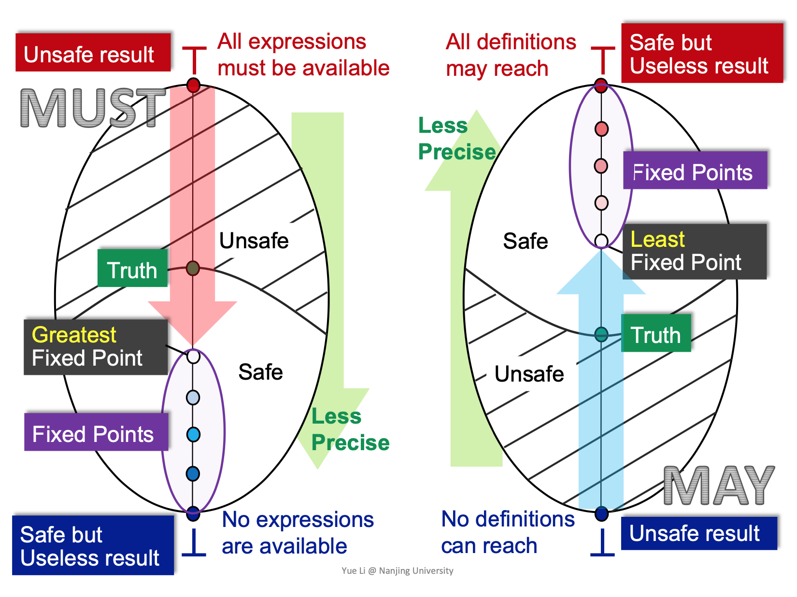

#### Meet-Over-All-Paths Solution（MOP）

- 公式：$$\mathrm{MOP}[s_i]=\mathop{\sqcup/\sqcap}\limits_{\textrm{A path }P\textrm{ from Entry to }S_i}\mathrm{F_P(OUT[Entry])}$$
- impractical：无界限的，不可枚举的
- not fully precise：有些路径可能不会执行
- 当$$F$$是distributive的时候（即$$F(x\sqcup y)=F(x)\sqcup F(y)$$），MOP=Ours。位向量或Gen/Kill问题（并集交集）是distributive的。

#### 常量传播

> 常量传播：给定程序点`p`处的一个变量`x`，确定`x`在`p`处是否一定有一个常量值（是什么）。

- 值$$V$$的域：UNDEF $$\rightarrow$$ -2/-1/0/1/2/... $$\rightarrow$$ NAC
- Meet Operator $$\sqcap$$
  - NAC $$\sqcap$$ $$v$$ = NAC
  - UNDEF $$\sqcap$$ $$v$$ = $$v$$
  - $$c\sqcap c = c$$
  - $$c_1\sqcap c_2=\mathrm{NAC}$$
- Transfer Function
  - s: x = c;        gen = {(x,c )}
  - s: x = y;        gen = {x,val(y)}
  - s: x = y op z;        gen = {(x, f(y,z))}
- Nondistributivity

#### Worklist算法

以前向分析为例，维护一个`Worklist`，初始化为所有的基本块集合，当`Worklist`非空时，从中选取一个基本块`B`，保存它的OUT旧值，然后计算它的新OUT值，若发生了变化，则把`B`的所有后继加入到`Worklist`中。

## 5. Interprocedural Analysis

#### 调用图构建（Call Graph Construction）

- 调用图（Call Graph）：一系列的从调用点（call-sites）指向目标方法（callees）的调用边。
- 调用图构建（逐渐precise和inefficient）
  1. 类继承分析（Class hierarchy analysis, CHA）
  2. 快速类型分析（Rapid type analysis, RTA）
  3. 变量类型分析（Variable type analysis, VTA）
  4. 指针分析（Pointer analysis, k-CFA）
- Java的方法调用：Virtual call的目标方法大于等于1（可能存在多态），在运行时才能决定。在运行时，对于$$o^1.foo(\dots)^2$$，$$foo$$的解析依赖于receiver object（即$$o$$的类型）以及method signature。
  - Signature = class type + method name + descriptor
  - Descriptor = return type + parameter types
- 如何解析（dispatch）virtual calls？
  - Dispatch(c, m)，若c包含一个非抽象的且拥有与m相同name、descriptor的方法m'，则返回m'，否则若存在父类c'，则返回Dispatch(c',m)
  - CHA需要全局程序的类继承信息，基于receiver variable的声明变量来解析virtual call。
- CHA对一个调用点cs的可能目标方法的解析（Resolve(cs)）

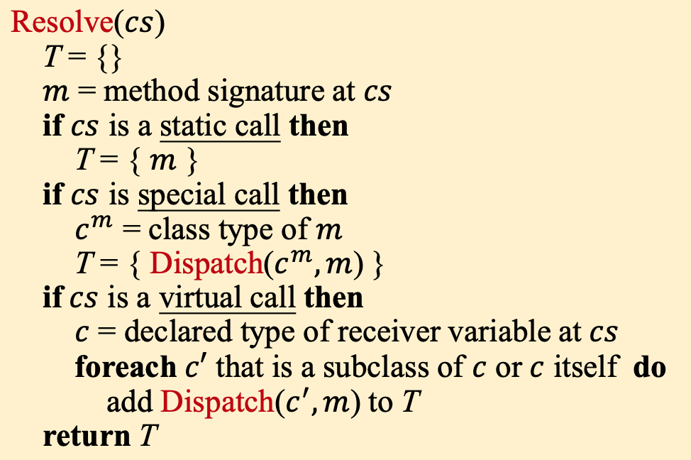

- 构建调用图的过程：从入口方法开始，对每个可达方法，解析它其中所有call sites的目标方法，直到没有新的方法能发现。

#### 过程间控制流图（Interprocedural Control-Flow Graph）

- ICFG在CFG的基础上加上两种边：
  - 调用边（Call edges）：从调用点指向目标方法的入口结点
  - 返回边（Return edges）：从目标方法的return语句指向call sites的后面一个语句

#### 过程间数据流分析（Interprocedural Data-Flow Analysis）

- 边传递（Edge transfer）
  - 调用边传递：将数据流从调用结点传递到目标方法的入口结点
  - 返回边传递：将数据流从目标方法的返回结点传递到返回点

## 6. Pointer Analysis

#### 指针分析

- 一种基本的静态分析，面向OO程序，被认为是may-analysis
- 指针分析：一个指针指向哪个对象？别名分析：两个指针是否可能指向同一个对象？
- 应用：基本信息（调用图、别名等）、编译器优化、缺陷检测、安全分析（信息流分析）等
- 关键因素：堆抽象（Allocation-site/Storeless）、上下文敏感性（C.S./C.I.）、流敏感性（F.S./F.I.）、分析范围（全程序/需求驱动）
- 我们关注的指针
  - 局部变量：`x`
  - 静态成员：`C.f`
  - 实例成员：`x.f`
  - 数组元素：`array[i]`（忽略索引，视为`array.arr`）
- 我们关注的语句（Pointer-Affecting Statements）
  - New：`x = new T()`
  - Assign：`x = y`
  - Store：`x.f = y`
  - Load：`y = x.f`
  - Call：`r = x.k(a, ...)`

## 7. Pointer Analysis Foundations

- Points-to relations：$$pt:\mathrm{Pointer}\rightarrow \mathcal{P}(O)$$，其中$$\mathrm{Pointer}=V\cup (O\times F)$$
- 实现核心：当$$pt(x)$$改变时，将改变的部分传播给$$x$$的相关指针。

- 解决办法：用一个图（Pointer Flow Graph, PFG）连接相关指针；当$$pt(x)$$改变时，将改变的部分传播给$$x$$的后继。
- PFG：对于`x=y`，有边$$x\leftarrow y$$；对于`x.f=y`，有边$$o_i.f\leftarrow y$$；对于`y=x.f`，有边$$y\leftarrow o_i.f$$。
- 实现：构建PFG <=> 在PFG上传播指向信息

#### 若不考虑过程间

- 规则

  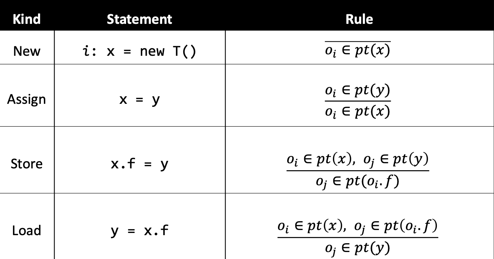

- 算法

  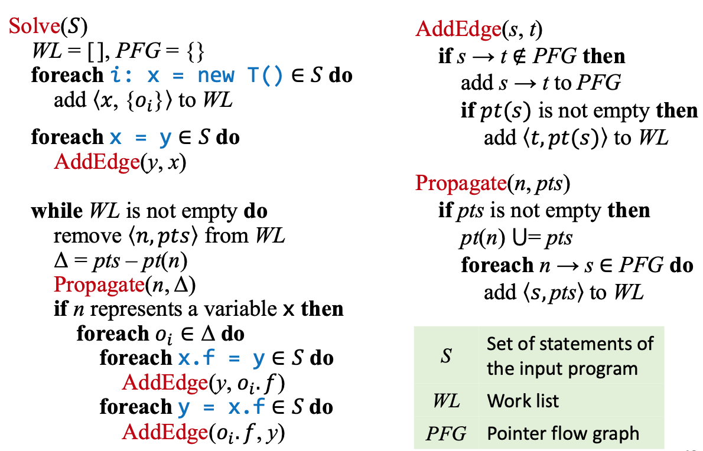

  - 差分传播（Differential Propagation）的目的：避免传播和处理重复的信息，提升效率。已有的$$pt(n)$$中的指向信息已经被传播到$$n$$的后继了，无需再次传播。

#### 若考虑过程间

- 规则：调用

  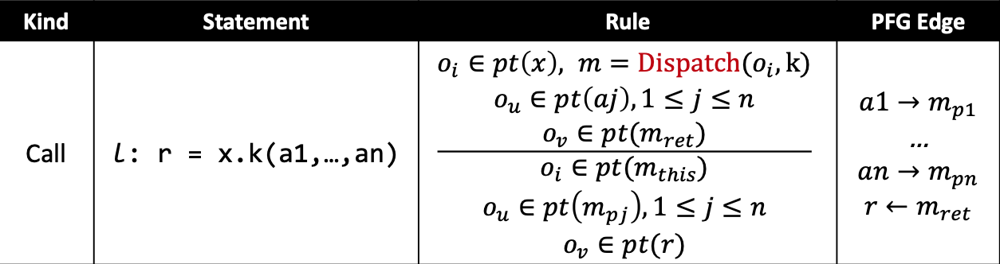

  - 为什么不加边$$x\rightarrow m_{this}$$？这条边会为`this`变量引入spurious的指向关系。Receiver object只应该流入对应的目标方法的`this`变量中。

- 算法

  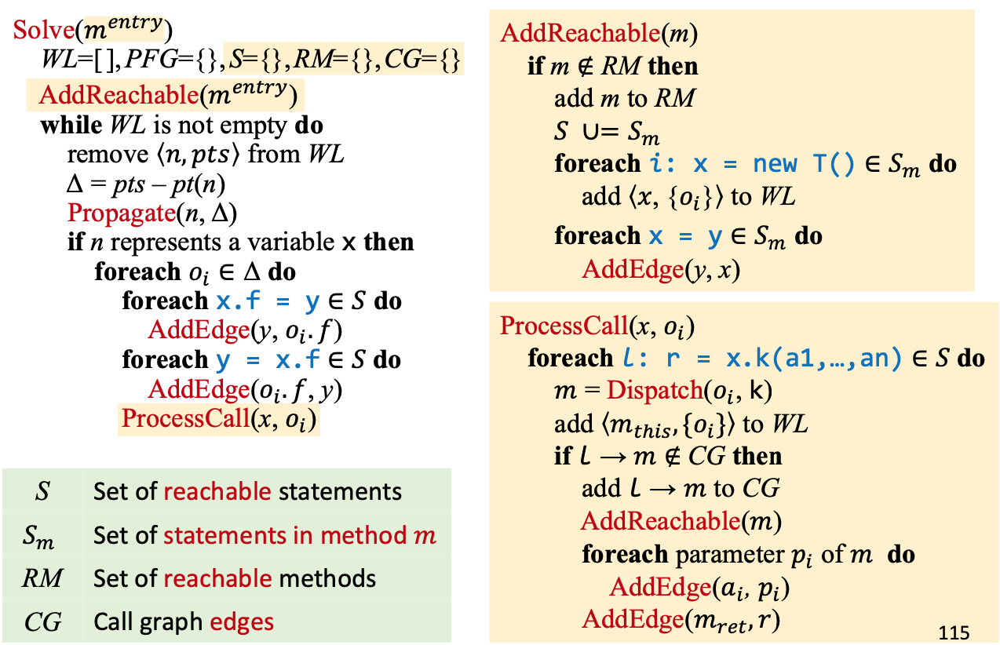

## 8. Pointer Anaysis Context Sensitivity

#### 上下文敏感堆

- 动态执行中，同一个分配点可能会在不同调用上下文创建多种对象。
- 用allocation site区分开不同call context的object。

#### 记号和规则

- 基本上都是在C.I.的基础上加个$$C$$。

- 重点是Call的规则

  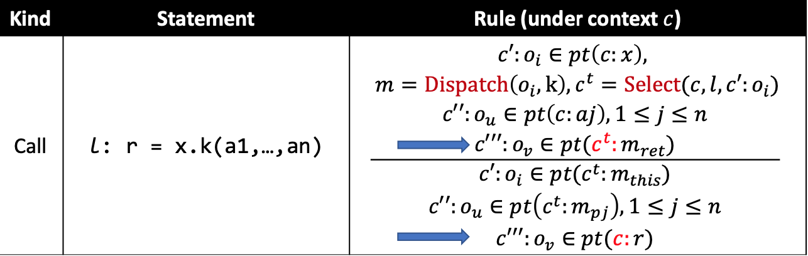

#### 上下文敏感变体

1. 调用点敏感（Call-site sensitivity）
   - $$\mathrm{Select}(c,l,\_)=[l',\dots,l'',l]$$，其中$$c=[l',\dots,l'']$$
   - k-Limiting Context Abstration：最近的$$k$$个调用点
2. 对象敏感（Object sensitivity）
   - 用receiver object作为上下文，$$\mathrm{Select}(\_,\_,c':o_i)=[o_j,\dots,o_k,o_i]$$，其中$$c'=[o_j,\dots,o_k]$$
   - 在实际情况中，对象敏感在OO语言的表现比调用点敏感更精确、更快
3. 类型敏感（Type sensitivity）
   - $$\mathrm{Select}(\_,\_,c':o_i)=[t',\dots,t'',\mathrm{InType}(o_i)]$$，其中$$c'=[t',\dots,t'']$$，这里type是指包含了receiver object的分配点的类（不是receiver object的类型）。
   - 一般来说，精确率方面object > type > call-site；效率方面type > object > call-site

## 9. Static Analysis for Security

- 安全：在敌对者（Adversary）的存在下，达成一些目标

#### 信息流安全

- 访问控制（Access control）：检查程序是否有权限访问某些信息，与信息如何**访问**有关
- 信息流安全（Information flow security）：追踪信息流如何流经程序，以确保程序安全地处理这些信息，与信息如何**传播**有关
- 信息流：若变量$$x$$中的信息（直接或间接）转移到变量$$y$$中，则有信息流$$x\rightarrow y$$。

- 将程序变量进行**分级**
- 安全等级：最基础的是two-level policy（H，高安全性，secret infomation；L，低安全性，public observable information）。可以建模为格，L <= H

#### 信息流政策（Information Flow Policy）

- 非干涉政策（Noninterference policy）：要求高安全等级的变量对低安全等级的变量**没有影响**。（确保信息流不会从H流向L）

#### 保密性和完整性（Confidentiality and Integrity）

- 保密性：防止秘密信息被泄漏【读保护，只能$$L\rightarrow H$$】
- 完整性：防止非信任的信息污染关键信息【写保护，只能$$H\rightarrow L$$】
  - 注入攻击（命令行注入、SQL注入等）
  - 正确性（信任信息不可被非信任信息污染）、完全性（一个数据库系统应该完整地存储所有数据）、一致性（一个文件传输系统应该确保两端的文件内容相同）

#### 显式流和隐藏信道（Explicit Flows and Covert Channels）

- 显式流：信息通过直接拷贝流动

- 隐式流：控制流受影响。秘密信息编码而成的控制流影响，都可能会泄漏。

- 隐藏信道

  > Channels that exploit a mechanism whose primary purpose is not information transfer are called **covert channels**.

  - 隐式流/终止信道/时间信道/异常/...

- 显式流比隐藏信道携带更多的信息，故更多关注它。

#### 污点分析（Taint Analysis）

- 将程序数据分为两类：tainted data（感兴趣的数据）和untainted data。关注tainted data从Source到Sink的传播。
- 应用
  - 保密性：Source为秘密数据，Sink为泄漏
  - 完整性：Source为非信任数据，Sink为关键计算
- 与指针分析结合起来
  - tainted data $$\rightarrow$$ objects
  - sources $$\rightarrow$$ allocation sites of tainted data
  - 输入：source方法集合、sink方法集合；输出：污点流（$$<t_j,m>$$）

## 10. Datalog-Based Program Analysis

#### 命令式（Imperative）语言和声明式（Declarative）语言

- 命令式：关注how to do，要考虑非常多的实现细节
- 声明式：关注what to do，简洁、易读、易实现

#### Datalog语言介绍

- 一种声明式逻辑编程语言，Prolog的子集，以数据库语言的方式产生，现在有各种应用（程序分析、声明式网络、大数据、云计算、……）
- Datalog = Data + Logic，无副作用，无控制流，无函数，不图灵完备。
- 谓词（Predicate）：本质上是一个数据表；事实（Fact）：一个特定的元组（行）属于一个关系（表）。
- 原子（Atom）：Datalog的基本元素，表示谓词`P(X1, X2, ..., Xn)`，其中`P` 是谓词的名称，括号内的是参数（terms，项）；项表示变量或常量。以上谓词形式也称为关系原子（relational atom），当`P`包含`X1, X2, ..., Xn`描述的元组时，`P(X1, X2, ..., Xn)`即为true。
- 规则（Rule）：表达逻辑推断的方法，形式为`H <- B1, B2, .., Bn`，其中`H`是Head（一个原子，也即结论），`B1, B2, ..., Bn`是前提，`Bi`是原子（也称为子目标）。若body为true则head为true。这里`,`相当于and。
- 规则的解释：考虑子目标的值的所有可能组合，若一个组合使前提为真，则结论为真。Datalog program = Facts + Rules。
- EDB和IDB谓词：EDB（外部数据库）是预先定义的，关系是不变的，可以视为输入；IDB（内部数据库）的谓词只能被规则构建，关系由规则推导，可以视为输出。
  - 对于`H <- B1, B2, ..., Bn`，`H`只能为IDB，但`Bi`既可以是EDB又可以是IDB。
- 逻辑或（Or）：可以写多条有同一head的规则，也可以用`;`符号（优先级低于`,`）
- 否定：用前缀感叹号`!`
- 递归：一个IDB谓词可以被它自身（直接或间接）推导出。
  - `Reach(from, to) <- Edge(from, to); Reach(from, node), Edge(node, to)`
- 规则安全（Rule Safety）
  - 一个规则是安全的，若每个变量都至少出现在一个非否定关系原子中。
  - Datalog仅允许安全的规则。
  - 原子的递归和否定必须分离，否则这个规则可能包含矛盾，推导无法收敛。
- Datalog程序的执行
  - 单调性（没有facts被删掉）
  - 终止性（因为单调且有限（规则安全））

#### 基于Datalog的指针分析

- 对应关系

  - EDB：指向关系信息，可以在语法层面上从程序提取
  - IDB：指针分析的结果
  - Rules：指针分析规则

- 建模

  - EDB
    - `New(x : V, o : O)`
    - `Assign(x : V, y : V)`
    - `Store(x : V, f : F, y : V)`
    - `Load(y : V, x : V, f : F)`
  - IDB
    - `VarPointsTo(v : V, o : O)`
    - `FieldPointsTo(oi : O, f : V, oj : O)`

- 规则

  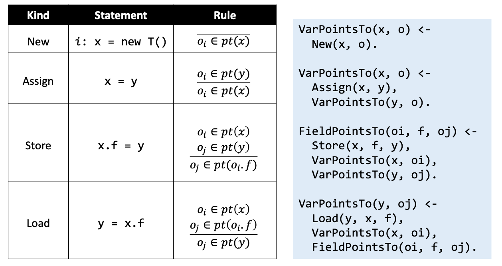

  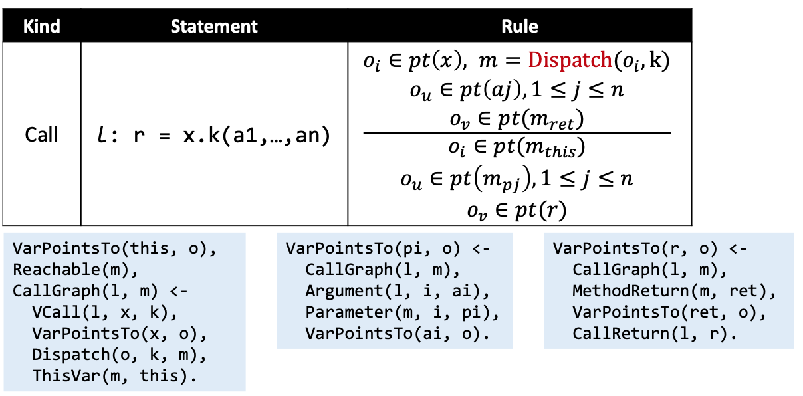

#### 基于Datalog的污点分析

- 建模

  - EDB
    - `Source(m : M)`
    - `Sink(m : M)`
    - `Taint(l : S, t : T)`
  - IDB
    - `TaintFlow(t : T, m : M)`

- 规则

  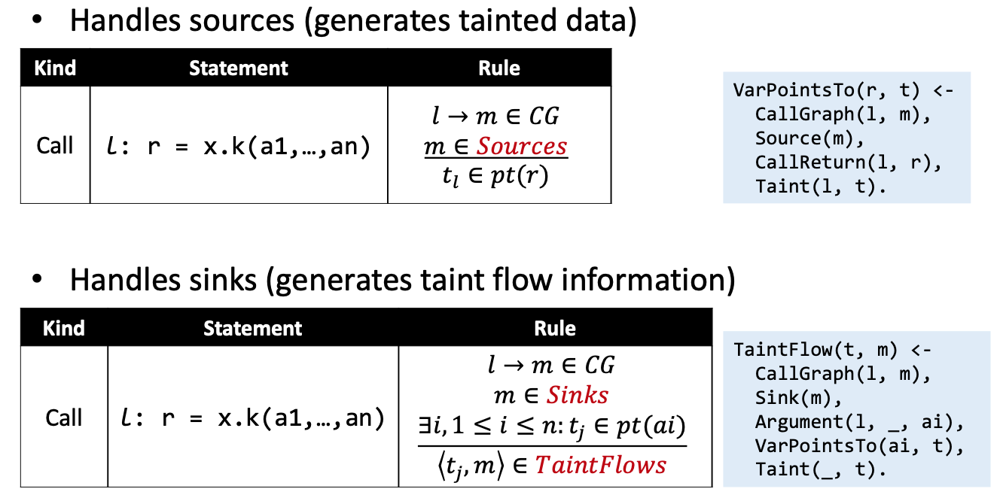

- 基于Datalog的程序分析
  - 优点：简洁、易读、易实现，受益于现成的优化的Datalog引擎
  - 缺点：受限的表达能力，不能完全地控制性能

## 11. CFL-Reachability and IFDS

#### Feasible和Realizable路径

- 我们希望Infeasible路径越少越好，但一个路径是否feasible是非确定性的。
- Realizable路径：returns和calls相匹配的那些路径
  - Realizable路径不一定会执行，但Unrealizable路径一定不可执行。
- 如何做？用CFL-Reachability！

#### CFL-Reachability

> A path is considered to connect two nodes A and B, or B is reachable from A, only if the concatenation of the labels on the edges of the path is a word in a specified context-free language.

- 一条路径是一条realizable路径，当且仅当这条路径的word在语言$$L(\mathit{realizable})$$中。
  - 对每个调用点$$i$$，分别标记它的调用边为$$(_i$$、返回边为$$)_i$$；将所有其他边标记为$$e$$。
  - $$\mathit{realizable}\rightarrow \mathit{matched}\quad \mathit{realizable}\mid (_i\quad \mathit{realizable}\mid \epsilon$$
  - $$\mathit{matched}\rightarrow (_i\quad \mathit{matched}\quad )_i\mid e\mid \epsilon\mid \mathit{matched}\quad \mathit{matched}$$

#### IFDS（Interprocedural, Finite, Distributive, Subset Problem）

- MRP（Meet-Over-All-Realizable-Paths）：$$\mathrm{MRP}_n\sqsubseteq \mathrm{MOP}_n$$

1. 给定一个程序P和一个数据流分析问题Q，为P构建一个supergraph $$G^*$$，基于Q为$$G^*$$中的边定义flow functions。
2. 通过将flow functions转化为representation relations，为P构建一个exploded supergraph $$G^\#$$。
3. 通过使用Tabulation算法将Q解决为一个图可达性问题，然后找到MRP解。

#### Supergraph

$$G^*=(N^*,E^*)$$，其中$$G^*$$包含一系列过程内流图$$G_1,G_2,\dots$$，每个流图$$G_p$$都有一个特殊的入口结点$$S_p$$和一个出口结点$$e_p$$；一个过程调用用一个调用结点$$Call_p$$和一个返回结点$$Ret_p$$表示；过程内call-to-return-site边从$$Call_p$$指向$$Ret_p$$；过程间call-to-start边从$$Call_p$$指向被调用过程的$$s_p$$；过程间exit-to-return-site边从$$e_p$$指向被调用过程的$$Ret_p$$。

- 若问题为“可能的未初始化变量”，可以用lambda表达式来定义每个边的流函数。
  - 注意点：call-to-return-site边允许传播局部信息，可从集合中剔除全局变量来减少FP;exit-to-return-site边要从集合中剔除局部变量（退栈）。

#### 构建Exploded Supergraph

- IDEA：将流函数转化为表示关系（representation relations）
- 若$$D$$为数据流facts的有限集，那么流函数可以表示为拥有$$2(D+1)$$个结点，最多$$(D+1)^2$$条边的图。
- 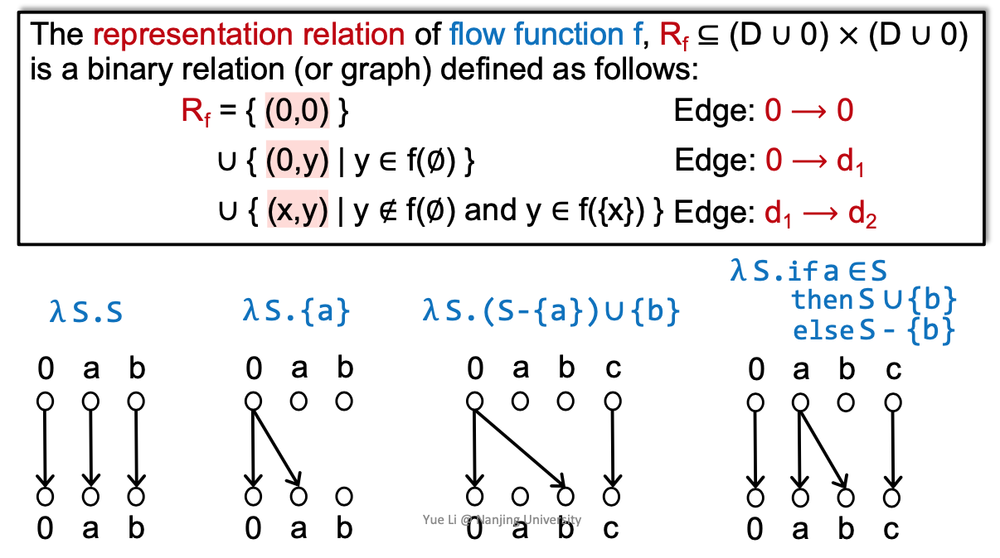
- 为什么需要边$$0\rightarrow 0$$？
  - 如果没有这条边，每条边的表示关系就不可能被连接起来而“粘贴”到一起，就像传统流分析中流函数不能被组合在一起。IFDS无法依赖这种不连接的表示关系输出正确解。

#### Tabulation算法的核心工作机理

#### IFDS的distributivity

- 不能做常量传播
  - 每个IFDS中的流函数一次只处理一个输入数据，无法表示“若x和y都存在”
  - 对于常量传播`z = x + y`，若我们仅知道x或y的值，则无法定义F
  - **给定一个语句S，除了S本身，如果我们需要考虑多个输入数据来得到正确的输出，那么这个分析就不是distributive的，不应该用IFDS表示。**
- 不能做指针分析
  - 流函数的输入数据缺少别名信息，我们需要别名信息才能得到正确的结果
  - 如果要在IFDS中获取别名信息，如`alias(x, y)`，则需要考虑多个输入数据`x`和`y`，无法在标准的IFDS的流函数中独立处理。因此指针分析是non-distributive的。

## 12. Soundiness

#### Soundness和Soundiness

- Soundness：分析涵盖了所有的程序行为，或分析结果建模了程序的所有可能执行
  - 学术界：所有发表的全程序分析，当用于真实程序设计语言时，都是unsound的。
  - 工业界：所有实际的全程序分析工具都只能做一些unsound的选择
- 困扰静态分析的语言特性
  - Java：反射、native code、动态类加载等
  - JavaScript：eval、document object model（DOM）等
  - C/C++：指针算术、函数指针等
- 对于这些困难语言特性，一般不处理，但可能对precision造成很大影响。如果claim soundness，会误导读者，因此CACM'15引入了soundiness这个概念
  - sound：一个sound的分析要求涵盖所有动态行为
  - soundy：一个soundy的分析在合理地使某些特定的困难语言特性unsoundly处理的前提下，涵盖所有动态行为
  - unsound：一个unsound的分析为了性能、精确率或accessibility的原因，故意忽略了特定的行为。

#### 反射（Reflection）

- 如何分析Java反射？
  - APLAS'05：字符串常量分析+指针分析。（字符串值若静态未知，反射目标就无法解析了）
  - ECOOP'14：类型推断+字符串分析+指针分析。（用usage points的信息来推断类型）
  - ICSE'11：动态分析辅助

#### Native Code

- `System.out.println("Hello World");`发生了什么？一步步解析下去，发现平台相关（Linux：`os:write` (c++)；Windows：`WriteFile` (c)）
- Java Native Interface（JNI）：允许Java和本地代码（C/C++）交互的JVM函数模型。
  - 为什么需要？需要平台相关特性（OS）；重用已有库（主要用C/C++写）
  - 为什么难以分析？JNI函数可以在本地代码创建对象、访问成员、调用方法等。
- 如何处理？
  - 手动建模关键的本地代码……
  - 最近工作：Identifying Java Calls in Native Code via Binary Scanning (ISSTA'20)