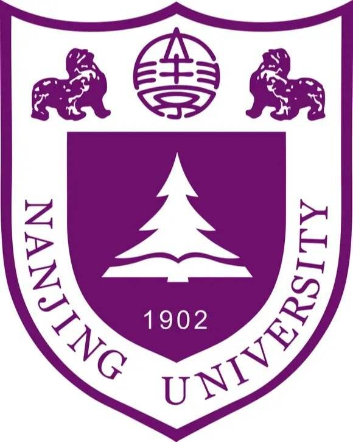
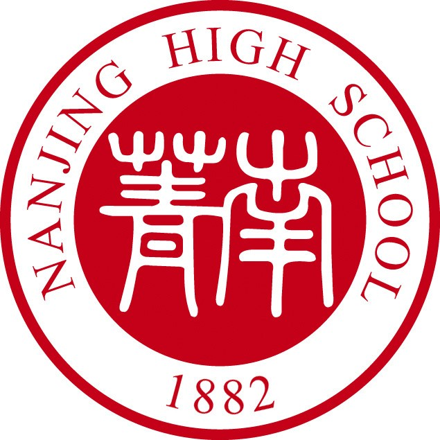

<!-- | [个人简介](#个人简介) | [教育经历](#教育经历) | [技能](#技能) | [荣誉奖项](#荣誉与奖项) | [服务经历](#服务与经历) | [科研项目](#科研与项目) | [个人博客](https://njubroccoli.github.io/blog/) -->

| [Home](https://njubroccoli.github.io/) | [Blog](https://njubroccoli.github.io/blog/) | 

# Yicheng Huang (黄奕诚)

- Assistant Investigator
- AI Lab, National University of Singapore (Suzhou) Research Institute
- 🏬 Room 429, NUSRI (No.377 Linquan Street), SIP, Suzhou
- 📮 njuhuangyc AT outlook DOT com

## About

I have obtained a B.Sc. degree and a M.Sc. degree from Nanjing University (both majoring in Computer Science and Technology). After graduating in 2023, I became a civil servant in Wuxi and later resigned. Since Jan 2024, I have been working in the AI Lab, NUSRI (Suzhou) and performs AI-related research and application development. My area of interest includes the methodology research and application development of AI for Education/Science/Software.

## Education

-  **Nanjing University** (Sep 2020 - Jun 2023), Nanjing, China 
  + Received a M.Sc. Degree in Computer Science and Technology
  + Institute of Computer Software, Department of Computer Science and Technology
  + Advisor: [Prof. Chang Xu](https://cs.nju.edu.cn/changxu/index.htm) and [Prof. Yanyan Jiang](https://ics.nju.edu.cn/~jyy/)

-  **Nanjing University** (Sep 2016 - Jun 2020), Nanjing, China
  + Received a B.Sc. Degree in Computer Science and Technology

-  **Nanjing Senior High School of Jiangsu Province** (Sep 2013 - Jun 2016), Jiangyin, China

## Work Experience

-  National University of Singapore (Suzhou) Research Institute (Jan 2024 - ), Suzhou, China
  + Assistant Investigator@AI Lab

-  Wuxi Public Security Bureau (Aug 2023 - Sep 2023), Wuxi, China
  + Civil Servant (Police) & Selected Graduate

## Pubs & Patents

1. **Yicheng Huang**, Chang Xu, Yanyan Jiang, Huiyan Wang, and Da Li, "WARDER: Towards Effective Spreadsheet Defect Detection by Validity-based Cell Cluster Refinements", Journal of Systems and Software (JSS), Volume 167, 2020, 110615. <a href="https://doi.org/10.1016/j.jss.2020.110615">[web]</a> <a href="https://njubroccoli.github.io/publications/huang_2020_warder.pdf">[pdf]</a> (Implemented in Java)
2. 蒋炎岩，**黄奕诚**，许畅. 一种电子表格公式计算规则逆向工程方法. 发明专利，申请号: 2023103290575. 申请日: 2023.03.30. (Implemented in Python)
3. 许畅，蒋炎岩，**黄奕诚**，陈钦霖，石丰民. 基于视频动态分析的电子表格公式合成与错误检测方法. 发明专利，专利号: ZL2019113070147. 授权公告日: 2023.04.25. (Implemented in Java/Android)

## Projects

- [The Raft Consensus Algorithm](https://github.com/NJUBroccoli/raft-impl) (from Course "Distributed System", Implemented in Golang)
- [x86 Full-system Simulator](https://github.com/NJUBroccoli/Programming-Assignment-2017) (from Course "Introduction to Computer Systems", Implemented in C)
- [Mini OS Kernel](https://github.com/NJUBroccoli/oslab) (from Course "Operating System", Implemented in C)
- [C-- Compiler](https://github.com/NJUBroccoli/HYCompiler) (from Course "Principle of Compiler", Implemented in C)
- Sudoku Game (from Course "Problem Solving", Implemented in C++)
- [Graphic Drawing APP](https://github.com/NJUBroccoli/HYC-Paint) (from Course "Computer Graphics", Implemented in Java)
- [Guandan AI System](https://github.com/QinlinChen/guandan-ai) (from Course "Artificial Intelligence", Implemented in Python)

## Services

- **Teaching Assistant** for ["Structure and Interpretation of Computer Programs" (Fall 2020)](https://nju-sicp.bitbucket.io/2020/), Nanjing University
- **Student Affairs** at Nanjing University
  + Vice Chairman of the Graduate Student Association of the Department of Computer Science and Technology (Jun 2021 - Jun 2022)
  + Director of the Comprehensive Affairs Center of the Social Practice Department of the Youth League Committee (Oct 2021 - Sep 2022)
  + Class Leader of the 2016 Elite-Plan Class of the Department of Computer Science and Technology (Sep 2016 - Jun 2020)

## Awards & Honors

- **Scholarships** from Nanjing University
  + Tencent Scholarship (2021)
  + Elite-Plan Scholarships (1st Prize@2019, 2nd Prize@2018, 3rd Prize@2017)

- **Competition Awards** from Nanjing University
  + Special Prize (School Level) and Second Prize (Province Level) on the Undergraduate Thesis (2020)
  + Winning the M Award in the MCM/ICM (2018)

- **Comprehensive Honors** from Nanjing University
  + Outstanding Graduates (2023, 2020), Outstanding Graduate Students (2022, 2020), Outstanding Graduate Cadres (2021), Outstanding Undergraduate Cadres (2018), Outstanding Undergraduate Students (2017)